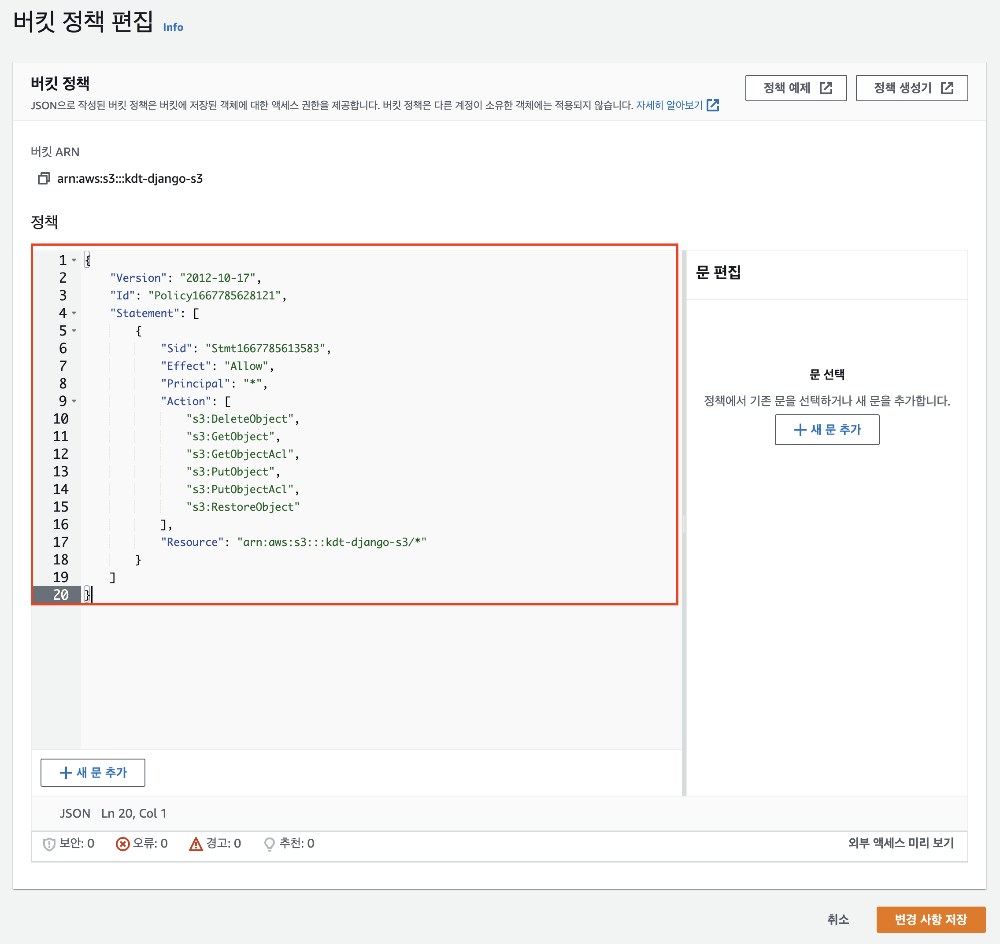

# ✔ 헤로쿠(Heroku) 배포 가이드

- [Heroku Working with Django](https://devcenter.heroku.com/categories/working-with-django)
  
  
  

> Git

- 헤로쿠는 기본적으로 git을 활용해서 배포를 합니다.

> Heroku 설치 & 로그인

1. Heroku CLI 설치
  
   - 아래 사이트에서 OS에 맞게 설치
   - [Install the Heroku CLI](https://devcenter.heroku.com/articles/heroku-cli)
  
2. [터미널] Heroku 설치 확인
  
   ```bash
   heroku --version
   
   # 아래 메세지가 출력되면 정상
   # heroku/7.65.0 darwin-x64 node-v14.19.0
   ```
  

> 배포 준비

1. [터미널] 패키지 설치
  
   - 가상 환경이 실행된 상태인지 확인합니다.
   
   ```bash
   pip install gunicorn 
   pip install dj-database-url # PostgreSQL 설정용 패키지
   pip install psycopg2-binary # PostgreSQL 설정용 패키지
   pip install whitenoise # 정적 파일 처리용 패키지
   pip install python-dotenv # 환경 변수 관리 패키지
   
   pip freeze > requirements.txt # 패키지 목록 저장
   ```
  
2. [Procfile] Procfile
  
   - Procfile
     - 헤로쿠가 배포 과정에 실행할 명령어 모음 파일
   
   - `manage.py`가 있는 폴더에 Procfile(대소문자 구분) 생성하고 아래 명령어 작성
     
     ```bash
     web: gunicorn [프로젝트명].wsgi --log-file -
     ```
    
3. [runtime.txt] runtime.txt 생성
  
   - runtime.txt
     - 헤로쿠가 사용해야할 파이썬 버전 명시
   
   - manage.py 가 있는 폴더에 `runtime.txt` 생성 후 버전 작성
     
     ```plain
     python-3.9.15
     ```
    
4. [settings.py] 데이터베이스 PostgreSQL 설정
  
   - PostgreSQL
     
     - 관계형 데이터베이스 중 하나로 헤로쿠에서 기본적으로 지원하는 데이터베이스
       
     - 헤로쿠에서는 SQLite를 사용할 수 없기 때문에 추가 설정이 필요합니다.
       
       - [settings.py] DATABASES 아래에 코드를 추가합니다.
       
       ```python
       DATABASES = {
        "default": {
           "ENGINE": "django.db.backends.sqlite3",
           "NAME": BASE_DIR / "db.sqlite3",
        }
       }
       
       """
       기존 DATABASES 코드 아래에 아래 세 줄을 추가합니다.
       """
       import dj_database_url
       
       db_from_env = dj_database_url.config(conn_max_age=500)
       DATABASES["default"].update(db_from_env)
       ```
      
5. [.env / settings.py] SECRET_KEY 분리
  
   - SECRET_KEY
     
     - Django 인증(회원가입, 로그인 등등) 과정에 필요한 외부로 노출되면 안되는 비밀키입니다.
       - [Djecrety.ir](https://djecrety.ir/) 에서 새로운 SECRET_KEY를 생성해서 사용합니다.
     
     - manage.py가 있는 폴더에`.env` 파일을 생성합니다.
       
     - [.env] 생성한 SECRET_KEY를 작성합니다.
       
       ```plain
       # .env
       SECRET_KEY="생성한 SECRET_KEY"
       
       # 예시
       # SECRET_KEY="$o5(+um4@+4g#3pp_zj-+b3vx99qbecllpsr%wh-d&hk(d=he@"
       ```
       
   - `.env` 파일을 `.gitignore`에 추가합니다.
     
   - [settings.py] SECRET_KEY 코드를 수정합니다.
     
     ```python
     """
     기존
     SECRET_KEY = "..."
     """
     
     # 수정
     """
     아래 3줄은 파일 최상단에 작성합니다.
     """
     from dotenv import load_dotenv
     import os
     load_dotenv() # .env 파일에서 환경 변수를 불러옵니다.
     
     # 기존 SECRET_KEY 대신 사용합니다.
     SECRET_KEY = os.getenv("SECRET_KEY")
     ```
    
6. [settings.py] ALLOWED_HOSTS 설정
  
   - ALLOWED_HOSTS
     
     - 서비스 접속을 허용할 도메인(주소) 목록입니다.
       
       - [settings.py] ALLOWED_HOSTS을 수정합니다.
       
       ```python
       """
       # 기존
       ALLOWED_HOSTS = []
       또는
       ALLOWED_HOSTS = ['*']
       """
       
       # 수정
       ALLOWED_HOSTS = ["127.0.0.1", "localhost", ".herokuapp.com"]
       ```
      
7. [settings.py / .env] DEBUG 설정
  
   - DEBUG
     
     - 오류가 발생했을 때 오류 원인 출력(노란 화면) 여부에 대해 결정하는 옵션입니다.
       
     - 사용자에게 노출되면 안 되는 정보들이 많이 포함된 화면입니다.
       
     - 그러므로 배포 환경에서는 DEBUG 옵션을 비활성화(False) 시킵니다.
       
       - 환경 변수를 통해 개발 환경(True)과 배포 환경(False)에서 다른 값이 할당되도록 하겠습니다.
       - [settings.py] DEBUG 값을 수정합니다.
       
       ```python
       """
       # 기존 
       DEBUG = True
       """
       
       # 수정
       # 환경 변수에서 가져온 DEBUG 값이
       # (개발 환경) "True" 라면 DEBUG에 True 가 할당됩니다.
       # (배포 환경) "False" 라면 DEBUG에 False 가 할당됩니다.
       DEBUG = os.getenv("DEBUG") == "True"
       ```
       
   - [.env] DEBUG 값을 추가합니다.
     
     ```plain
     SECRET_KEY="..."
     
     DEBUG="True"
     ```
    
8. [settings.py] STATIC_ROOT 설정
  
   - STATIC_ROOT
     
     - 배포 이전에는 Django가 각 앱의 static 폴더에서 정적 파일을 처리합니다.
     - 하지만, 배포 이후에는 정적 파일에 대한 처리가 필요합니다.
     - 정적 파일 처리를 위해 파일을 모아야 하는데(python manage.py collectstatic)
     - STATIC_ROOT에 할당된 경로에 파일이 모입니다.
   - [settings.py] STATIC_ROOT를 생성하고, 경로를 할당합니다.
     
     ```python
     """
     STATIC_URL = '/static/'
     STATIC_URL 아래에 작성합니다.
     """
     
     STATIC_ROOT = BASE_DIR / "staticfiles"
     ```
    
9. [settings.py] whitenoise 설정
  
   - whitenoise
     
     - 정적(static) 파일을 사용자에게 제공해주는 패키지입니다.
     - DEBUG = False 일 때 장고는 정적 파일을 사용자에게 제공하지 않습니다.
     - 정적 파일 제공을 whitenoise가 대신 담당 합니다.
   - [settings.py] MIDDLEWARE 리스트의 `SecurityMiddleware` 아래에 코드를 추가합니다.
     
   - SecurityMiddleware는 기존에 작성 되어 있는 Middleware 입니다.
     
   - SecurityMiddleware를 추가하지 않도록 합시다.
     
     ```python
     MIDDLEWARE = [
           """
           SecurityMiddleware는 추가하지 않습니다.
           SecurityMiddleware는 기존에 있는 코드입니다.
           """
        "django.middleware.security.SecurityMiddleware",
     
           # SecurityMiddleware 아래에 다음 코드를 추가합니다.
        "whitenoise.middleware.WhiteNoiseMiddleware",
     
           # ... 이하 생략
     ]
     ```
    

> 배포

1. Heroku 로그인
  
   - [터미널] 명령어 입력
     
     ```bash
     heroku login
     ```
     
   - [터미널] 웹 로그인
     
     - 아래 상태에서 아무 키나 입력하면 로그인 페이지가 열립니다.
       
       
       
   - [브라우저] Log In 버튼 클릭
     
     
     
   - [브라우저] 로그인 완료 확인, 창 닫기
     
     
     
   - [터미널] 로그인 성공 메세지 확인
     
     
    
2. [터미널] Heroku 앱 생성
  
   ```bash
   # 앱 이름을 정해서 랜덤으로 정해서 생성해줍니다.
   heroku create
   ```
  
3. [터미널] 헤로쿠 환경(배포 환경)에서의 환경 변수(env) 등록
  
   - [브라우저] 헤로쿠 대쉬보드 접속
     
     - [heroku dashboard](https://dashboard.heroku.com/apps/)
   - [브라우저] 생성한 앱 대쉬보드 접속
     
   - [브라우저] Settings - Reveal Config Vars 클릭
     
     
     
   - DEBUG = False 입력 → Add 클릭 / SECRET_KEY = 생성한 SECRET_KEY 입력 → Add 클릭
     
     
     
     
    
4. [터미널] 배포
  
   ```bash
   git add .
   
   git commit -m "Commit Message"
   
   # 로컬 master 브랜치 -> 헤로쿠 저장소 master 브랜치
   git push heroku master
   ```
  
5. [터미널] 데이터베이스 설정
  
   ```bash
   # 데이터베이스 마이그레이트
   heroku run python manage.py migrate
   
   # 관리자 계정 생성
   heroku run python manage.py createsuperuser
   ```
  
6. [터미널] 웹사이트 열기
  
   ```bash
   heroku open
   ```
  

> 재배포

- `git add - commit - push heroku master`를 합니다.
  
- makemigrations를 했다면 migrate를 합니다.
  

> 에러 해결

1. 업로드한 이미지(Media)가 보이지 않아요.
  
   - Heroku는 업로드한 파일을 저장을 해주지 않습니다.(무료 플랜)
   - 파일 업로드는 AWS의 S3를 사용해서 처리해야 합니다.

2. 에러 메세지(1)
  
   - Your account has reached its concurrent builds limit.
     
     ```bash
     # 터미널에 아래 명령어를 입력해서 헤로쿠를 재시작합니다.
     heroku restart
     ```
    
3. 에러 메세지(2)
  
   - You're using the staticfiles app without having set the STATIC_ROOT setting to a filesystem path
     
   - `STATIC_ROOT`를 확인해주세요.
     
4. 정적(static) 파일 출력이 안되요.
  
   - `whitenoise`를 확인해주세요.
  
5. 에러 메세지(3)
  
   - raise KeyError(key) from None
     
   - KeyError: '…'
     
   - 헤로쿠 환경 변수 `SECRET_KEY` 를 확인해주세요.
    
6. 에러 화면
  
   - Bad Request (400)
     
   - `ALLOWED_HOSTS`를 확인해주세요.


# ✔ Django - S3 연결 가이드
> AWS S3
- Simple Storage Service의 약자이며 인터넷 스토리지 서비스
- 사용량만큼 비용을 지불하며 프리티어에서의 제한은 아래와 같음
  - 5GB까지 무료
  - GET 요청 20000건 → 읽기 제한
  - PUT 요청 2000건 → 쓰기 제한
- 즉, 1년 동안 5GB까지 무료로 저장할 수 있고, 1년 동안 20000건의 조회 요청, 1년 동안 2000건의 쓰기 요청 가능

> IAM
- AWS 서비스 접근을 위한 사용자를 추가

1. 사용자 추가

   - AWS 좌측 상단 검색창에 IAM 을 입력해서 IAM 페이지 이동 - 사용자 메뉴 클릭
   - 사용자 추가 버튼을 클릭해서 사용자 추가를 시작합니다
   - MFA
     - AWS의 이중보안 시스템
     - 게임 로그인 시 아이디 / 비밀번호 외에 OTP를 요구하는 시스템
   
     

2. 사용자 세부 정보 설정

   - 사용자 이름을 작성 / AWS 자격 증명 유형 - 액세스 키 선택
 
     

3. 권한 설정

   - 기존 정책 직접 연결 - `AmazonS3FullAccess` 검색 후 선택
 
     

4. 검토

   - 사용자 만들기 클릭
 
     

5. 액세스 정보(.csv) 다운로드

   

> S3 
1. 버킷 추가

   - S3 검색 - 페이지 진입 - 버킷 만들기 클릭
 
     

2. 버킷 설정

   - 버킷 이름 작성
   - AWS 리전 선택
   - 모든 퍼블릭 액세스 차단 해제 - 해제 확인
   - 버킷 생성
 
     

3. 버킷 정책 생성

   - 생성한 버킷 클릭 - 권한 탭 이동
   - 버킷 정책 편집 - 정책 생성기
 
     
 
     
 
     ```
     *Select Type of Policy - S3 Bucket Policy
     Effect - Allow
     Principal - *
     Actions 
     - DeleteObject
     - GetObject
     - GetObjectAcl
     - PutObject
     - PutObjectAcl
     Amazon Resource Name
     - arn:aws:s3:::[버킷이름]/*
 
     - 예시) arn:aws:s3:::kdt-django-s3/*
     ```
 
   - Generate Policy 클릭 - 생성된 정책을 정책 편집 페이지에 복사 후 변경사항 저장
 
     
 
     

> Django S3

1. 패키지 설치

   ```bash
   pip install python-dotenv
   pip install django-storages
   pip install boto3
   pip freeze > requirements.txt
   ```

2. settings.py 설정

   ```
   BASE_DIR(manage.py가 있는 폴더)에 .env 파일 생성 후 아래 값 작성
 
   AWS_ACCESS_KEY_ID = [IAM 사용자 Access key ID]
   AWS_SECRET_ACCESS_KEY = [IAM 사용자 Secret access key]
   AWS_STORAGE_BUCKET_NAME = [S3 버킷 이름]
 
 
   # 예시
   AWS_ACCESS_KEY_ID = 21390ujskladjlask
   AWS_SECRET_ACCESS_KEY = 21oi3uqwjd09asoi
   AWS_STORAGE_BUCKET_NAME = kdt-django-s3
   ```
 
   ```python
   # 최상단에 아래 3줄을 추가.
   from dotenv import load_dotenv
   import os
   load_dotenv() # .env 파일에서 환경 변수를 불러옵니다.
 
 
   INSTALLED_APPS = [
     "storages", # storages 추가
     # ... 이하 생략
   ]
 
   """
   기존 MEDIA 설정 주석
   MEDIA_ROOT = ...
   MEDIA_URL = ...
   """
 
   # 아래 코드 추가
   DEFAULT_FILE_STORAGE = "storages.backends.s3boto3.S3Boto3Storage"
 
   AWS_ACCESS_KEY_ID = os.getenv("AWS_ACCESS_KEY_ID")
   AWS_SECRET_ACCESS_KEY = os.getenv("AWS_SECRET_ACCESS_KEY")
   AWS_STORAGE_BUCKET_NAME = os.getenv("AWS_STORAGE_BUCKET_NAME")
 
   AWS_REGION = "ap-northeast-2"
   AWS_S3_CUSTOM_DOMAIN = "%s.s3.%s.amazonaws.com" % (
       AWS_STORAGE_BUCKET_NAME,
       AWS_REGION,
   )
   ```

3. 테스트

   - 로컬 서버에서 미디어 파일이 정상적으로 업로드 및 조회가 되는지 확인합니다.

4. 개발 & 배포 환경 분리

   - 개발 환경에서는 기존 설정(MEDIA_URL / MEDIA_ROOT)이 작동하도록 배포 환경에서는 S3 설정이 작동하도록 설정을 분리합니다.
 
   ```
   .env에 DEBUG 값 추가
 
   DEBUG = True
   ```
 
   ```python
   # settings.py
 
   """
   기타 환경에 따라 설정 분리가 필요한 경우 코드를 분리해서 추가로 작성합니다. 
   """
 
   DEBUG = os.getenv("DEBUG") == "True"
 
   if DEBUG: 
       MEDIA_URL = "/media/"
       MEDIA_ROOT = BASE_DIR / "media"
 
   else:   
       DEFAULT_FILE_STORAGE = "storages.backends.s3boto3.S3Boto3Storage"
 
       AWS_ACCESS_KEY_ID = os.getenv("AWS_ACCESS_KEY_ID")
       AWS_SECRET_ACCESS_KEY = os.getenv("AWS_SECRET_ACCESS_KEY")
       AWS_STORAGE_BUCKET_NAME = os.getenv("AWS_STORAGE_BUCKET_NAME")
 
       AWS_REGION = "ap-northeast-2"
       AWS_S3_CUSTOM_DOMAIN = "%s.s3.%s.amazonaws.com" % (
           AWS_STORAGE_BUCKET_NAME,
           AWS_REGION,
       )
   ```

5. 헤로쿠 배포 시 환경변수 설정

   - 헤로쿠로 배포할 경우 S3에 대한 환경 변수를 추가로 설정합니다.
 
     
 
6. 배포 후 이미지 업로드 테스트

   - 문제 없이 이미지 업로드 및 출력이 되는지 확인합니다.