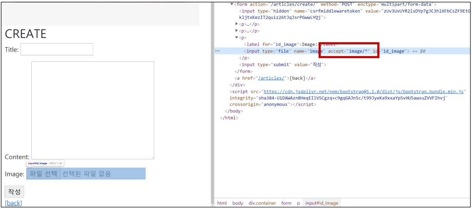
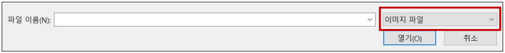
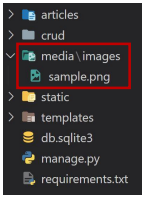
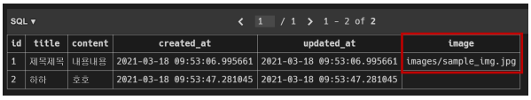
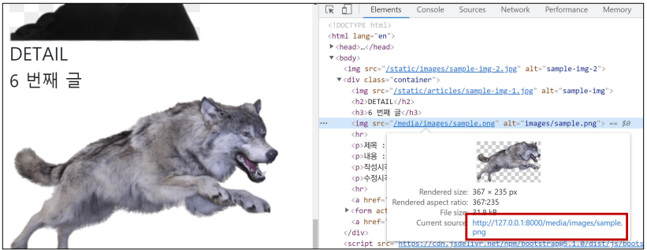

# ✔ 이미지 업로드 - 기본 설정
> 미디어 파일
- 사용자가 웹에서 업로드하는 정적 파일 (user-uploaded)
- 유저가 업로드한 모든 정적 파일

> Media 관련 필드

1. `FileField`

   - 파일 업로드에 사용하는 모델 필드
   - 2개의 선택 인자를 가지고 있음: `upload_to`, `storage`
   - upload_to 속성: 실제 이미지가 저장되는 경로를 지정
     - 문자열 경로 지정 방식
  
       ```python
       # models.py
 
       class MyModel(models.Model):
         # 방법1) MEDIA_ROOT/uploads/ 경로로 파일 업로드
         upload = models.FileField(upload_tp='uploads/')
         # 방법2) MEDIA_ROOT/uploads/2021/01/01 경로로 파일 업로드
         upload = models.FileField(upload_to='uploads/%Y/%m/%d/')
       ```
      
     - 함수 호출

       ```python
       # models.py

       def articles_image_path(instance, filename):
        # MEDIA_ROOT/user_<pk>/ 경로로 <filename> 이름으로 업로드
        return f'user_{instance.user.pk}/{filename}'

       class Article(models.Model):
        image = models.ImageField(upload_to=articles_image_path)
       ```

2. `ImageField`
  
   - 이미지 업로드에 사용하는 모델 필드
   - FileField를 상속받는 서브 클래스이기 때문에 FileField의 모든 속성 및 메서드를 사용 가능하며, 더해서 사용자에 의해 업로드된 객체가 유효한 이미지인지 검사함
   - ImageField 인스턴스는 최대 길이가 100자인 문자열로 DB에 생성되며, max_length 인자를 사용하여 최대 길이를 변경 할 수 있음
   - 주의) 사용하려면 반드시 `Pillow` 라이브러리가 필요

> URL 설정
- settings.py에 `MEDIA_ROOT`, `MEDIA_URL` 설정
- upload_to 속성을 정의하여 업로드된 파일에 사용할 MEDIA_ROOT의 하위 경로를 지정
- 업로드된 파일의 경로는 django가 제공하는 ‘url’ 속성을 통해 얻을 수 있음

  ```django
  
  ```

> `MEDIA_ROOT`

- 사용자가 업로드한 파일(미디어 파일)들을 보관할 디렉토리의 절대 경로
- django는 성능을 위해 업로드 파일은 데이터베이스에 저장하지 않음
  - 즉, 실제 데이터베이스에 저장되는 것은 파일의 경로

  ```python
  # settings.py

  MEDIA_ROOT = BASE_DIR / 'media'
  ```

> `MEDIA_URL`

- MEDIA_ROOT에서 제공되는 미디어를 처리하는 URL
- 업로드된 파일의 주소(URL)를 만들어 주는 역할
  - 웹 서버 사용자가 사용하는 public URL
- 비어 있지 않은 값으로 설정 한다면 반드시 slash(/)로 끝나야 함

  ```python
  # settings.py

  MEDIA_URL = '/media/'
  ```

> **개발** 단계에서 사용자가 업로드한 파일을 `제공`하는 방법
- 사용자가 업로드한 파일이 우리 프로젝트에 업로드는 되지만, 실제로 사용자에게 제공하기 위해서는 업로드된 파일의 URL이 필요함

  ```python
  # pjt/urls.py

  from django.conf import settings
  from django.conf.urls.static import static

  urlpatterns = [
      ...
  ] + static(settings.MEDIA_URL, document_root=settings.MEDIA_ROOT)
  ```


# ✔ 이미지 업로드 - CREATE
> 모델 설정

- `ImageField`
  - upload_to='images/'
    - 실제 이미지가 저장되는 경로를 지정
  - blank=True
    - 이미지 필드에 빈 값(빈 문자열)이 허용되도록 설정 (이미지를 선택적으로 업로드 할 수 있도록) 

  ```python
  # articles/models.py

  from django.db import models

  class Article(models.Model):
    ...
    image = models.ImageField(blank=True, upload_to='images/')
  ```

- 모델 설정 후 마이그레이션 진행
  - 단, ImageField를 사용하기 위해서는 `Pillow` 라이브러리 설치 필요

  ```bash
  $ pip install Pillow
  $ pip freeze > requirements.txt

  $ python manage.py makemigrations
  $ python manage.py migrate
  ```

> HTML 설정

- 게시글 작성 HTML에 form `enctype` 속성 지정

  ```django
  <!-- articles/create.html -->

  

  
  <h1>CREATE</h1>
  <form action='' method='POST' enctype='multipart/form-data'>
    
    {{ form.as_p }}
    <input type='submit' value='작성'>
  </form>
  
  ```

- input 요소의 `accept` 속성 확인
  - [mdn 문서 - `<input type="file">`](https://developer.mozilla.org/ko/docs/Web/HTML/Element/Input/file#%EA%B3%A0%EC%9C%A0_%ED%8C%8C%EC%9D%BC_%EC%9C%A0%ED%98%95_%EC%A7%80%EC%A0%95%EC%9E%90)

  

  

> View 설정
- 업로드 한 파일은 `request.FILES` 객체로 전달됨

  ```python
  # articles/views.py

  from django.views.decorators.http import require_http_methods
  from .forms import ArticleForm 

  @require_http_methods(['GET', 'POST'])
  def create(request):
    if request.method == 'POST':
      form = ArticleForm(request.POST, request.FILES)
      # form = ArticleForm(data=request.POST, files=request.FILES)
      if form.is_valid():
        article = form.save()
        return redirect('articles:detail', article.pk)
    else:
      ...
  ```

- 파일 트리 및 DB 확인
  - 실제 파일 위치: `MEDIA_ROOT/images/`

    

    

> 참고) Model field option - `blank` vs `null`

- 문자열 기반 및 비문자열 기반 필드 모두에 대해 null option은 DB에만 영향을 미치므로, form에서 빈 값을 허용하려면 blank=True를 설정해야 함

1. `blank` option - **Validation-related**

   - 기본 값: False
   - True인 경우 필드를 비워 둘 수 있음
     - DB에는 ‘’(빈 문자열)이 저장됨
   - 유효성 검사에서 사용 됨 (is_valid) 
     - 필드에 blank=True가 있으면 form 유효성 검사에서 빈 값을 입력할 수 있음

2. `null` option - **Database-related**

   - 기본 값 : False
   - True면 django는 빈 값을 DB에 NULL로 저장 
   - 주의 사항
     - CharField, TextField와 같은 문자열 기반 필드에는 사용하는 것을 피해야 함
     - 문자열 기반 필드에 True로 설정 시 ‘데이터 없음(no data)’에 “빈 문자열(1)”과 “NULL(2)”의 2가지 가능한 값이 있음을 의미하게 됨
     - 대부분의 경우 "데이터 없음"에 대해 두 개의 가능한 값을 갖는 것은 중복되며, Django는 NULL이 아닌 빈 문자열을 사용하는 것이 규칙

> 참고) form 요소 - `enctype`(인코딩) 속성

1. `multipart/form-data`
   
   - 파일/이미지 업로드 시에 반드시 사용해야 함 (전송되는 데이터의 형식을 지정)
   - `<input type="file">`을 사용할 경우에 사용

2. `application/x-www-form-urlencoded` (기본값)

   - 모든 문자 인코딩

3. `text/plain`

   - 인코딩을 하지 않은 문자 상태로 전송
   - 공백은 '+' 기호로 변환하지만, 특수 문자는 인코딩 하지 않음


# ✔ 이미지 업로드 - READ
> img 태그 활용

- `article.image.url`: 업로드 파일의 경로
- `article.image`: 업로드 파일의 파일 이름

  ```django
  <!-- articles/detail.html -->
  

  
    <h2>DETAIL</h2>
    <h3>{{ article.pk }}번째 글</h3>
    
    ...
  
  ```

  


# ✔ 이미지 업로드 - UPDATE
- 이미지는 바이너리 데이터(하나의 덩어리)이기 때문에 텍스트처럼 일부만 수정 하는 것은 불가능하고, 새로운 사진으로 덮어 씌우는 방식을 사용

  ```django
  <!-- articles/update.html -->

  

  
  <h1>UPDATE</h1>
  <form action='' method='POST' enctype='multipart/form-data'>
    
    {{ form.as_p }}
    <input type='submit' value='수정'>
  </form>
  
  ```

  ```python
  # articles/views.py

  from django.shortcuts import get_object_or_404, render
  from django.views.decorators.http import require_http_methods
  from .forms import ArticleForm 
  from .models import Article

  @require_http_methods(['GET', 'POST'])
  def update(request, pk):
    article = get_object_or_404(Article, pk=pk)
    if request.method == 'POST':
      form = ArticleForm(request.POST, request.FILES, instance=article)
      if form.is_valid():
        form.save()
        return redirect('articles:detail', article.pk)
    else:
      ...
  ```


# ✔ Django-imagekit 라이브러리
- 실제 원본 이미지를 서버에 그대로 업로드 하는 것은 서버의 부담이 큰 작업
- `` 태그에서 직접 사이즈를 조정할 수도 있지만 (width 와 height), Django-imagekit를 통해 업로드 될 때 **이미지 자체를 resizing** 할 수 있음
- [GitHub django-imagekit](https://github.com/matthewwithanm/django-imagekit/)

> 기본 설정
- django-imagekit 설치

  ```bash
  $ pip install django-imagekit
  $ pip freeze > requirements.txt
  ```

- INSTALLED_APPS에 추가

  ```python
  # settings.py

  INSTALLED_APPS = [
    ...
    'imagekit',
    ...
  ]
  ```

> 모델 설정

1. 원본 이미지와 resizing 이미지 모두 저장할 경우

   ```python
   # articles/models.py
 
   from django.db import models
   from imagekit.models import ImageSpecField
   from imagekit.processors import ResizeToFill
 
   class Article(models.Model):
     ...
     image = models.ImageField(blank=True, upload_to='images/')
     image_thumbnail = ImageSpecField(source='image',
                                       processors=[ResizeToFill(100, 50)],
                                       format='JPEG',
                                       options={'quality': 60})
   ```

2. resizing 이미지만 저장할 경우

   - `ProcessedImageField()`의 parameter로 작성된 값들은 변경이 되더라도 다시 makemigrations를 해줄 필요없이 즉시 반영 됨

   ```python
   # articles/models.py
 
   from django.db import models
   from imagekit.models import ProcessedImageField
   from imagekit.processors import Thumbnail
 
   class Article(models.Model):
     ...
     image_thumbnail = ProcessedImageField(upload_to='images/',
                                            blank=True,
                                            processors=[Thumbnail(100, 50)],
                                            format='JPEG',
                                            options={'quality': 60})
   ```
 


