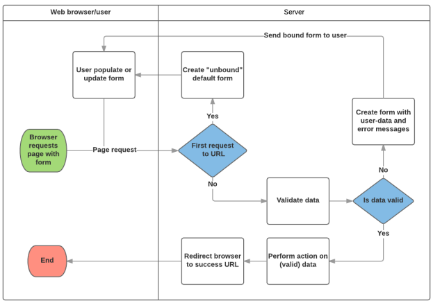
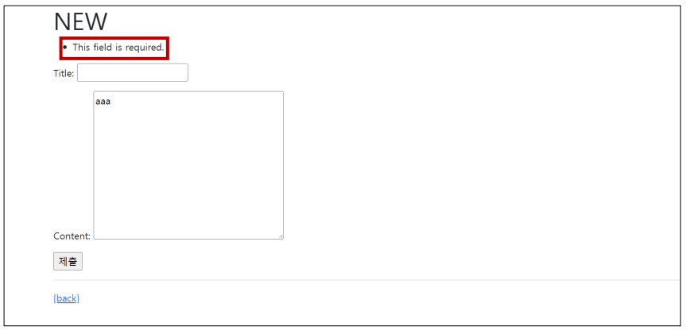

# ✔ Django ModelForm
- DB 기반의 어플리케이션을 개발하다보면, HTML Form(UI)은 Django의 모델(DB)과 매우 밀접한 관계를 가지게 됨
  - 사용자로부터 값을 받아 DB에 저장하여 활용하기 때문
  - 즉, 모델에 정의한 필드의 구성 및 종류에 따라 HTML Form이 결정됨
- 사용자가 입력한 값이 DB의 데이터 형식과 일치하는지를 확인하는 유효성 검증이 반드시 필요하며 이는 서버 사이드에서 반드시 처리해야 함

> ModelForm Class
- Model을 통해 Form Class를 만들 수 있는 helper class
- ModelForm은 Form과 똑같은 방식으로 View 함수에서 사용

> ModelForm 선언
- forms 라이브러리의 ModelForm 클래스를 상속받음
- 정의한 ModelForm 클래스 안에 `Meta 클래스`를 선언
- Meta 클래스
  - 어떤 모델을 기반으로 form을 작성할 것인지에 대한 정보를 지정
  - `model` 속성: 참조 할 모델
  - `fields` 속성: form에 포함시킬 필드
    - `'__all__'`를 사용하여 모델의 모든 필드를 포함할 수 있음
  - `exclude` 속성: form에 포함시키지 않을 필드

  ```python
  # articles/forms.py

  from django import forms
  from .models import Article

  class ArticleForm(forms.ModelForm):
    
    class Meta:
      model = Article
      fields = '__all__'
  ```

  ```python
  # articles/forms.py

  from django import forms
  from .models import Article

  class ArticleForm(forms.ModelForm):
    
    class Meta:
      model = Article
      fields = ['title',]
  ```

  ```python
  # articles/forms.py

  from django import forms
  from .models import Article

  class ArticleForm(forms.ModelForm):
    
    class Meta:
      model = Article
      exclude = ('title',)
  ```

> ModelForm의 활용
- ModelForm 객체를 context로 전달

  ```python
  # articles/views.py

  from .forms import ArticleForm

  def new(request):
    form = ArticleForm()
    
    context = {
      'form': form,
    }
    
    return render(request, 'articles/new.html', context)
  ```

- Input Field 활용
- Form Rendering Options: `<label>` & `<input>` 쌍에 대한 **3가지** 출력 옵션 가능
  
  1. `as_p()`
     - 각 필드가 단락(`<p>` 태그)으로 감싸져서 렌더링
  
  2. `as_ul()`
     - 각 필드가 목록 항목(`<li>` 태그)으로 감싸져서 렌더링
     - `<ul>` 태그는 직접 작성해야 함

  3. `as_table()`
     - 각 필드가 테이블(`<tr>` 태그) 행으로 감싸져서 렌더링

  ```django
  <!-- articles/new.html -->

  

  
    <h1>NEW</h1>
    <form action="" method="POST">
      
      {{ form.as_p }}
      <input type="submit">
    </form>
    <hr>
    <a href="">[back]</a>
  
  ```


# ✔ ModelForm과 Create & Update

> ModelForm 활용 로직
- **요청 방식**(method)에 따른 분기
  - method = GET인 경우, HTML Form 전달
  - method = POST인 경우, 사용자 입력 데이터 수신
- **유효성 검사**에 따른 분기 - `is_valid()` method
  - 유효성 검사 실패시 Form으로 전달 
  - 유효성 검사 성공시 DB 저장 - `save()` method
  
  

> ModelForm의 method & attribute

1. `is_valid()` method
   
   - 유효성 검사를 실행하고, 데이터가 유효한지 여부를 boolean으로 반환
   - 데이터 유효성 검사를 보장하기 위한 많은 테스트에 대해, Django는 is_valid()를 제공하여 개발자의 편의를 도움

2. `save()` method

   - form 인스턴스에 바인딩 된 데이터를 통해 데이터베이스 객체를 만들고 저장
   - ModelForm의 하위 클래스는 키워드 인자 `instance` 여부를 통해 생성할 지, 수정할지를 결정함
     - ModelForm의 인자 instance는 수정 대상이 되는 객체(기존 객체)를 지정
     - instance가 제공되지 않은 경우: save()는 지정된 모델의 새 인스턴스를 만듦(**CREATE**)
     - instance가 제공된 경우: save()는 해당 인스턴스를 수정(**UPDATE**)

      ```python
      # CREATE
      form = ArticleForm(request.POST)
      form.save()

      # UPDATE
      article = Article.objects.get(pk=pk)
      form = ArticleForm(request.POST, instance=article)
      form.save()
      ```

3. `errors` attribute
   
   - is_valid()의 반환 값이 False인 경우 form 인스턴스의 errors 속성에 값이 작성되는데, 유효성 검증을 실패한 원인이 딕셔너리 형태로 저장됨

      ```python
      # articles/views.py
    
      def create(request):
        form = ArticleForm(request.POST)
    
        if form.is_valid():
          article = form.save()
          return redirect('articles:detail', article.pk)
        
        print(f'에러: {form.errors}')
        return redirect('articles:new')
      ```

   - 다음과 같은 구조로 코드를 작성하면 유효성 검증을 실패했을 때 사용자에게 실패 결과 메세지를 출력해줄 수 있음

      ```python
      # articles/views.py

      def create(request):
        form = ArticleForm(request.POST)

        if form.is_valid():
          article = form.save()
          return redirect('articles:detail', article.pk)
        
        context = {
          'form': form,
        }

        return render(request, 'articles/new.html', context)
      ```

   - title에 공백을 넣고 제출한 결과
     
     

> CREATE
- new와 create view 함수를 합침
  - index 페이지에 있던 new 관련 링크 수정
  - new view 함수에 대한 url path를 삭제
  - new.html → create.html 이름변경
- **요청 방식**(method)에 따른 분기
  - 기존의 new와 create view 함수의 역할은 `request.method` 값을 기준으로 나뉨
  - method = GET인 경우, HTML Form 전달
  - method = POST인 경우, 사용자 입력 데이터 수신
- **유효성 검사**에 따른 분기
  - 유효성 검사를 통과하면, 데이터 저장 후 상세 페이지로 리다이렉트
  - 유효성 검사를 통과하지 못하면, 에러 정보가 담긴 form 인스턴스를 context에 넣어 작성 페이지로 다시 렌더링
  
  ```django
  <!-- articles/index.html -->

  

  
    <h1>Articles</h1>
    <a href="">CREATE</a>
    <hr>
    ...
  
  ```

  ```python
  # articles/urls.py
  
  app_name = 'articles'
  
  urlpatterns = [
    path('', views.index, name='index'),
    path('create/', views.create, name='create'),
  ]
  ```

  ```python
  # articles/views.py

  def create(request):
    if request.method == 'POST':
      form = ArticleForm(request.POST)
      if form.is_valid():
        article = form.save()
        return redirect('articles:detail', article.pk)
    else:
      form = ArticleForm()
    
    context = {
      'form': form,
    }

    return render(request, 'articles/create.html', context)
  ```

  ```django
  <!-- articles/create.html -->

  

  
    <h1>CREATE</h1>
    <form action="" method="POST">
      
      {{ form.as_p }}
      <input type="submit">
    </form>
    <hr>
    <a href="">[back]</a>
  
  ```

> UPDATE
- edit과 update view 함수를 합침
  - detail 페이지에 있던 edit 관련 링크 수정
  - edit view 함수에 대한 url path를 삭제
  - edit.html → update.html 이름변경
- **요청 방식**(method)에 따른 분기
  - 기존의 edit과 update view 함수의 역할은 `request.method` 값을 기준으로 나뉨
  - method = GET인 경우, HTML Form 전달
  - method = POST인 경우, 사용자 입력 데이터 수신
- **유효성 검사**에 따른 분기
  - 유효성 검사를 통과하면, 데이터 저장 후 상세 페이지로 리다이렉트
  - 유효성 검사를 통과하지 못하면, 에러 정보가 담긴 form 인스턴스를 context에 넣어 작성 페이지로 다시 렌더링
  
  ```django
  <!-- articles/detail.html -->

  <a href="">UPDATE</a><br>
  ```

  ```python
  # articles/urls.py

  app_name = 'articles'

  urlpatterns = [
    path('', views.index, name='index'),
    path('<int:pk>/update/', views.update, name='update'),
  ]
  ```

  ```python
  # articles/views.py

  def update(request, pk):
    article = Article.objects.get(pk=pk)

    if request.method == 'POST':
      form = ArticleForm(request.POST, instance=article)
      if form.is_valid():
        form.save()
        return redirect('articles:detail', article.pk)
    else:
      form = ArticleForm(instance=article)
    
    context = {
      'form': form,
      'article': article,
    }

    return render(request, 'articles/update.html', context)
  ```

  ```django
  <!-- articles/update.html -->

  

  
    <h1>UPDATE</h1>
    <form action="" method="POST">
      
      {{ form.as_p }}
      <input type="submit">
    </form>
    <hr>
    <a href="">[back]</a>
  
  ```