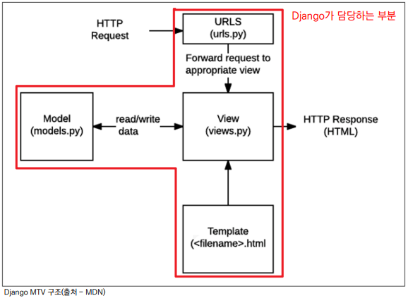

# ✔ 소프트웨어 디자인 패턴 (Software Design Pattern)

> Software Design Pattern

- Design Pattern: 건축 분야에서 사용된 용어, 여러 번 짓다보니 자주 사용되는 구조가 있다는 것을 알게 되어 이를 일반화해서 하나의 공법으로 만들어 둔 것
- 소프트웨어도 수십년간 전 세계의 개발자들이 계속 만들다 보니 자주 사용되는 구조가 있다는 것을 알게 되었고, 공통적으로 발생하는 문제에 대해 재사용 가능한 해결책이 있다는 것을 알게 됨
- 클라이언트-서버 구조도 소프트웨어 디자인 패턴 중 하나
- 자주 사용되는 소프트웨어의 구조를 일반적으로 구조화 해둔 것
- 다수의 엔지니어들이 일반화된 패턴으로 소프트웨어 개발을 할 수 있도록 한 규칙

> Django에서의 Design Pattern

- Django에 적용된 디자인 패턴은 **MTV 패턴**
- MTV 패턴: MVC 디자인 패턴을 기반으로 조금 변형된 패턴
  - 두 패턴은 서로 크게 다른 점은 없으며 일부 역할에 대해 부르는 이름이 다름

    | MVC        | MTV      |
    |:----------:|:--------:|
    | Model      | Model    |
    | View       | Template |
    | Controller | View     |

# ✔ MTV Design Pattern

> MVC Design Pattern

- MVC는 Model - View – Controller의 준말
- 데이터 및 논리 제어를 구현하는데 널리 사용되는 소프트웨어 디자인 패턴
- 하나의 큰 프로그램을 세가지 역할로 구분한 개발 방법론
  
  - `Model`: **데이터**와 관련된 로직을 관리
  - `View`: **레이아웃**과 **화면**을 처리
  - `Controller`: 명령을 **Model & View로 연결**
  
- MVC 디자인 패턴의 목적
  - 더 나은 업무의 분리와 향상된 관리를 제공
  - 각 부분을 독립적으로 개발할 수 있어, 하나를 수정하고 싶을 때 모두 건들지 않아도 됨
  - 개발 효율성 및 유지보수가 쉬워짐
  - 다수의 멤버로 개발하기 용이함

> MTV Design Pattern

- MTV는 Model - Template – View의 준말
- Django는 MTV 디자인 패턴을 가지고 있음
  
  - `Model`: **데이터** 관련
  - `Template`: **화면** 관련
  - `View`: **Model & Template 중간 처리** 및 응답 반환

1. Model

   - 데이터와 관련된 로직을 관리
   - 응용프로그램의 데이터 구조를 정의하고 데이터베이스의 기록을 관리
   - MVC 패턴에서 Model의 역할에 해당

2. Template

   - 레이아웃과 화면을 처리
   - 화면상의 사용자 인터페이스 구조와 레이아웃을 정의
   - MVC 패턴에서 View의 역할에 해당

3. View

   - Model & Template과 관련한 로직을 처리해서 응답을 반환
   - 클라이언트의 요청에 대해 처리를 분기하는 역할
     - 데이터가 필요하다면 model에 접근해서 데이터를 가져오고
     - 가져온 데이터를 template로 보내 화면을 구성하고
     - 구성된 화면을 응답으로 만들어 클라이언트에게 반환
   - MVC 패턴에서 Controller의 역할에 해당

   