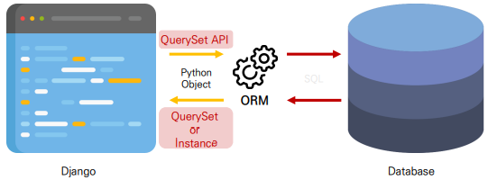

# ✔ ORM
- DB와 ORM 관련 추가 설명 👉 [Database](https://github.com/hyejinny97/TIL/tree/master/Database)
- Object-Relational-Mapping
- 객체 지향 프로그래밍에서 데이터베이스을 연동할 때, 데이터베이스와 객체 지향 프로그래밍 언어 간의 호환되지 않는 데이터를 변환하는 프로그래밍 기법
- Django는 내장 Django ORM을 사용
- 한 마디로 SQL을 사용하지 않고 데이터베이스를 조작할 수 있게 만들어주는 매개체

  

- 장점
  - SQL을 잘 알지 못해도 객체지향 언어로 DB 조작이 가능
  - 객체 지향적 접근으로 인한 높은 생산성
- 단점
  - ORM 만으로 세밀한 데이터베이스 조작을 구현하기 어려운 경우가 있음


# ✔ ORM 실습 편의를 위한 외부 라이브러리 설치 및 설정
> IPython 설치
- 파이썬 기본 쉘보다 더 강력한 파이썬 쉘

  ```bash
  $ pip install ipython
  ```

- 참고) Shell
  - 운영체제 상에서 다양한 기능과 서비스를 구현하는 인터페이스를 제공하는 프로그램
  - Shell(껍데기), 사용자와 운영 체제의 내부사이의 인터페이스를 감싸는 층이기 때문에 그러한 이름이 붙음
  - 사용자 <–> 셸 <–> 운영체제

- 참고) Python Shell
  - 파이썬 코드를 실행해주는 인터프리터
  - 인터렉티브 혹은 대화형 shell 이라고 부름
  - Python 명령어를 실행하여 그 결과를 바로 제공
  
    ```bash
    $ python -i
    ```

> django-extensions 설치 및 설정
- Django 확장 프로그램 모음
- shell_plus, graph model 등 다양한 확장 기능 제공

  ```bash
  $ pip install django-extensions
  ```

  ```python
  # settings.py

  INSTALLED_APPS = [
    'django_extensions',
    ...,
  ]
  ```

> Django shell
- ORM 관련 구문 연습을 위해 파이썬 쉘 환경을 사용
- 다만 일반 파이썬 쉘을 통해서는 장고 프로젝트 환경에 영향을 줄 수 없기 때문에, Django환경 안에서 진행할 수 있는 Django shell을 사용
- 원래는 다음과 같은 명령어를 통해 Django shell을 사용하지만
  
  ```bash
  $ python manage.py shell
  ```

- django-extension이 제공하는 더 강력한 shell_plus로 진행
  
  ```bash
  $ python manage.py shell_plus
  ```

  ```bash
  # Shell Plus Model Imports
  from articles.models import Article
  from django.contrib.admin.models import LogEntry
  from django.contrib.auth.models import Group, Permission, User
  from django.contrib.contenttypes.models import ContentType
  from django.contrib.sessions.models import Session
  # Shell Plus Django Imports
  from django.core.cache import cache
  from django.conf import settings
  from django.contrib.auth import get_user_model
  from django.db import transaction
  from django.db.models import Avg, Case, Count, F, Max, Min, Prefetch, Q, Sum, When
  from django.utils import timezone
  from django.urls import reverse
  from django.db.models import Exists, OuterRef, Subquery
  Python 3.9.13 (main, Aug 24 2022, 22:54:29)
  Type 'copyright', 'credits' or 'license' for more information
  IPython 8.4.0 -- An enhanced Interactive Python. Type '?' for help.
 
  In [1]: 
  ```


# ✔ QuerySet API
> Database API
- Django가 제공하는 ORM을 사용해 데이터베이스를 조작하는 방법
- Model을 정의하면 데이터를 만들고 읽고 수정하고 지울 수 있는 API를 제공
- Database API 구문
  
  ```
  Article.objects.all()
  ```

  - Article: `Model class`
  - objects: `Manager`
  - all(): `Queryset API`

1. Objects manager
 
   - Django 모델이 데이터베이스 쿼리 작업을 가능하게 하는 인터페이스
   - Django는 기본적으로 모든 Django 모델 클래스에 대해 objects 라는 Manager 객체를 자동으로 추가함
   - 이 Manager를 통해 특정 데이터를 조작할 수 있음
   - DB를 Python class로 조작할 수 있도록 여러 메서드를 제공하는 manager

2. QuerySet
   
   - 파이썬으로 작성한 코드가 ORM의 의해 SQL로 변환되어 데이터베이스에 전달되며, 데이터베이스의 응답 데이터를 ORM이 QuerySet이라는 자료 형태로 변환하여 우리에게 전달
   - 데이터베이스에게서 전달 받은 **객체 목록**(데이터 모음)
   - objects manager를 사용하여 복수의 데이터를 가져오는 queryset method를 사용할 때 반환되는 객체
   - 단, 데이터베이스가 단일한 객체를 반환 할 때는 QuerytSet이 아닌 모델(Class)의 인스턴스로 반환됨

3. QuerySet API

   - QuerySet과 상호작용하기 위해 사용하는 도구 (메서드, 연산자 등)

     

> QuerySet API를 활용한 CRUD
- Create (생성) / Read (조회) / Update (수정) / Delete (삭제)
- 대부분의 컴퓨터 소프트웨어가 가지는 기본적인 데이터 처리 기능 4가지

> 데이터 생성 (CREATE)

1. `create()` 메서드 활용하는 방법
   
   ```python
   Article.objects.create(title='third', content='django!')
   ```

2. 인스턴스를 이용해 조작하는 방법 (1)

   ```python
   article = Article()
   article.title = 'first' 
   article.content = 'django!'
   article.save() 
   ```

   - 클래스를 통한 인스턴스 생성
   - 클래스 변수명과 같은 이름의 인스턴스 변수를 생성 후 값 할당
   - 인스턴스로 save 메서드 호출해 DB에 값 저장

   ```python
   article
   # <Article: Article object (1)>

   article.id
   # 1

   article.pk
   # 1

   article.title
   # 'first'

   article.content
   # 'django!'

   article.created_at
   # datetime.datetime(2022, 8, 21, 2, 43, 56, 49345, tzinfo=<UTC>)
   ```

   - DB 테이블의 컬럼 이름이 id 임에도 pk를 사용할 수 있는 이유는 Django가 제공하는 shortcut이기 때문
   - 단순히 모델 클래스를 통해 인스턴스를 생성하는 것은 DB에 영향을 미치지 않기 때문에 반드시 save를 호출해야 테이블에 레코드가 생성됨

3. 인스턴스를 이용해 조작하는 방법 (2)
   
   ```python
   article = Article(title='second', content='django!')
   article.save()
   ```

   - 인스턴스 생성 시 초기 값을 함께 작성하여 생성

> 데이터 조회 (READ)

1. 전체 데이터 조회 - `all()`

   ```python
   Article.objects.all()
 
   # <QuerySet [<Article: Article object (1)>, <Article: Article object (2)>]>
   ```

2. 단일 데이터 조회 - `get()`
   
   ```python
   Article.objects.get(pk=1)
 
   # <Article: Article object (1)>
   ```

   - 객체를 찾을 수 없으면 DoesNotExist 예외를 발생시킴
   - 둘 이상의 객체를 찾으면 MultipleObjectsReturned 예외를 발생시킴
   - 따라서, primary key와 같이 고유성(uniqueness)을 보장하는 조회에서 사용해야 함

3. 일부 데이터 조회 - `filter()`

   ```python
   Article.objects.filter(content='django!')

   # <QuerySet [<Article: Article object (1)>, <Article: Article object (3)>]>
   ```

   - 조회된 객체가 없거나 1개여도 QuerySet을 반환

> 데이터 수정 (UPDATE)

1. 인스턴스를 이용해 조작하는 방법

   ```python
   article = Article.objects.get(pk=1)
   article.title = 'byebye'
   article.save()
   ```

   - 수정하고자 하는 article 인스턴스 객체를 조회 후 반환 값을 저장
   - article 인스턴스 객체의 인스턴스 변수 값을 새로운 값으로 할당
   - save() 인스턴스 메서드 호출

> 데이터 삭제 (DELETE)

1. `delete()` 메서드 활용하는 방법
   
   ```python
   article = Article.objects.get(pk=1)
   article.delete()
   ```

   - 삭제하고자 하는 article 인스턴스 객체를 조회 후 반환 값을 저장
   - delete() 인스턴스 메서드 호출