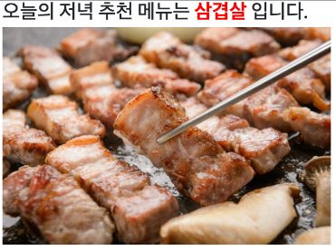
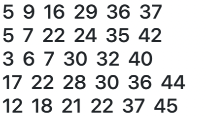
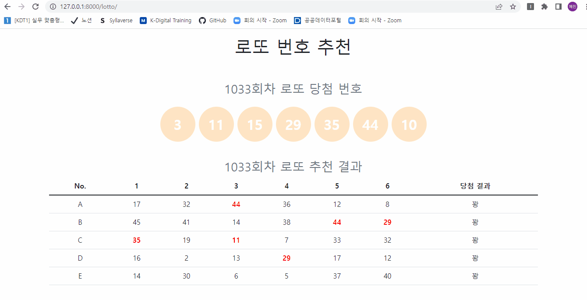

# 장고 실습 01 - 요청(request)/반응(response) 기초 실습

## 과정
- [목표](#목표)
- [요구사항](#요구-사항)
- [실습 결과 완성본](#실습-결과-완성본)

## 목표
- URL-views-template을 구성하는 과정에서 요청/반응 과정을 익힘
- 템플릿 변수 사용법을 익힘

## 요구 사항
> today-dinner 주소

- today-dinner 주소를 요청하면 랜덤으로 저녁 메뉴와 메뉴 이미지를 추천해주는 화면을 응답하는 프로그램을 개발합니다.
- 예시
  
  

> 로또 번호 추첨 주소

- lotto 주소를 요청하면 랜덤으로 로또 다섯 줄을 뽑아주는 화면을 응답하는 프로그램을 개발합니다.
- 예시

  

## 실습 결과 완성본
> today-dinner 주소

> 로또 번호 추첨 주소

