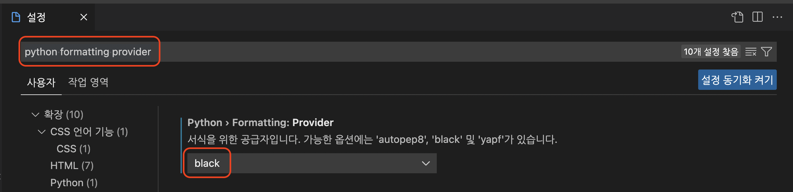
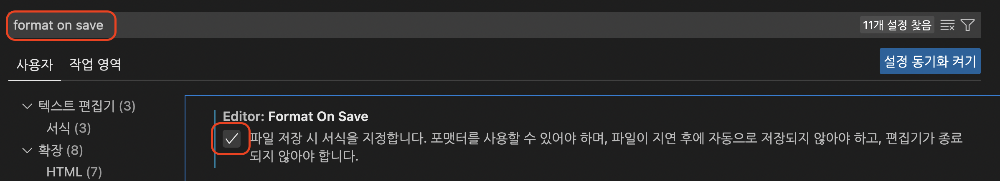
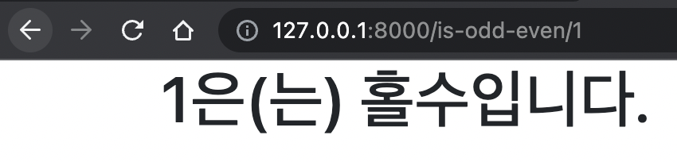
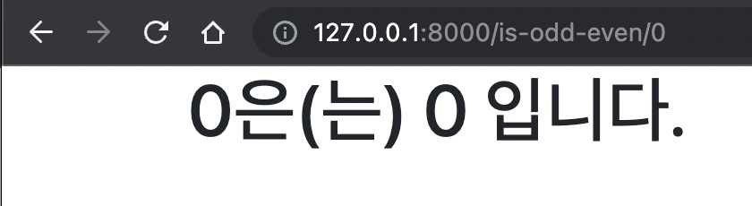
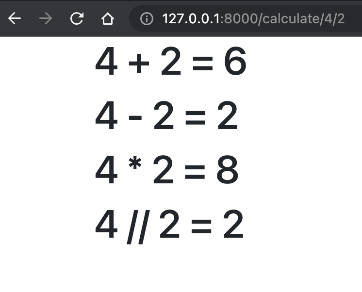
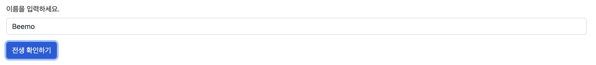
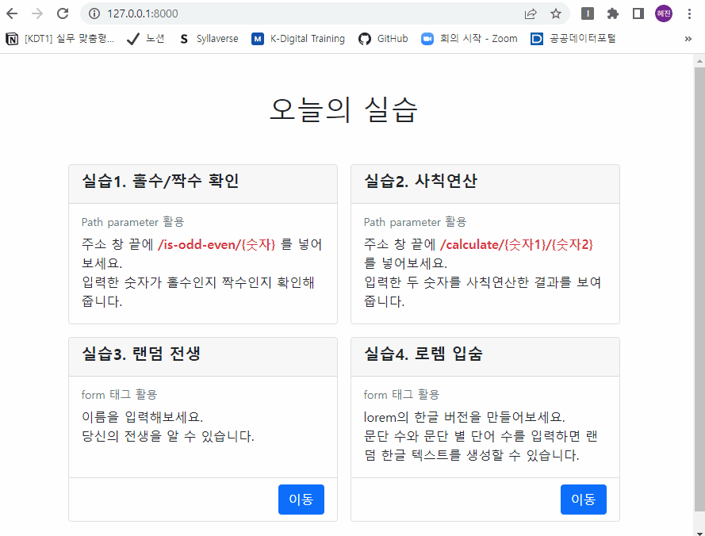

# 장고 실습 02 - form 데이터 주고 받기 실습


## 과정
- [목표](#목표)
- [준비 사항](#준비-사항)
- [요구 사항](#요구-사항)
- [실습 결과 완성본](#실습-결과-완성본)


## 목표
- variable router 활용하는 법 학습
- HTML form element를 통해 데이터를 보내고 가져오는 법 학습


## 준비 사항
> Code Formatter black 설정

- Code Formatter는 1인 개발에서는 코드 스타일에 대한 고민을 줄여주고, 2명 이상의 프로젝트에서 코드 스타일을 통일하기 위해 사용합니다. 
- 참고 사이트
  - [Python Code Formatter Black 적용기](https://jiku90.tistory.com/12)
  - [vscode에서 black으로 code format 자동화하기](https://lovedh.tistory.com/entry/vscode%EC%97%90%EC%84%9C-black%EC%9C%BC%EB%A1%9C-code-format-%EC%9E%90%EB%8F%99%ED%99%94%ED%95%98%EA%B8%B0-python)

1. black 패키지 설치 (가상환경 마다 설치해야함)
   
   ```bash
   $ pip install black
   ```

2. vscode python formatting provider 설정

   

3. vscode format on save 체크
   
   

4. 파이썬 코드 수정 후 저장하기


## 요구 사항
> [url] 입력한 숫자가 홀수인지 짝수인지 확인하기
- 숫자를 입력하면 숫자가 홀수인지 짝수인지 0인지 판단하고 화면에 표시하는 프로그램을 개발하세요.
- 해당 프로그램은 **Path parameter**를 활용해야 합니다.
  - 주소창에 직접 값을 넣는 형태로 실습을 진행합니다.(form 사용 x)
  - EX) is-odd-even/1 , is-odd-even/2 , is-odd-even/0 
- 화면 예시
  
  

  

  

> [url] 사칙연산 수행하기
- 숫자 2개를 입력하면 사칙연산 수행 결과를 화면에 표시하는 프로그램을 개발하세요.
- 해당 프로그램은 **Path parameter**를 활용해야 합니다.
  - 주소창에 직접 값을 넣는 형태로 실습을 진행합니다.(form 사용 x)
  - 사칙연산은 view에서 수행합니다. view에서 연산한 결과를 템플릿에 출력합니다.
- 화면 예시
  
  

> [form] 랜덤 전생
- 이름을 입력하면 랜덤으로 대상의 전생을 화면에 표시하는 프로그램을 개발하세요. 
- 또는 [봉봉](https://kr.vonvon.me/) 사이트를 참고해서 랜덤 게임을 개발하세요.
- 해당 프로그램은 **form 태그**를 활용하여 사용자에게 텍스트 1개를 입력 받아야 합니다.
  - 페이지 2개를 만듭니다. 
    - 이름을 입력하는 폼이 있는 페이지
    - 랜덤으로 전생을 출력하는 페이지
- 화면 예시
  - 이름 입력 페이지
    
    

  - 전생 확인 페이지

    

> [form] 로렘 입숨 한글 버전
- <https://www.lipsum.com/>의 한글 버전 프로그램을 개발하세요.
- 해당 프로그램은 **form 태그**를 활용하여 사용자에게 숫자 2개를 입력 받아야 합니다.
  - 문단의 수
  - 문단 별 단어의 수
    - 사용할 단어 꾸러미는 자유롭게 만들어주세요. 
- 생성 버튼을 누르면 랜덤 한글 텍스트를 생성하고 텍스트를 화면에 표시합니다.
- 화면 예시
  - 문단 수, 단어 수 입력 페이지
  
    

  - 텍스트 확인 페이지

    


## 실습 결과 완성본

