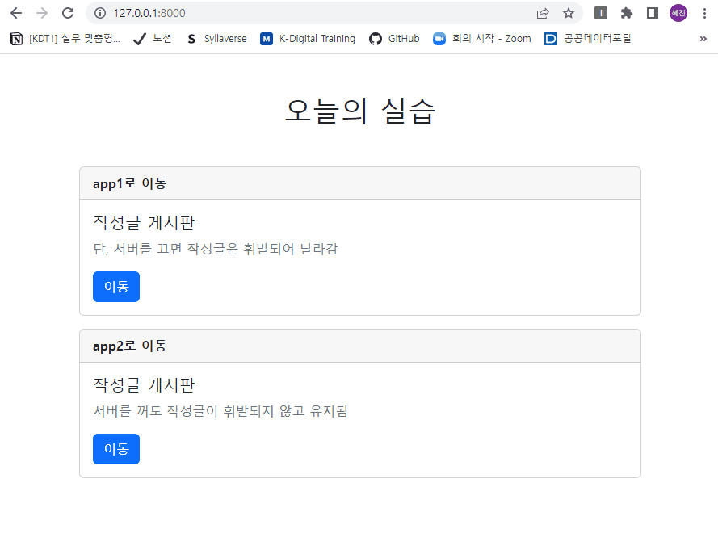

# 장고 실습 04 - Django urls/templates 분리, models 적용 실습


## 과정
- [목표](#목표)
- [준비 사항](#준비-사항)
- [요구 사항](#요구-사항)
- [실습 결과 완성본](#실습-결과-완성본)


## 목표
- App URL Mapping 학습
- templates 내 디렉토리 생성을 통해 물리적으로 이름공간을 구분해 줌으로써 Template Namespace를 학습
- models을 활용해 DB 조작해보기


## 준비 사항
> Code Formatter black 설정

  ```bash
  $ pip install black
  ```


## 요구 사항
- 앱이름 'home', 'app1', 'app2'를 생성
- 각 앱 내에 urls.py을 만들어 url 따로 관리
- 각 앱 내에 templates 폴더를 만들어 템플릿을 따로 관리
- 상속해 줄 골격 템플릿 (base.html)은 현 폴더 최상단에 위치시키고, 찾을 수 있도록 settings.py 내 TEMPLATES 리스트 속성 변경해주기

> home 앱
- 루트 경로로 들어오는 url를 관리함
- 홈 화면 페이지와 연결해줌
- 홈페이지에는 `/app1/`으로 이동시켜주는 버튼과 `/app2/`로 이동시켜주는 버튼이 있음

> app1 앱
- 입력란과 제출 버튼이 있는 폼이 있음
- 입력란에 text를 적고 제출을 하면, 폼 아래에 지금까지 제출한 모든 텍스트가 차례대로 나타나게 해야함
  - views.py 내 전역**변수**에 제출된 텍스트를 저장해 놓음
- 단, 서버가 돌아가는 동안에만 제출된 텍스트가 유지되고, 서버를 꺼버리면 휘발됨

> app2 앱
- 입력란과 제출 버튼이 있는 폼이 있음
- 입력란에 text를 적고 제출을 하면, 폼 아래에 지금까지 제출한 모든 텍스트가 차례대로 나타나게 해야함
  - django의 models.py를 이용해 제출된 텍스트를 **DB**에 저장시킴
- 따라서, 서버가 꺼져도 제출된 텍스트는 항상 유지됨


## 실습 결과 완성본
> app1 앱


> app2 앱

