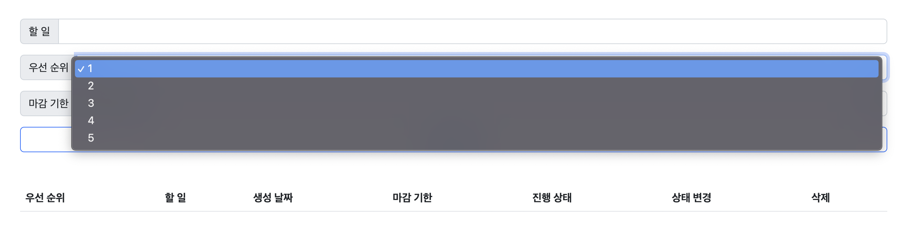
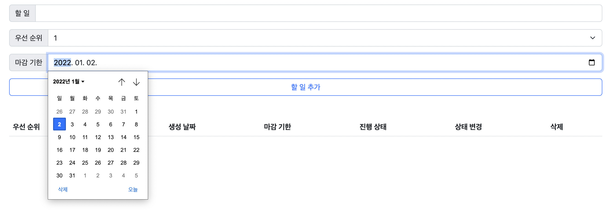
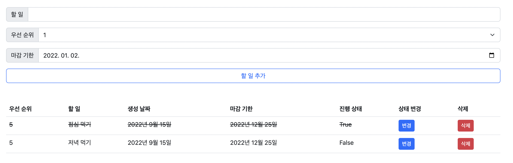

# 장고 실습 05 - Django CRUD를 통해 메모 사이트 구현 실습

## 과정

- [목표](#목표)
- [준비 사항](#준비-사항)
- [요구 사항](#요구-사항)
- [실습 결과 완성본](#실습-결과-완성본)
- [실습 후기](#실습-후기)

## 목표

- URL Patterns Name 학습
- models을 활용해 DB 조작해보기
- view 함수를 통해 데이터 생성, 조회, 수정, 삭제(CRUD) 구현
- CRUD 기능을 가진 Todo 서비스를 개발

## 준비 사항

> Code Formatter black 설정

```bash
$ pip install black
```

## 요구 사항

> 모델 Model - `M`

- 모델은 아래 조건을 만족해야 합니다.
- 다만, 기능 추가를 위해 필드를 추가해도 됩니다.
- 모델 이름 : Todo
- 모델 필드 및 속성

  | 필드 이름      | 역할     | 데이터 타입  | 속성                |
  |:----------:|:------:|:-------:|:-----------------:|
  | content    | 할 일 내용 | Char    | max_length=80     |
  | completed  | 완료 여부  | Boolean | default=False     |
  | priority   | 우선순위   | Integer | default=3         |
  | created_at | 생성 날짜  | Date    | auto_now_add=True |
  | deadline   | 마감 기한  | Date    | null=True         |

> 기능 View - `V`

- 아래 기능을 구현합니다.

1. 할 일 추가하기 `Create`
  
   - create() 메소드를 활용합니다.
   - 내용/우선 순위/마감 기한 데이터를 사용자에게 입력받아서 데이터를 생성합니다.
   - 할 일 목록 페이지로 redirect 합니다.

2. 할 일 목록 보기 `Read`

   - 모든 데이터를 id를 기준으로 오름차순으로 정렬해서 불러옵니다.
   - 불러온 데이터를 템플릿에서 반복문을 사용해 1개씩 화면에 표시합니다.

3. 할 일 완료(completed) 여부(True / False) 변경하기 `Update`

   - 삭제할 할 일의 id가 필요합니다.
   - get() 메소드를 사용하여 변경할 데이터를 불러옵니다.
   - 불러온 데이터의 상태를 변경 후 저장합니다.
   - 할 일 목록 페이지로 redirect 합니다.

4. 할 일 삭제하기 `Delete`

   - 삭제할 할 일의 id가 필요합니다.
   - get() 메소드를 사용하여 변경할 데이터를 불러옵니다.
   - 불러온 데이터를 삭제합니다.
   - 할 일 목록 페이지로 redirect 합니다.


> 화면 Template - `T`

1. 할 일 추가 폼 `<form>`

   - 할 일
     - `<input type = “text”>` 태그를 활용합니다. 
     - 최대 입력 길이는 80입니다.
   
   - 우선 순위
     - `<select> <option>` 태그를 활용합니다.
     - 참고 자료 : <https://thrillfighter.tistory.com/572>
  
   - 마감 기한
     - `<input type="date">` 태그를 활용합니다.
  
   - 할 일 추가 버튼
     - `<input type=”submit”>` 태그를 활용합니다.

     

     

2. 할 일 목록 테이블 `<table>`

   - `<thead>`
     - 우선 순위 / 할 일 내용 / 생성 날짜 / 마감 기한 / 진행 상태 / 상태 변경 / 삭제 를 테이블 헤더로 사용합니다.

   - `<tbody>`
     - id를 기준으로 오름차순으로 정렬한 모든 데이터를 화면에 표시합니다.

   - 변경 버튼
     - 버튼을 누르면 해당 할 일의 상태(True / False)가 수정됩니다.
   
   - 삭제 버튼
     - 버튼을 누르면 해당 할 일이 삭제됩니다.

     


## 실습 결과 완성본


## 실습 후기

위 실습에서는 todo 글 작성한 후 create하거나 기존 글을 update/delete할 때, GET method로 요청해주었다. 이 method로 서버에 요청할 경우에 보안상 문제가 생길 수 있다는 것을 배웠지만, 어떻게 해결해야하는지는 아직 배우지 않았다. 아마 GET이 아닌 POST method를 이용해 보내면, url에 query string parameter 형태로 보내지지 않기 때문에 보완 문제를 해결할 수 있지 않을까 추측해본다. 추후 GET method을 사용함으로써 발생할 수 있는 보안 문제를 해결하는 법을 배우게 되면, 앞으로 CUD를 구현할 때 좀 더 안전하게 작동하도록 로직을 짤 수 있을 것 같다.