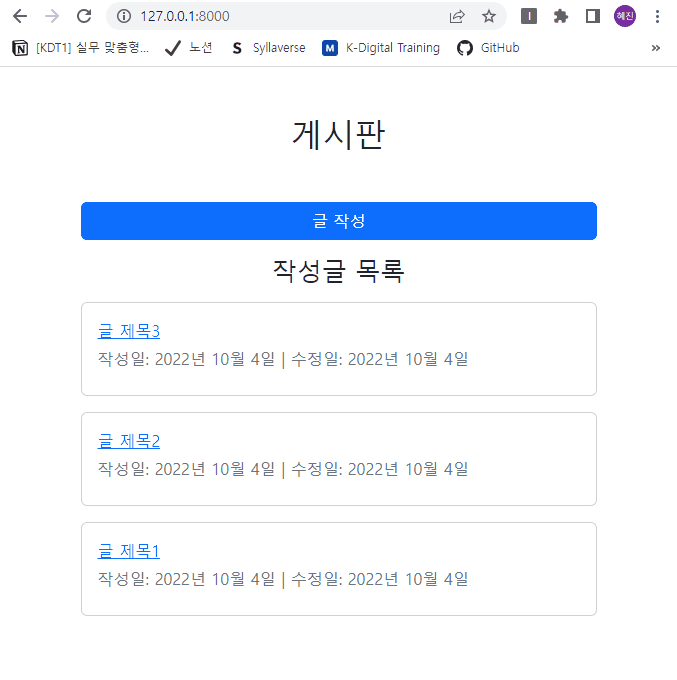

# 장고 실습 06 - Django ModelForm을 활용한 게시판 구현 실습

## 과정

- [목표](#목표)
- [준비 사항](#준비-사항)
- [요구 사항](#요구-사항)
- [실습 결과 완성본](#실습-결과-완성본)

## 목표

- CUD 구현 시, GET이 아닌 POST로 request
- csrf_token 사용
- view 함수를 통해 데이터 생성, 조회, 수정, 삭제(CRUD) 구현
- ModelForm을 활용해 create & update 구현
- CRUD 기능을 가진 게시판 서비스를 개발

## 준비 사항
> 가상 환경 생성 및 실행

```bash
$ python -m venv venv
```

```bash
$ source venv/Scripts/activate
```

> Django & Code Formatter black 설치

```bash
$ pip install django==3.2.13
```

```bash
$ pip install black
```

> 설치된 패키지 목록 기록

```bash
$ pip freeze > requirements.txt
```

> 장고 프로젝트 생성 & 앱 생성 및 앱 등록

```bash
$ django-admin startproject pjt .
```

```bash
$ python manage.py startapp articles
```

> SECRET KEY 분리 설정

- secrets.json
  
  ```json
  {
      "SECRET_KEY": "new secret key"
  }
  ```

- settings.py 수정
  
  ```python
  import os, json
  from django.core.exceptions import ImproperlyConfigured

  secret_file = os.path.join(BASE_DIR, 'secrets.json') # secrets.json 파일 위치를 명시

  with open(secret_file) as f:
      secrets = json.loads(f.read())

  def get_secret(setting, secrets=secrets):
      try:
          return secrets[setting]
      except KeyError:
          error_msg = "Set the {} environment variable".format(setting)
          raise ImproperlyConfigured(error_msg)

  SECRET_KEY = get_secret("SECRET_KEY")
  ```

- .gitignore에 추가
  
  ```
  secrets.json
  ```

> .gitignore 설정

  ```
  .venv
  ```


## 요구 사항

> 모델 Model - `M`

- 모델은 아래 조건을 만족해야 합니다.

- 다만, 기능 추가를 위해 필드를 추가해도 됩니다.

- 모델 이름 : Articles

- 모델 필드 및 속성
  
  | 필드 이름      | 역할    | 데이터 타입 | 속성                |
  |:----------:|:-----:|:------:|:-----------------:|
  | title      | 글 제목  | Char   | max_length=80     |
  | content    | 글 내용  | Text   |                  |
  | created_at | 생성 날짜 | Date   | auto_now_add=True |
  | updated_at | 수정 날짜 | Date   | auto_now=True     |

> 기능 View - `V`

- 아래 기능을 구현합니다.

1. 글 작성 페이지 들어가기/작성한 글 생성하기 `Create`
   
   - ModelForm을 활용해 글 작성 페이지 구현합니다.
   - 글 저장 시, 제목/내용을 사용자에게 입력받습니다.
   - 입력된 데이터가 유효할 경우, DB에 저장하고 상세 페이지로 redirect 합니다.
   - 입력된 데이터가 유효하지 않을 경우, 글 작성 페이지로 다시 render 합니다.

2. 글 목록 보기 `Read`
   
   - 모든 데이터를 pk을 기준으로 내림차순으로 정렬해서 불러옵니다.
   - 불러온 데이터를 템플릿에서 반복문을 사용해 1개씩 화면에 표시합니다.

3. 글 수정 페이지 들어가기/수정한 글 저장하기 `Update`
   
   - 수정할 글의 id가 필요합니다.
   - get() 메소드를 사용하여 변경할 데이터를 불러옵니다.
   - ModelForm을 활용해 글 수정 페이지 구현합니다.
   - 글 수정한 후 저장 시, 제목/내용을 사용자에게 입력받습니다.
   - 입력된 데이터가 유효할 경우, DB에 저장하고 상세 페이지로 redirect 합니다.
   - 입력된 데이터가 유효하지 않을 경우, 글 수정 페이지로 다시 render 합니다.

4. 글 삭제하기 `Delete`
   
   - 삭제할 할 일의 id가 필요합니다.
   - get() 메소드를 사용하여 변경할 데이터를 불러옵니다.
   - 불러온 데이터를 삭제합니다.
   - 글 목록 페이지로 redirect 합니다.

> 화면 Template - `T`

1. 글 목록 페이지 - `index.html`
 
2. 글 작성 및 저장 페이지 - `create.html`

3. 글 상세 페이지 - `detail.html`

4. 글 수정 및 저장 페이지 - `update.html`


## 실습 결과 완성본

