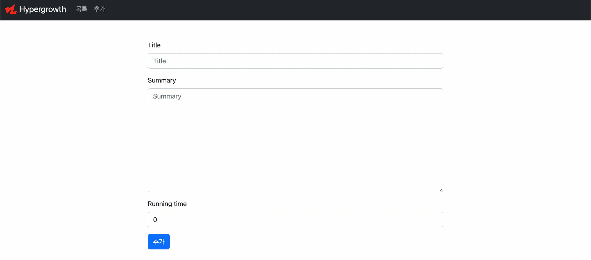
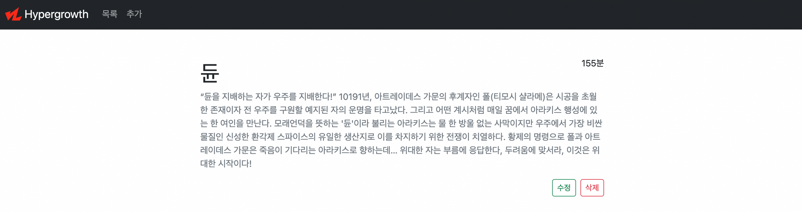
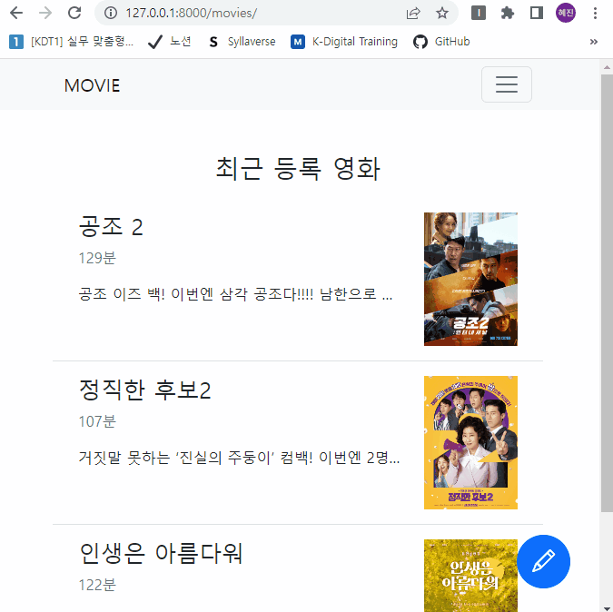
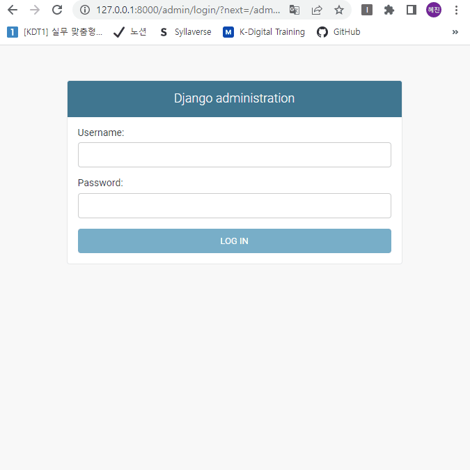

# 장고 실습 08 - Django 영화 정보 제공 사이트 개발 실습

## 과정

- [목표](#목표)
- [준비 사항](#준비-사항)
- [요구 사항](#요구-사항)
- [실습 결과 완성본](#실습-결과-완성본)

## 목표

- view 함수를 통해 데이터 생성, 조회, 수정, 삭제(CRUD) 구현
- Django ModelAdmin을 활용해 admin 사이트 구현
- django-bootstrap5 패키지 활용
- ModelForm / Staticfiles를 활용한 영화 정보 제공 서비스를 개발

## 준비 사항

> 가상 환경 생성 및 실행

```bash
$ python -m venv venv
```

```bash
$ source venv/Scripts/activate
```

> Django & Code Formatter black 설치

```bash
$ pip install django==3.2.13
```

```bash
$ pip install black
```

> 설치된 패키지 목록 기록

```bash
$ pip freeze > requirements.txt
```

> 장고 프로젝트 생성 & 앱 생성 및 앱 등록

```bash
$ django-admin startproject pjt .
```

```bash
$ python manage.py startapp articles
```

> SECRET KEY 분리 설정

- secrets.json
  
  ```json
  {
      "SECRET_KEY": "new secret key"
  }
  ```

- settings.py 수정
  
  ```python
  import os, json
  from django.core.exceptions import ImproperlyConfigured
  
  secret_file = os.path.join(BASE_DIR, 'secrets.json') # secrets.json 파일 위치를 명시
  
  with open(secret_file) as f:
      secrets = json.loads(f.read())
  
  def get_secret(setting, secrets=secrets):
      try:
          return secrets[setting]
      except KeyError:
          error_msg = "Set the {} environment variable".format(setting)
          raise ImproperlyConfigured(error_msg)
  
  SECRET_KEY = get_secret("SECRET_KEY")
  ```

- .gitignore에 추가
  
  ```
  secrets.json
  ```

> .gitignore 설정

```
.venv
```

> Django Template auto formatting

- 참고 사이트: [VSCode에서 Django 템플릿 오토 포매팅하기](https://velog.io/@junsikchoi/VSCode%EC%97%90%EC%84%9C-Django-%ED%85%9C%ED%94%8C%EB%A6%BF-%EC%98%A4%ED%86%A0-%ED%8F%AC%EB%A7%A4%ED%8C%85%ED%95%98%EA%B8%B0)

- extension 설치할 것들
  
  - Unibeautify - Universal Formatter
  - Django
  - Python

- VSCode settings.json에서 추가 설정
  
  ```json
  {
    "files.associations": {
      "**/*.html": "html",
      "**/templates/**/*.html": "django-html",
      "**/templates/**/*": "django-txt",
      "**/requirements{/**,*}.{txt,in}": "pip-requirements"
    },
    "emmet.includeLanguages": {
      "django-html": "html"
    },
    "unibeautify.enabled": true,
    "[django-html]": {
      "editor.formatOnSave": true,
      "editor.defaultFormatter": "Glavin001.unibeautify-vscode"
    }
  }
  ```

## 요구 사항

### ▶ 기본 요구 사항 - 영화 정보 등록 페이지

> 모델 Model - `M`

- 모델은 아래 조건을 만족해야 합니다.

- 다만, 기능 추가를 위해 필드를 추가해도 됩니다.

- 모델 이름 : Movie

- 모델 필드 및 속성
  
  | 필드 이름        | 역할       | 데이터 타입  | 속성            |
  |:------------:|:--------:|:-------:|:-------------:|
  | title        | 영화 제목    | Char    | max_length=80 |
  | summary      | 줄거리      | Text    |               |
  | running_time | 영화 상영 시간 | Integer |               |

> 기능 View - `V`

- 아래 기능을 구현합니다.

- 생성 및 수정은 ModelForm을 사용하여 구현합니다.
1. 영화 데이터 목록 조회
   
   - `GET` `http://127.0.0.1:8000/movies/`

2. 영화 데이터 정보 조회
   
   - `GET` `http://127.0.0.1:8000/movies/<int:pk>/`

3. 영화 데이터 생성
   
   - `POST` `http://127.0.0.1:8000/movies/create/`

4. 영화 데이터 수정
   
   - `POST` `http://127.0.0.1:8000/movies/<int:pk>/update/`

5. 영화 데이터 삭제
   
   - `POST` `http://127.0.0.1:8000/movies/<int:pk>/delete/`

> 화면 Template - `T`

- 아래 작성된 페이지를 구현합니다.
1. 네비게이션바, Bootstrap Navbar 컴포넌트
   
   - 서비스 로고
     - Django Staticfiles 활용
   - 목록 버튼
     - 클릭 시 메인 페이지로 이동
   - 추가 버튼
     - 클릭 시 정보 추가 페이지로 이동

2. 메인 페이지
   
   - `GET` `http://127.0.0.1:8000/movies/`
   - 영화 목록 출력
   - 제목을 클릭하면 해당 영화의 정보 페이지로 이동

3. 영화 정보 페이지
   
   - `GET` `http://127.0.0.1:8000/movies/<int:pk>/`
   - 해당 영화 정보 출력
   - 수정 / 삭제 버튼

4. 영화 작성 페이지
   
   - `GET` `http://127.0.0.1:8000/movies/create/`
   - 영화 정보 작성 폼

5. 영화 수정 페이지
   
   - `GET` `http://127.0.0.1:8000/movies/<int:pk>/update/` 
   - 영화 정보 수정 폼

> 참고 화면






> 디자인 참고 사이트

- [eo planet](https://eopla.net/)
- [surfit](https://www.surfit.io/)
- [Disquiet](https://disquiet.io/)
- [인살롱](https://hr.wanted.co.kr/hrevents/)
- [publy](https://publy.co/qna?fr=top-navi)
- [wanted](https://www.wanted.co.kr/community)
- [blind](https://www.teamblind.com/kr/topics/%EC%B1%84%EC%9A%A9-%EC%A0%84%EC%B2%B4)

### ▶ (추후 구현 예정) 영화 검색 페이지 추가 

> 영화 정보 사이트 전체적 구상

1. 홈 페이지 (영화 검색 페이지)
   
   - 구글의 홈페이지처럼 찾고자 하는 영화를 검색
   - [TMDB API](https://developers.themoviedb.org/3/getting-started/introduction)를 이용해서 TMDB와 내가 만든 DB의 데이터베이스에 검색한 영화 데이터가 있으면 상세 페이지로 이동해 영화 정보를 보여줌
   - 만약 TMDB와 내가 만든 DB의 데이터베이스에 검색한 영화 데이터가 없으면, 영화 등록 페이지로 이동하라는 메시지가 뜸

2. 영화 정보 등록 페이지
   
   - 위 요구 사항에 따라 페이지 구현

## 실습 결과 완성본

> 영화 정보 사이트



> Admin 사이트

