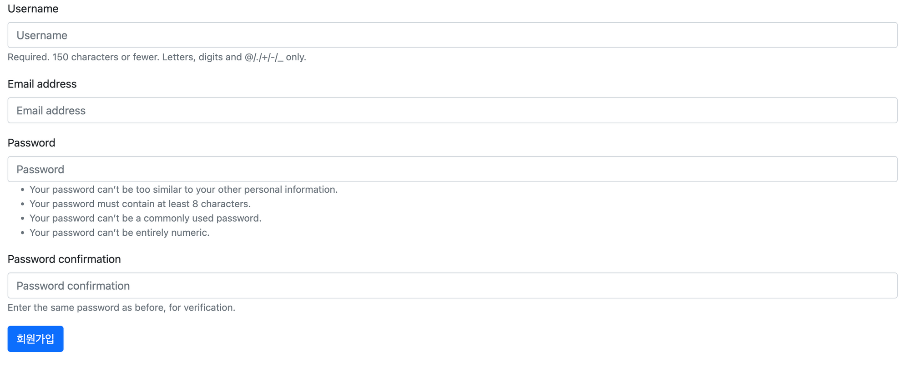
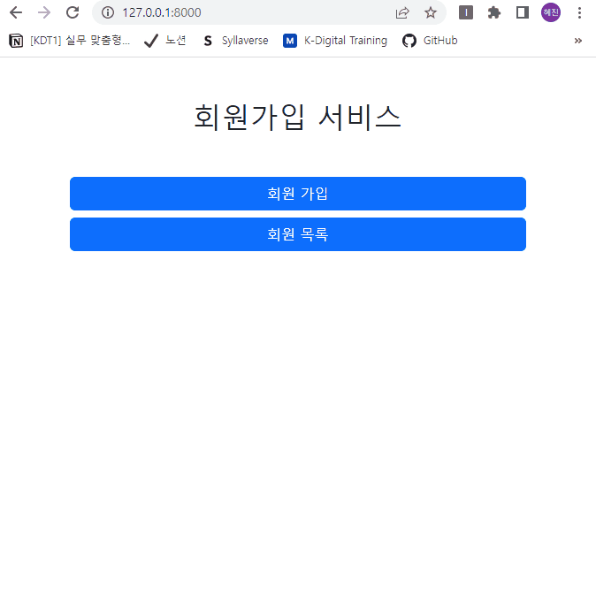
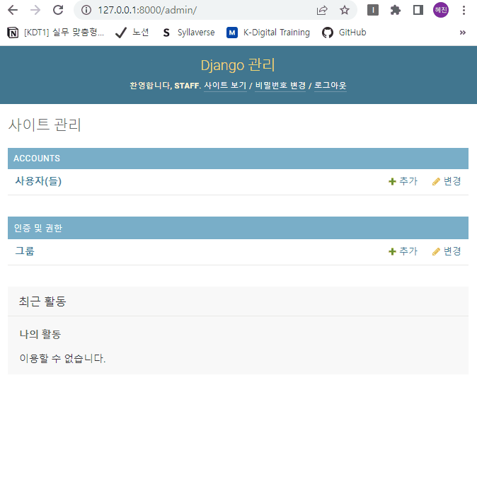

# 장고 실습 09 - Django Auth를 활용한 회원가입 서비스 개발

## 과정

- [목표](#목표)
- [준비 사항](#준비-사항)
- [요구 사항](#요구-사항)
- [실습 결과 완성본](#실습-결과-완성본)

## 목표

- Django Auth를 활용한 회원가입이 가능한 서비스를 개발합니다.

## 준비 사항

> 가상 환경 생성 및 실행

```bash
$ python -m venv venv
```

```bash
$ source venv/Scripts/activate
```

> 패키지 설치
1. Django 
  
   ```bash
   $ pip install django==3.2.13
   ```

2. Code Formatter black 
  
   ```bash
   $ pip install black
   ```

3. django-bootstrap5
  
   ```bash
   $ pip install django-bootstrap5
   ```

   - 패키지 설치 후, settings.py의 INSTALLED_APPS에 `'django_bootstrap5',` 추가

> 설치된 패키지 목록 기록

```bash
$ pip freeze > requirements.txt
```

> 장고 프로젝트 생성 & 앱 생성 및 앱 등록

```bash
$ django-admin startproject pjt .
```

```bash
$ python manage.py startapp accounts
```

> SECRET KEY 분리 설정

- secrets.json
  
  ```json
  {
      "SECRET_KEY": "new secret key"
  }
  ```

- settings.py 수정
  
  ```python
  import os, json
  from django.core.exceptions import ImproperlyConfigured
  
  secret_file = os.path.join(BASE_DIR, 'secrets.json') # secrets.json 파일 위치를 명시
  
  with open(secret_file) as f:
      secrets = json.loads(f.read())
  
  def get_secret(setting, secrets=secrets):
      try:
          return secrets[setting]
      except KeyError:
          error_msg = "Set the {} environment variable".format(setting)
          raise ImproperlyConfigured(error_msg)
  
  SECRET_KEY = get_secret("SECRET_KEY")
  ```

- .gitignore에 추가
  
  ```
  secrets.json
  ```

> .gitignore 설정

```
.venv
```


## 요구 사항

> 모델 Model - `M`

- 모델 이름 : User
- Django `AbstractUser 모델` 상속

> 폼 Form

- Django 내장 회원가입 폼인 `UserCreationForm`을 상속받은 `CustomUserCreationForm` 생성 후 활용
- 해당 폼은 아래 필드만 출력합니다.
  - username
  - email
  - password1
  - password2

> 기능 View - `V`

1. 회원가입 Create
  
   - `POST` `http://127.0.0.1:8000/accounts/signup/`
   - `CustomUserCreationForm`을 활용해서 회원가입 구현

2. 회원 목록 조회 Read(index)

   - `GET` `http://127.0.0.1:8000/accounts/`

3. 회원 정보 조회 Read(detail)

   - `GET` `http://127.0.0.1:8000/accounts/<int:user_pk>/`


> 화면 Template - `T`

1. 메인페이지
   
   - `GET` `http://127.0.0.1:8000/`
   - 회원가입 페이지 이동 버튼
   - 회원 목록 페이지 이동 버튼

     

2. 회원가입 페이지

   - `GET` `http://127.0.0.1:8000/accounts/signup/`
   - 회원가입 폼

     

3. 회원 목록 페이지

   - `GET` `http://127.0.0.1:8000/accounts/`
   - 회원 목록 테이블
   - username 클릭 시 해당 회원 조회 페이지(프로필 페이지)로 이동

     

4. 회원 조회 페이지(프로필 페이지)
   
   - `GET` `http://127.0.0.1:8000/accounts/<user_pk>/`
   - 회원 정보 출력


## 실습 결과 완성본

> 회원가입 서비스



> Admin 사이트

