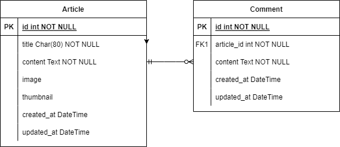
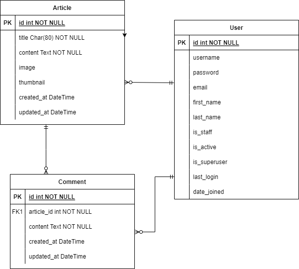

# 장고 실습 13 - 1:N 관계로 매핑된 게시글-댓글 게시판 서비스 개발

## 과정

- [목표](#목표)
- [준비 사항](#준비-사항)
- [요구 사항](#요구-사항)
- [추가 사항](#추가-사항)
- [실습 결과 완성본](#실습-결과-완성본)

## 목표

- 게시글과 댓글이 1:N 관계로 매핑된 게시글에 댓글을 작성할 수 있는 서비스를 개발합니다.

## 준비 사항

> 가상 환경 생성 및 실행

```bash
$ python -m venv venv
```

```bash
$ source venv/Scripts/activate
```

> 패키지 설치

1. Django 
   
   ```bash
   $ pip install django==3.2.13
   ```

2. Code Formatter black 
   
   ```bash
   $ pip install black
   ```

3. django-bootstrap5
   
   ```bash
   $ pip install django-bootstrap5
   ```
   
   - 패키지 설치 후, settings.py의 INSTALLED_APPS에 `'django_bootstrap5',` 추가

4. Pollow

```bash
$ pip install Pillow
```

5. django-imagekit
   
   ```bash
   $ pip install django-widget-tweaks
   ```
   
   - 패키지 설치 후, settings.py의 INSTALLED_APPS에 `'imagekit',` 추가

6. django-widget-tweaks
   
   ```bash
   $ pip install django-imagekit
   ```
   
   - 패키지 설치 후, settings.py의 INSTALLED_APPS에 `'widget_tweaks',` 추가

> 설치된 패키지 목록 기록

```bash
$ pip freeze > requirements.txt
```

> 장고 프로젝트 생성 & 앱 생성 및 앱 등록

```bash
$ django-admin startproject pjt .
```

```bash
$ python manage.py startapp articles
```

> SECRET KEY 분리 설정

- secrets.json
  
  ```json
  {
      "SECRET_KEY": "new secret key"
  }
  ```

- settings.py 수정
  
  ```python
  import os, json
  from django.core.exceptions import ImproperlyConfigured
  
  secret_file = os.path.join(BASE_DIR, 'secrets.json') # secrets.json 파일 위치를 명시
  
  with open(secret_file) as f:
      secrets = json.loads(f.read())
  
  def get_secret(setting, secrets=secrets):
      try:
          return secrets[setting]
      except KeyError:
          error_msg = "Set the {} environment variable".format(setting)
          raise ImproperlyConfigured(error_msg)
  
  SECRET_KEY = get_secret("SECRET_KEY")
  ```

- .gitignore에 추가
  
  ```
  secrets.json
  ```

> .gitignore 설정

```
.venv
```

## 요구 사항
- 게시글과 댓글이 1:N 관계로 매핑

  

> 모델 Model - `M`

- 모델 이름 : Article
- 모델 필드

  | 필드 이름      | 역할      | 필드             | 속성                                                                                                                                                         |
  | ---------- | ------- | -------------- | ---------------------------------------------------------------------------------------------------------------------------------------------------------- |
  | title      | 글 제목    | Char           | max_length=80                                                                                                                                              |
  | content    | 글 내용    | Text           |                                                                                                                                                            |
  | image      | 글 이미지   | Image          | blank=True, upload_to='images/'                                                                                                                            |
  | thumbnail  | 썸네일 이미지 | ProcessedImage | upload_to='thumbnails/',                                             blank=True, processors=[Thumbnail(150, 300)], format='JPEG', options={'quality': 100} |
  | created_at | 작성일     | DateTime       | auto_now_add                                                                                                                                               |
  | updated_at | 수정일     | DateTime       | auto_now                                                                                                                                                   |

- 모델 이름 : Comment
- 모델 필드

  | 필드 이름      | 역할     | 필드         | 속성                       |
  | ---------- | ------ | ---------- | ------------------------ |
  | article    | 참조 게시글 | ForeignKey | on_delete=models.CASCADE |
  | content    | 댓글 내용  | Char       | max_length=80            |
  | created_at | 작성일    | DateTime   | auto_now_add             |
  | updated_at | 수정일    | DateTime   | auto_now                 |


> 기능 View - `V`

**게시판 articles**

1. 게시글 목록 조회 Read(index)
   
   - `GET` `http://127.0.0.1:8000/articles/`

2. 게시글 정보 조회 Read(detail)
   
   - `GET` `http://127.0.0.1:8000/articles/<int:article_pk>/`
   - 해당 게시글(article_pk)에 작성된 댓글 정보 조회

3. 게시글 생성 Create
   
   - `POST` `http://127.0.0.1:8000/articles/create/`
   - 사용자가 글 이미지 **image**와 썸네일 이미지 **thumbnail**를 업로드할 수 있어야합니다.

4. 게시글 수정 Update
   
   - `POST` `http://127.0.0.1:8000/articles/<int:pk>/update/`

5. 게시글 삭제 Delete
   
   - `POST` `http://127.0.0.1:8000/articles/<int:pk>/delete/`

**댓글 comments**

1. 게시글에 작성된 댓글 목록 조회 - Read(deail)

   - `GET` `http://127.0.0.1:8000/articles/<int:article_pk>/`
   - 해당 게시글(article_pk)의 댓글 목록 조회

2. 댓글 생성 - Create

   - `POST` `http://127.0.0.1:8000/articles/<int:article_pk>/comments/`

3. 댓글 삭제 - Delete

   - `POST` `http://127.0.0.1:8000/articles/<int:article_pk>/comments/<int:comment_pk>/delete/`


> 화면 Template - `T`

1. 게시글 목록 페이지
   
   - `GET` `http://127.0.0.1:8000/articles/`
   - 썸네일 이미지 **thumbnail**가 있으면 썸네일 이미지를 출력합니다.

2. 게시글 정보 페이지
   
   - `GET` `http://127.0.0.1:8000/articles/<int:article_pk>/`
   - 글 이미지 **image** 가 있으면 이미지를 출력합니다.
   - 댓글 작성 폼
   - 총 댓글 개수 출력
   - 댓글 목록
     - 댓글 내용
     - 댓글 삭제 버튼

3. 게시글 작성 페이지
   
   - `GET` `http://127.0.0.1:8000/articles/create/` 
   - 게시글 작성 폼
   - 사용자가 이미지를 업로드할 수 있어야합니다.

4. 게시글 수정 페이지
   
   - `GET` `http://127.0.0.1:8000/articles/<int:pk>/update/`
   - 게시글 수정 폼

> 참고 사이트
- [원티드 커뮤니티](https://www.wanted.co.kr/community)


## 추가 사항
- user 모델 만들기
- user와 article, user와 comment을 각각 1:N 관계로 매핑

  

- 프로필 페이지에서 사용자가 쓴 글, 사용자가 쓴 댓글 전부 볼 수 있게 추가 구현
- 작성자 자신의 게시글, 댓글만 수정/삭제가 가능하도록 설정

> 모델 Model - `M`

**accounts 앱**

- 모델 이름 : User
  - Django `AbstractUser 모델` 상속

**articles 앱**

- 모델 이름 : Article
  - ForeignKey를 이용해서 writer 필드 추가

- 모델 이름 : Comment
  - ForeignKey를 이용해서 writer 필드 추가

> 폼 Form

**회원가입**

- Django 내장 회원가입 폼 `UserCreationForm`을 상속받아서 `CustomUserCreationForm` 작성 & 활용
- 해당 폼은 아래 필드만 출력합니다.
  - username
  - email
  - password1
  - password2

**회원 정보 수정**

1. 비밀번호 제외한 기본 정보 수정
  
   - Django 내장 폼 `UserChangeForm`을 상속 받아서 `CustomUserChangeForm` 작성 & 활용
   - 해당 폼은 아래 필드만 출력합니다.
     - first_name
     - last_name
     - email
2. 비밀번호 수정
  
   - Django 내장 비밀번호 변경 폼 `PasswordChangeForm` 활용

**로그인**

 - Django 내장 로그인 폼 `AuthenticationForm` 활용

> 기능 View - `V`

**회원가입**

1. 회원가입 Create
  
   - `POST` `http://127.0.0.1:8000/accounts/signup/`
   - `CustomUserCreationForm`을 활용해서 회원가입 구현
2. 회원 목록 조회 Read(index)
  
   - `GET` `http://127.0.0.1:8000/accounts/`
3. 회원 정보 조회 Read(detail)
  
   - `GET` `http://127.0.0.1:8000/accounts/<int:user_pk>/`
4. 회원 정보(비밀번호를 제외한 기본 정보) 수정 Update(update)
  
   - `POST` `http://127.0.0.1:8000/accounts/update/`
   - `CustomUserChangeForm`를 활용해서 회원 정보 수정 구현

5. 회원 정보(비밀번호) 수정 Update(change_password)
  
   - `POST` `http://127.0.0.1:8000/accounts/password/`
   - `PasswordChangeForm`를 활용해서 회원 정보 수정 구현
6. 회원 탈퇴 Delete
  
   - `POST` `http://127.0.0.1:8000/accounts/delete/`

**로그인**

1. 로그인
  
   - `POST` `http://127.0.0.1:8000/accounts/login/`
   - `AuthenticationForm`를 활용해서 로그인 구현
2. 로그아웃
  
   - `POST` `http://127.0.0.1:8000/accounts/logout/`

> 화면 Template - `T`

1. 네비게이션바, Bootstrap `<nav>`
  
   - 로그인 상태에 따라 다른 화면 출력
  
   1. 로그인 상태인 경우
      - 로그인한 사용자의 username 출력
      - username 클릭 시 해당 회원 조회 페이지(프로필 페이지)로 이동
      - 로그아웃 버튼
   2. 비 로그인 상태인 경우
      - 로그인 페이지 이동 버튼
      - 회원가입 페이지 이동 버튼
2. 회원가입 페이지
  
   - `GET` `http://127.0.0.1:8000/accounts/signup/`
   - 회원가입 폼
3. 로그인 페이지
  
   - `GET` `http://127.0.0.1:8000/accounts/login/`
   - 로그인 폼
   - 회원가입 페이지 이동 버튼
4. 회원 목록 페이지
  
   - `GET` `http://127.0.0.1:8000/accounts/`
   - 회원 목록 테이블
   - 회원 아이디를 클릭하면 해당 회원 조회 페이지(프로필 페이지)로 이동
5. 회원 조회 페이지(프로필 페이지)
  
   - `GET` `http://127.0.0.1:8000/accounts/<user_pk>/`
   - 회원 정보 출력
6. 회원 정보 수정 페이지
  
   - `GET` `http://127.0.0.1:8000/accounts/update/`

> 참고 사이트
- [원티드 커뮤니티](https://www.wanted.co.kr/community)


## 실습 결과 완성본

> 게시글과 댓글이 1:N 관계로 매핑된 게시판


> 추가) 사용자(user)의 프로필 페이지에 사용자가 쓴 글/댓글 목록

