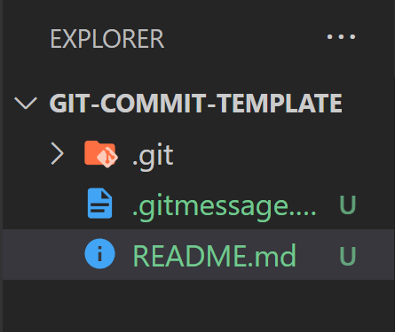
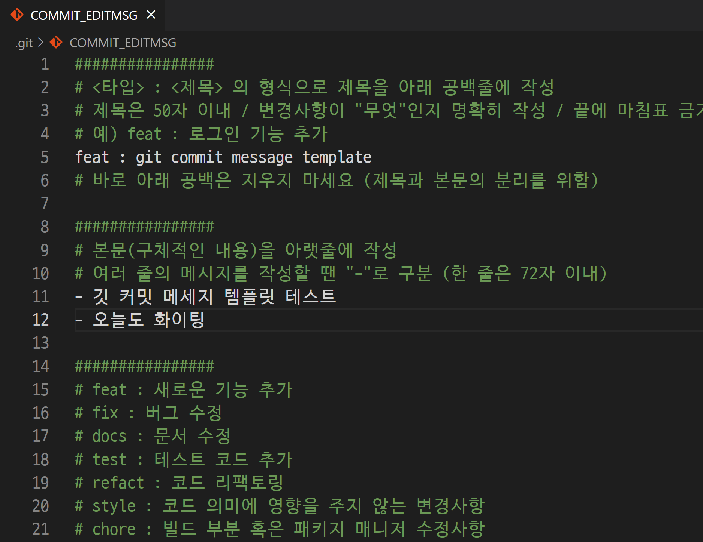
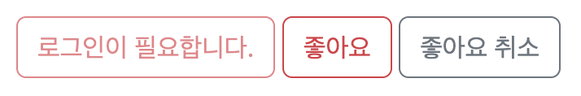
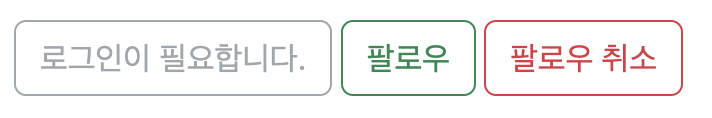
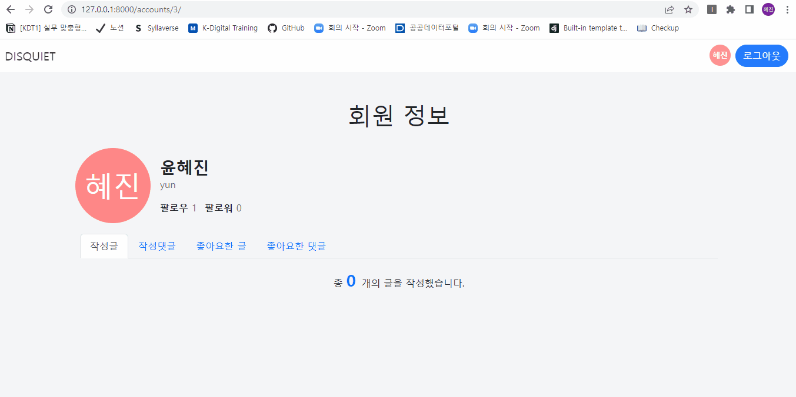
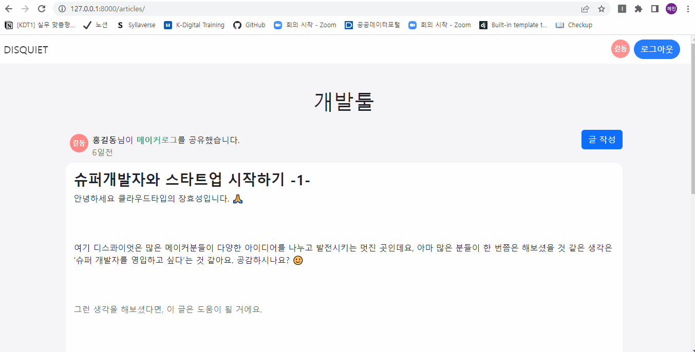

# 장고 실습 14 - Django Model 1:N과 M:N 관계를 매핑하여 게시판 서비스 개발

## 과정

- [목표](#목표)
  - [2022.10.20 실습 목표](#--20221020-실습-목표)
  - [2022.10.24 실습 목표](#--20221024-실습-목표)
  - [2022.10.25 실습 목표](#--20221025-실습-목표)
  - [2022.10.26 실습 목표](#--20221026-실습-목표)
- [준비 사항](#준비-사항)
- [요구 사항](#요구-사항)
   - [2022.10.20 실습 요구사항](#--20221020-실습-요구사항)
   - [2022.10.24 실습 요구사항](#--20221024-실습-요구사항)
   - [2022.10.25 실습 요구사항](#--20221025-실습-요구사항)
   - [2022.10.26 실습 요구사항](#--20221026-실습-요구사항)
- [실습 결과 완성본](#실습-결과-완성본)

## 목표

### 1️⃣ 2022.10.20 실습 목표

- ModelForm을 활용한 CRUD 구현
- Django Model 1 : N 관계를 매핑하고, View에서 서로 참조해서 사용하기
  - 유저 : 게시글 = 1 : N
  - 유저 : 댓글 = 1 : N
  - 게시글 : 댓글 = 1 : N
- Django Auth를 활용한 회원 관리 기능 개발에 대한 흐름 파악 및 개발
- 로그인 상태에 따라 컴포넌트 출력 및 기능 제한
- Django Media 활용 동적파일 다루기
- GIT COMMIT MESSAGE TEMPLATE 깃 커밋 메세지 템플릿 적용

### 2️⃣ 2022.10.24 실습 목표

- 이전에 진행한 실습에 유저(User)와 게시글(Article)이 N : M 관계로 매핑된 좋아요 기능을 추가로 개발

### 3️⃣ 2022.10.25 실습 목표

- 유저(User)와 유저(User)가 N : M 관계로 매핑된 팔로우 기능을 추가로 개발

### 4️⃣ 2022.10.26 실습 목표

- JavaScript  비동기 처리에 대해 학습합니다. 
  - 비동기 처리 필요성
  - 비동기 처리 원리와 과정
  - 참고) [자바스크립트 비동기 처리와 콜백 함수](https://joshua1988.github.io/web-development/javascript/javascript-asynchronous-operation/)
  - 참고) [[자바스크립트] 비동기 처리 1부 - Callback](https://www.daleseo.com/js-async-callback/)

- 댓글 기능을 비동기로 처리합니다.
  - 생성
  - 삭제
  
## 준비 사항

### ▶ 환경 설정

> 가상 환경 생성 및 실행

```bash
$ python -m venv venv
```

```bash
$ source venv/Scripts/activate
```

> 패키지 설치

1. Django 
   
   ```bash
   $ pip install django==3.2.13
   ```

2. Code Formatter black 
   
   ```bash
   $ pip install black
   ```

3. django-bootstrap5
   
   ```bash
   $ pip install django-bootstrap5
   ```
   
   - 패키지 설치 후, settings.py의 INSTALLED_APPS에 `'django_bootstrap5',` 추가

4. Pillow
   
   ```bash
   $ pip install Pillow
   ```

5. django-imagekit
   
   ```bash
   $ pip install django-imagekit
   ```
   
   - 패키지 설치 후, settings.py의 INSTALLED_APPS에 `'imagekit',` 추가

6. django-widget-tweaks
   
   ```bash
   $ pip install django-widget-tweaks
   ```
   
   - 패키지 설치 후, settings.py의 INSTALLED_APPS에 `'widget_tweaks',` 추가

> 설치된 패키지 목록 기록

```bash
$ pip freeze > requirements.txt
```

> 장고 프로젝트 생성 & 앱 생성 및 앱 등록

```bash
$ django-admin startproject pjt .
```

```bash
$ python manage.py startapp articles
$ python manage.py startapp accounts
```

> SECRET KEY 분리 설정

- secrets.json
  
  ```json
  {
      "SECRET_KEY": "new secret key"
  }
  ```

- settings.py 수정
  
  ```python
  import os, json
  from django.core.exceptions import ImproperlyConfigured
  
  secret_file = os.path.join(BASE_DIR, 'secrets.json') # secrets.json 파일 위치를 명시
  
  with open(secret_file) as f:
      secrets = json.loads(f.read())
  
  def get_secret(setting, secrets=secrets):
      try:
          return secrets[setting]
      except KeyError:
          error_msg = "Set the {} environment variable".format(setting)
          raise ImproperlyConfigured(error_msg)
  
  SECRET_KEY = get_secret("SECRET_KEY")
  ```

- .gitignore에 추가
  
  ```
  secrets.json
  ```

> .gitignore 설정

```
.venv
```

### ▶ GIT COMMIT MESSAGE TEMPLATE 깃 커밋 메세지 템플릿

1. 템플릿을 적용할 git 프로젝트에 `.gitmessage.txt` 생성
   
   

2. `.gitmessage.txt` 템플릿 내용 작성
   
   ```
   ################
   # <타입> : <제목> 의 형식으로 제목을 아래 공백줄에 작성
   # 제목은 50자 이내 / 변경사항이 "무엇"인지 명확히 작성 / 끝에 마침표 금지
   # 예) feat : 로그인 기능 추가
   
   # 바로 아래 공백은 지우지 마세요 (제목과 본문의 분리를 위함)
   
   ################
   # 본문(구체적인 내용)을 아랫줄에 작성
   # 여러 줄의 메시지를 작성할 땐 "-"로 구분 (한 줄은 72자 이내)
   
   ################
   
   # feat : 새로운 기능 추가
   
   # fix : 버그 수정
   
   # docs : 문서 수정
   
   # test : 테스트 코드 추가
   
   # refact : 코드 리팩토링
   
   # style : 코드 의미에 영향을 주지 않는 변경사항
   
   # chore : 빌드 부분 혹은 패키지 매니저 수정사항
   
   ################
   ```

3. 명령어 입력
   
   ```bash
   # 커밋 메세지 템플릿 적용 명령어
   $ git config --local commit.template .gitmessage.txt
   
   # 깃 커밋 메세지를 vscode에서 작성하기 위한 설정
   $ git config --local core.editor "code --wait"
   ```

4. git add / git commit
   
   ```bash
   $ git add .
   
   # -m 옵션 없이 commit만 입력
   $ git commit 
   ```

5. `COMMIT_EDITMSG` 파일에 메세지 작성 후 저장 & 파일 닫기 (이후 자동으로 commit 완료 됨)
   
   

## 요구 사항

### 1️⃣ 2022.10.20 실습 요구사항

> 모델 Model - `M`

1. 모델 이름 : User
   
   - Django `AbstractUser` 모델 상속

2. 모델 이름 : Article
   
   | 필드 이름      | 역할    | 필드         | 속성                                |
   | ---------- | ----- | ---------- | --------------------------------- |
   | title      | 글 제목  | Char       | max_length=80                     |
   | content    | 글 내용  | Text       |                                   |
   | image      | 글 이미지 | Image      | blank=True, upload_to='articles/' |
   | created_at | 작성일   | DateTime   | auto_now_add                      |
   | updated_at | 수정일   | DateTime   | auto_now                          |
   | writer     | 작성자   | ForeignKey | on_delete=models.CASCADE          |

3. 모델 이름 : Comment
   
   | 필드 이름      | 역할     | 필드         | 속성                       |
   | ---------- | ------ | ---------- | ------------------------ |
   | content    | 댓글 내용  | Char       | max_length=80            |
   | created_at | 작성일    | DateTime   | auto_now_add             |
   | updated_at | 수정일    | DateTime   | auto_now                 |
   | article    | 참조 게시글 | ForeignKey | on_delete=models.CASCADE |
   | writer     | 작성자    | ForeignKey | on_delete=models.CASCADE |

> 기능 View - `V`

**게시판 articles**

1. 게시글 목록 조회 Read(index)
   
   - `GET` `http://127.0.0.1:8000/articles/`

2. 게시글 정보 조회 Read(detail)
   
   - `GET` `http://127.0.0.1:8000/articles/<int:article_pk>/`
   - 해당 게시글(article_pk)에 작성된 댓글 정보 조회

3. 게시글 생성 Create
   
   - `POST` `http://127.0.0.1:8000/articles/create/`
   - 사용자가 글 이미지 **image**와 썸네일 이미지 **thumbnail**를 업로드할 수 있어야합니다.
   - 로그인한 사용자만 데이터를 생성할 수 있습니다.

4. 게시글 수정 Update
   
   - `POST` `http://127.0.0.1:8000/articles/<int:pk>/update/`
   - 데이터를 생성한 사용자만 수정할 수 있습니다.

5. 게시글 삭제 Delete
   
   - `POST` `http://127.0.0.1:8000/articles/<int:pk>/delete/`
   - 데이터를 생성한 사용자만 삭제할 수 있습니다.

**댓글 comments**

1. 게시글에 작성된 댓글 목록 조회 - Read(deail)
   
   - `GET` `http://127.0.0.1:8000/articles/<int:article_pk>/`
   - 해당 게시글(article_pk)의 댓글 목록 조회

2. 댓글 생성 - Create
   
   - `POST` `http://127.0.0.1:8000/articles/<int:article_pk>/comments/create/`
   - 로그인한 사용자만 데이터를 생성할 수 있습니다.

3. 댓글 삭제 - Delete
   
   - `POST` `http://127.0.0.1:8000/articles/<int:article_pk>/comments/<int:comment_pk>/delete/`
   - 데이터를 생성한 사용자만 삭제할 수 있습니다.

**회원 관리 accounts**

1. 회원가입 - Create
   
   - `POST` `http://127.0.0.1:8000/accounts/signin/`

2. 로그인
   
   - `POST` `http://127.0.0.1:8000/accounts/login/`

3. 로그아웃
   
   - `POST` `http://127.0.0.1:8000/accounts/logout/`

4. 회원 정보 조회 - Read
   
   - `GET` `http://127.0.0.1:8000/accounts/<int:user_pk>/`
   - 회원이 작성한 게시글 목록을 출력합니다.
   - 회원이 작성한 댓글 목록을 출력합니다.

> 화면 Template - `T`

1. 게시글 목록 페이지
   
   - `GET` `http://127.0.0.1:8000/articles/`
   - 썸네일 이미지 **thumbnail**가 있으면 썸네일 이미지를 출력합니다.

2. 게시글 정보 페이지
   
   - `GET` `http://127.0.0.1:8000/articles/<int:article_pk>/`
   - 글 이미지 **image** 가 있으면 이미지를 출력합니다.
   - 게시글 작성자(username) 클릭 시 해당 회원 조회 페이지로 이동
   - 댓글 작성 폼
     - 로그인한 사용자에게만 보여야합니다.
   - 총 댓글 개수 출력
   - 댓글 목록
     - 댓글 내용
     - 댓글 삭제 버튼
       - 댓글을 작성한 사용자에게만 보여야합니다.

3. 게시글 작성 페이지
   
   - `GET` `http://127.0.0.1:8000/articles/create/` 
   - 게시글 작성 폼
   - 로그인한 사용자만 글 작성 페이지로 진입할 수 있습니다.  
   - 사용자가 이미지를 업로드할 수 있어야합니다.

4. 로그인 페이지
   
   - `GET` `http://127.0.0.1:8000/accounts/login/`
   - 로그인 폼
   - 회원가입 페이지 이동 버튼

5. 회원가입 페이지
   
   - `GET` `http://127.0.0.1:8000/accounts/signup/`
   - 회원가입 폼
   - 로그인 페이지 이동 버튼

6. 회원 조회 페이지(프로필 페이지)
   
   - `GET` `http://127.0.0.1:8000/accounts/<int:user_pk>/`
   - 회원이 작성한 게시글 목록 출력

> 참고 사이트

- [디스콰이엇 홈페이지](https://disquiet.io/)

### 2️⃣ 2022.10.24 실습 요구사항

> 모델 Model - `M`

1. 모델 이름: Article
   
   - 아래 필드 추가
   
   | 필드 이름      | 역할  | 필드         | 속성                           |
   | ---------- | --- | ---------- | ---------------------------- |
   | like_users | 좋아요 | ManyToMany | related_name='like_articles' |

2. 모델 이름: Comment
   
   - 아래 필드 추가
   
   | 필드 이름      | 역할  | 필드         | 속성                           |
   | ---------- | --- | ---------- | ---------------------------- |
   | like_users | 좋아요 | ManyToMany | related_name='like_comments' |

> 기능 View - `V`

**게시판 articles**

- 게시글 좋아요 & 좋아요 취소
  
  - `POST` `http://127.0.0.1:8000/articles/<int:article_pk>/likes/`
  - 로그인한 유저만 좋아요를 할 수 있습니다.

> 화면 Template - `T`

- 게시글 정보 페이지
  
  - `GET` `http://127.0.0.1:8000/articles/<int:article_pk>/`
  
  - 좋아요 버튼
  
  - 해당 글이 받은 좋아요 수를 표시합니다.
  
  - 로그인 상태와 좋아요 상태에 따라 다르게 표현하고, 기능을 제한합니다.
  
  - 각 버튼 예시
    
      

> 참고 사이트

- [Wanted 사이트의 커뮤니티 페이지](https://www.wanted.co.kr/community/post/6956)

### 3️⃣ 2022.10.25 실습 요구사항

> 모델 Model - `M`

1. 모델 이름 : User
   
   - 아래 필드 추가
   
      | 필드 이름      | 역할  | 필드         | 속성                                          |
      | ---------- | --- | ---------- | ------------------------------------------- |
      | followings | 팔로우 | ManyToMany | symmetrical=False, related_name='followers' |

> 기능 View - `V`

**회원관리 accounts**

- 회원 팔로우 & 팔로우 취소
  
  - `POST` `http://127.0.0.1:8000/accounts/<int:user_pk>/follow/`
  - 로그인한 유저만 팔로우 기능을 사용할 수 있습니다.

> 화면 Template - `T`

1. 회원 정보 페이지(프로필 페이지)

   - `GET` `http://127.0.0.1:8000/accounts/<int:user_pk>/`
   - 팔로우 목록: 해당 회원의 팔로우 목록
   - 팔로잉 목록: 해당 회원의 팔로잉 목록
   - 스스로를 팔로우 할 수 없습니다.
   - 다른 회원의 프로필 페이지
     - 팔로우 버튼
     - 로그인한 유저만 팔로우 기능을 사용할 수 있습니다.
     - 로그인 상태 / 팔로우 상태에 따라 다르게 표현 합니다.
     - 예시 이미지
  
         

> 참고 사이트

- [Instagram](https://www.instagram.com/dlwlrma/)

### 4️⃣ 2022.10.26 실습 요구사항

> 기능 View - `V`

**댓글 comments**

1. 댓글 생성

   - `POST` `http://127.0.0.1:8000/articles/<int:article_pk>/comments/`
   - 비동기 처리

2. 댓글 삭제

   - `POST` `http://127.0.0.1:8000/articles/<int:article_pk>/comments/<int:comment_pk>/delete/`
   - 비동기 처리

## 실습 결과 완성본

> 1️⃣ 2022.10.20 실습 결과물


> 2️⃣ 2022.10.24 실습 결과물


> 3️⃣ 2022.10.25 실습 결과물



> 4️⃣ 2022.10.26 실습 결과물



- 댓글 생성을 비동기 처리할 때, 기존 댓글을 모두 지우고 전체 댓글을 다시 DOM 조작으로 만들어 주었다. 기존 댓글 형태처럼 만들기엔 DOM을 조작하기 번거러워 간단하게 댓글 내용과 댓글 작성자만 나타내 주었다.