# 프로젝트 사전 기획 - 영화 리뷰 커뮤니티 조사 및 기획

## 과정
- [목표](#목표)
- [요구사항](#요구-사항)
- [조사 결과](#조사-결과)
- [참고 사이트](#참고-사이트)

## 목표
- 영화 리뷰 커뮤니티 개발 프로젝트를 위한 사전 조사
- 동료와 함께 영화 페이지 기능 개발 기획

## 요구 사항
### ✅ 기능 조사 및 설계
- 영화 리뷰 커뮤니티 서비스에 필요한 기능들을 조사하고, 논의하고, 정리합니다.
- 정리 양식은 자유입니다. 아래는 화면을 기준으로 기능을 정리한 예시입니다.

> 리뷰 목록 페이지
- 리뷰 목록 출력
- 리뷰 작성 버튼
- 리뷰 보기 버튼

> 글 작성 페이지
- 리뷰 작성 폼
  - 영화 제목
  - 리뷰 내용
  - 평점
- 리뷰 작성 완료 버튼

### ✅ 화면 조사 및 설계
- 위에서 정리한 기능을 표현할 화면을 조사하고, 논의하고, 정리합니다.
- 구현해보고 싶은 사이트의 화면을 스크린샷으로 저장해두거나, 그림판으로 간단하게 레이아웃을 그려보거나, [피그마](https://www.figma.com/)를 사용할 수 있다면 디테일하게 요소들을 배치해보거나 자유롭게 화면을 기획해주세요.

## 조사 결과
> 영화 리뷰 커뮤니티 홈페이지

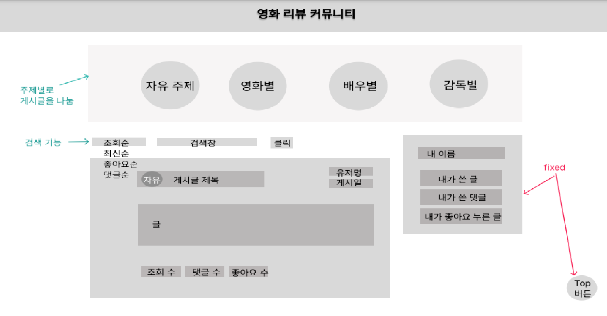

- 주제별로 게시글을 나누어서 자유/영화/배우/감독별로 게시글을 확인할 수 있게 함
- 주제에 상관없이 조회순/최신순/좋아요순/댓글순으로 정렬 가능하고 특정 키워드로 검색해서 찾을 수도 있음
- 게시물은 카드 형태로 구성되어 나타나고, 글제목/일부작성내용/게시일/작성자명/조회수/댓글수/좋아요수/댓글수가 한눈에 보이도록 함
- 게시물 카드를 클릭하면 모달 창이 뜨면서 전체적인 작성내용과 달린 댓글들을 확인할 수 있음
- 로그인했을 때 화면 오른쪽에 자신의 이름과 내가 쓴 글/댓글/좋아요 누른 글 버튼이 보이게 됨
- 참고
  - [kinolights](https://m.kinolights.com/community/feed)

    

> 영화별 주제 클릭 시 나타나는 페이지

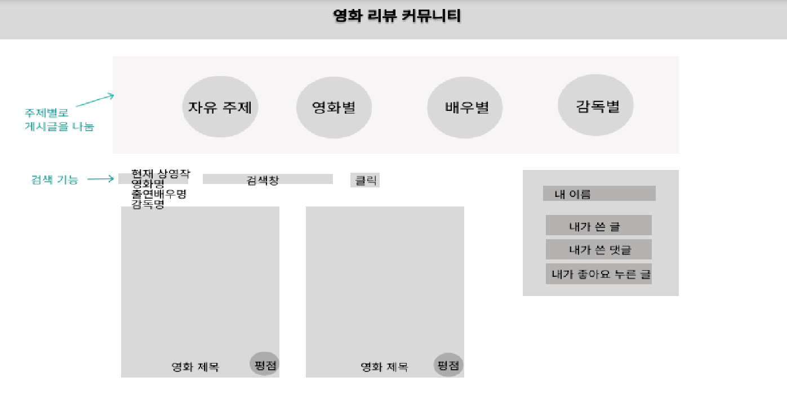

- 바로 보이는 페이지에는 현재 상영작을 바탕으로 영화 카드들이 떠있음
- 영화명으로 찾고자하는 영화 검색 가능
- 각 영화는 카드로 나타나고, 영화 포스터와 영화제목, 평점이 한눈에 보이게 함

> 영화 카드 클릭 시 나타나는 페이지

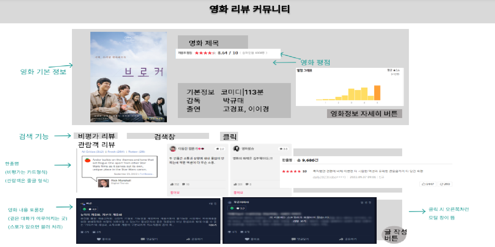

- 상단엔 영화 기본 정보를 보여줌
  - 영화 포스터, 영화 제목, 평점(다양한 영화사이트의 평점 포함), 감독, 출연진 등
  - '자세히' 버튼을 누르면 해당 영화 정보가 자세하게 적힌 페이지로 넘어가게 됨
- 비평가 리뷰/관람객 리뷰 구분지어서 리뷰 볼 수 있게 함
- 작성자명/게시글제목으로 검색 가능
- 한줄평 구간에는 비평가인 경우 카드 형식으로 나타내고, 관람객인 경우 줄글 형식으로 나타냄
  - 한줄평에는 글/좋아요수/작성일/작성자명이 포함되어 있음
- 영화 내용 토론장 구간에는 모든 게시글이 카드 형식으로 나타나게 함
  - 스포가 포함된 글은 블러 처리함
  - 글/좋아요수/작성일/작성자명/댓글수가 포함되어 있음
  - 카드를 클릭하면 자세한 작성글을 볼 수 있게 모달창이 뜨게 됨
- 오른쪽 아래 글 작성 버튼이 존재해 클릭하면 글을 작성할 수 있게 모달창이 뜨게 됨
- 참고
  - [네이버 영화 사이트](https://movie.naver.com/movie/point/af/list.naver?st=mcode&sword=163533&target=after)
  
    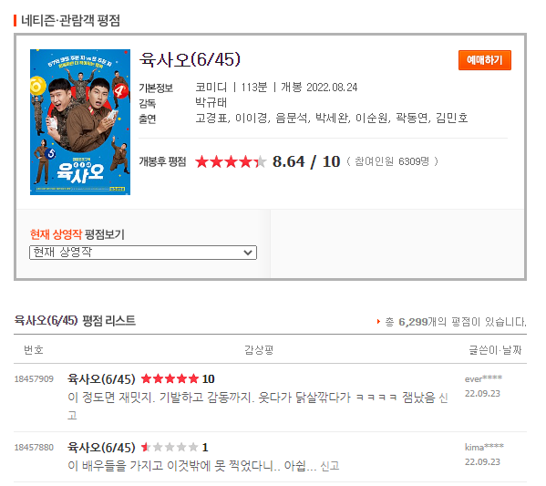

    

    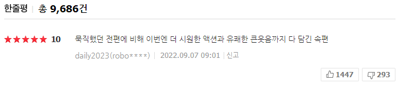

  - [kinolights](https://m.kinolights.com/title/5296)
  
    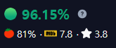

    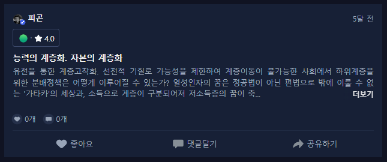

    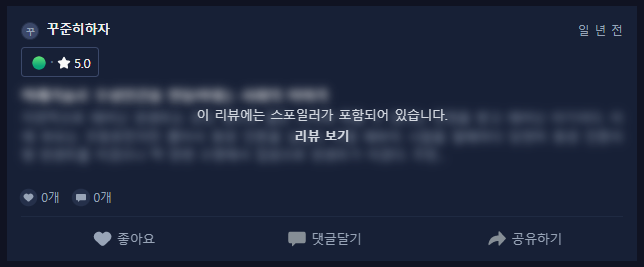

  - [rotten tomato](https://www.rottentomatoes.com/tv/andor/s01)

    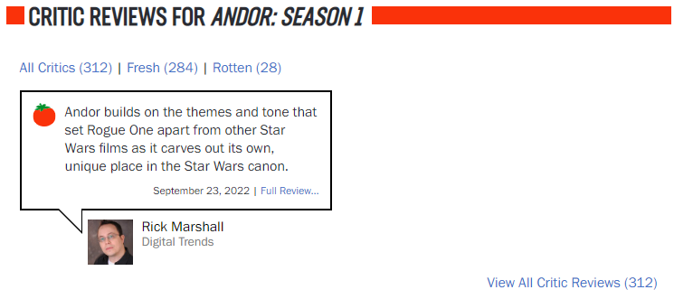

  - [왓챠](https://pedia.watcha.com/ko-KR/contents/m5agQGD)

    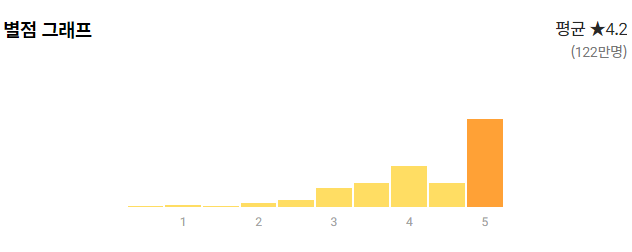

    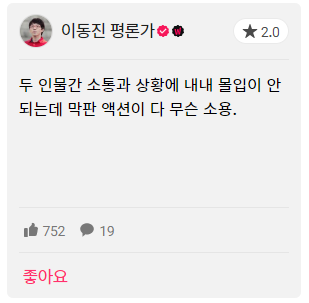

> 영화 리뷰 카드 클릭 시 나타나는 모달창

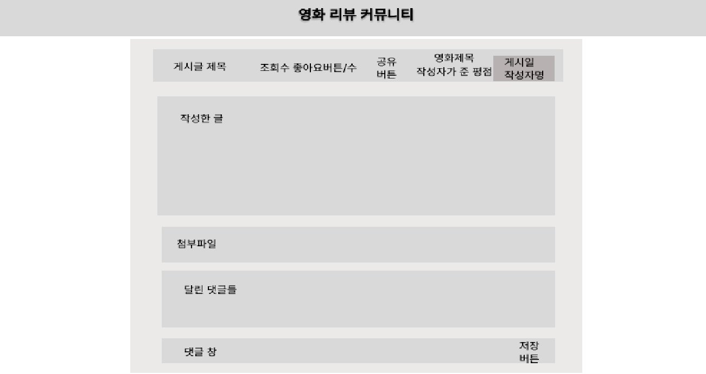

- 모달창의 헤더부분에는 게시글 제목/게시일/작성자명/영화제목/작성자평점/조회수/좋아요수/공유버튼이 있음
- 모달창의 바디부분에는 작성한 글/첨부사진/등록된 영화링크을 볼 수 있음
- 모달창의 푸터부분에는 달린 댓글 내용과 댓글 창이 있음
- 참고
  - [kinolights](https://m.kinolights.com/community/post/pC1naYMBeXSd9P__qurd)
  
    

    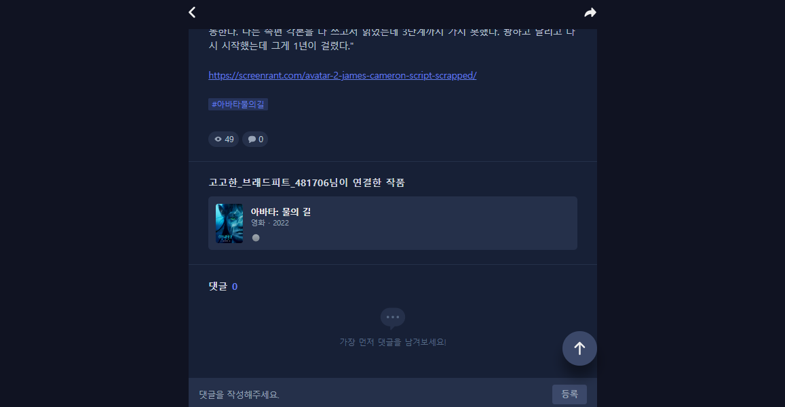

> 글 작성 버튼 클릭 시 나타나는 모달창

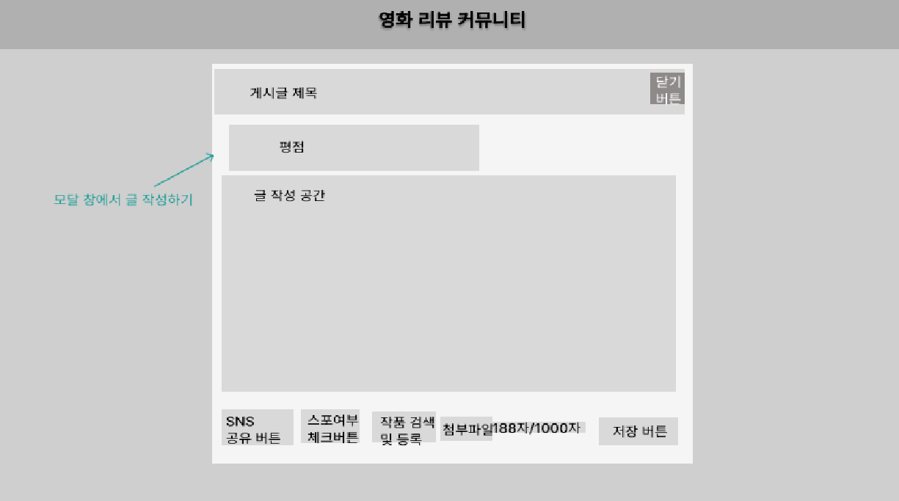

- 모달창의 헤더부분에는 게시글 제목/닫기버튼이 있음
- 모달창의 바디부분에는 평점/글 작성 공간이 있음
- 모달창의 푸터부분에는 공유버튼/스포여부버튼/작품검색및등록버튼/첨부파일/글자수/저장버튼이 있음
- 참고
  - [왓챠]()

    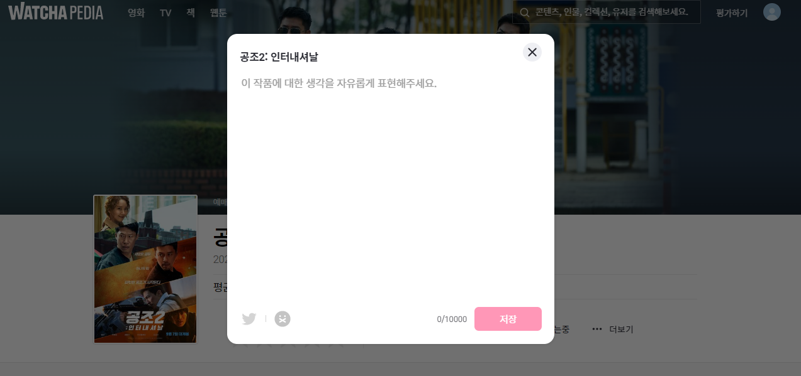

  - [kinolights](https://m.kinolights.com/community/post/pC1naYMBeXSd9P__qurd)

    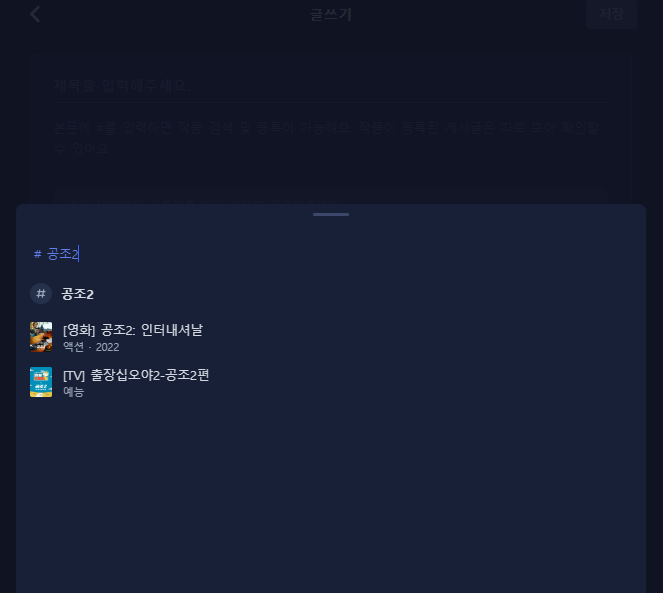

> 리뷰 페이지 이외 발견한 좋은 기능
1. [키노라이츠](https://link.fmkorea.org/link.php?url=https%3A%2F%2Fm.kinolights.com%2F&lnu=2307637880&mykey=MDAwMjc3NTk0NjkyNg==)
   - 회원의 인생작 모음
   - OOT별로 종료 예정작
   - 보고 싶은 영화 찜하기
   - 이미 본 형화 체크 기능 -> 안 본 영화 추천
   - 무료 관람 가능 영화 표시
   - 성별/연령별 영화 추천

2. [metacritic](https://www.metacritic.com/browse/movies/score/metascore/year/filtered?sort=desc)
   - 평점별 영화 정렬

## 참고 사이트

- 왓챠피디아: [https://pedia.watcha.com/ko-KR/](https://link.fmkorea.org/link.php?url=https%3A%2F%2Fpedia.watcha.com%2Fko-KR%2F&lnu=1607193418&mykey=MDAwMjc3NTk0NjkyNg==)

- 키노라이츠: [https://m.kinolights.com/](https://link.fmkorea.org/link.php?url=https%3A%2F%2Fm.kinolights.com%2F&lnu=2307637880&mykey=MDAwMjc3NTk0NjkyNg==)

- IMDB: [https://www.imdb.com/](https://link.fmkorea.org/link.php?url=https%3A%2F%2Fwww.imdb.com%2F&lnu=4292130821&mykey=MDAwMjc3NTk0NjkyNg==)

- 로튼 토마토: <https://www.rottentomatoes.com/>

- 네이버 영화 사이트: <https://movie.naver.com/>

- 다음 영화 사이트: <https://movie.daum.net/main>

- metacritic: <https://www.metacritic.com/browse/movies/score/metascore/year/filtered?sort=desc>
