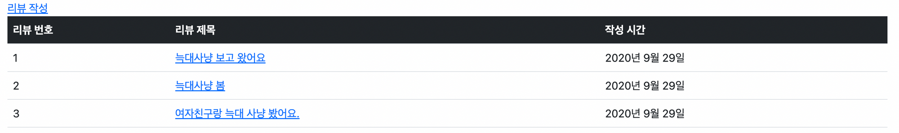
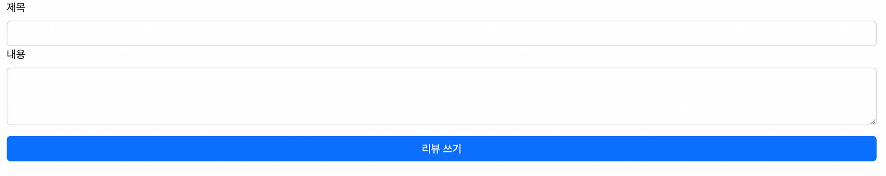
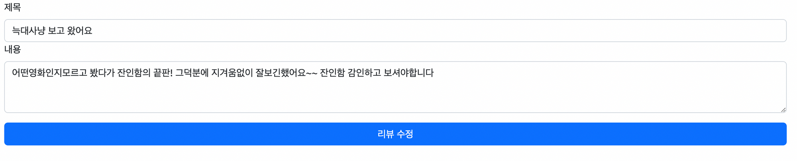

# 프로젝트 주간 페어 프로그래밍 - 영화 리뷰 커뮤니티 CRUD


## 과정

- [목표](#목표)
- [준비 사항](#준비-사항)
- [요구사항](#요구-사항)
- [프로젝트 결과 완성본](#프로젝트-결과-완성본)
- [프로젝트 후기](#프로젝트-후기)

## 목표

- 두 사람이 팀을 이뤄서 영화 리뷰 커뮤니티 서비스의 CRUD 기능과 페이지를 구현합니다.

## 준비 사항

### ▶ 프로젝트 시작 전

> 1번 개발자

1. 깃허브 저장소 생성
2. 2번 사람을 collaborator로 초대
3. 가상환경 생성 후, 장고 프로젝트를 생성
   - .gitignore : 가상환경을 ignore
   - pip freeze > requirements.txt : 패키지 목록을 생성
4. 생성한 저장소에 장고 프로젝트를 push

> 2번 개발자

1. 1번 개발자가 생성한 저장소를 clone
2. 가상환경 생성한 후, requirements.txt 설치
   - pip install -r requirements.txt 
3. 앱 생성한 후, 저장소에 push
4. 1번 개발자가 저장소로부터 pull 땡겨오기

### ▶ 프로젝트 진행 중

드라이버 <-> 네비게이터 전환할 때, 드라이버는 push하고 네비게이터는 pull해서 항상 두 사람이 같은 코드를 유지해야 한다.

### ▶ 프로젝트 완성 후

> 2번 개발자는 1번 개발자의 Github 저장소를 Mirror

1. 2번 개발자는 깃허브에 새로운 저장소 생성

2. 1번 개발자의 저장소를 clone
   
   ```bash
   $ git clone --mirror {1번 개발자의 저장소 주소}
   $ cd {1번 개발자의 저장소 이름}
   ```

3. 복사한 저장소를 자신의 원격 저장소에 연결
   
   ```bash
   $ git remote set-url --push origin {2번 개발자가 새롭게 생성한 저장소 주소}
   ```

4. push
   
   ```bash
   $ git push --mirror
   ```

## 요구 사항

> 모델 Model - `M`

- 모델은 아래 조건을 만족해야합니다. 
- 기능 추가를 위한 필드를 추가해도 됩니다.
- 모델 이름 : `Review`
- 모델 필드

  | 이름         | 역할       | 필드       | 속성                |
  | ---------- | -------- | -------- | ----------------- |
  | title      | 리뷰 제목    | Char     | max_length=80     |
  | content    | 리뷰 내용    | Text     |                   |
  | created_at | 할 일 생성시간 | DateTime | auto_now_add=True |
  | updated_at | 할 일 수정시간 | DateTime | auto_now=True     |

> 기능 View - `V`
- 아래 작성된 기능을 구현합니다.
- 리뷰 목록 보기
- 리뷰 내용 보기
- 리뷰 작성 하기
- 리뷰 수정하기
- 리뷰 삭제하기

> 화면 Template - `T`
- 아래 작성된 페이지와 컴포넌트를 구현해야 합니다.
- 리뷰 목록 페이지 index
  
  

  - 리뷰 ID / 리뷰 제목 / 리뷰 작성 시간
  - 리뷰 제목 클릭 시 해당 리뷰의 detail 페이지로 이동
  - 작성 버튼 클릭 시 new 페이지로 이동
- 리뷰 보기 페이지 detail
  
  

  - 리뷰 제목 / 리뷰 내용 / 리뷰 작성 시간
  - 수정 버튼 클릭 시 edit 페이지로 이동
  - 삭제 버튼 클릭 시 리뷰 삭제 - `delete`
- 리뷰 작성 페이지 new

  

  - 리뷰 제목 / 리뷰 내용
  - 생성 버튼 클릭 시 새로운 리뷰 생성 - `create`
- 리뷰 수정 페이지 edit

  

  - 작성 폼에 원본 리뷰의 제목 과 내용이 작성된 상태
  - 수정 버튼  클릭 시 해당 리뷰 데이터 수정 - `update`


## 프로젝트 결과 완성본

영화 리뷰 사이트 GitHub 저장소로 이동 👉 [movie_review_01](https://github.com/hyejinny97/movie_review_1)


## 프로젝트 후기

가장 먼저 조원분과 [키노라이츠](https://m.kinolights.com/) 영화 웹사이트를 참고해서 디자인을 일부 기획하고 구현을 시작했다. 명세서에는 테이블 형식으로 글 목록을 보여주라고 명시되어 있었기 때문에 처음에는 명세서대로 구현했다. 이후 어느정도 CRUD 기능을 다 만들고 나서 테이블이 아닌 카드 형식으로 작성된 글들을 보여주게 구현했다. 

오늘 새롭게 알게된 css 속성이 있는데, 

```css
.txt{
    overflow: hidden;
    text-overflow: ellipsis;
    white-space: nowrap;  
}
```

위와 같이 사용을 하면, 한 줄 내로 글 생략이 가능하고 텍스트의 끝부분에 말줄임표(…)를 붙혀줄 수 있다. 

원래 글 작성 시에 내가 리뷰할 영화를 선택해서 저장하면, 글 목록 페이지에서 해당 영화에 대한 포스터를 같이 보여주기로 기획했지만, 데이터베이스 설계하고 models을 만드는 과정에서 약간의 복잡한 절차를 걸쳐야해서 시간 관계상 랜덤 포스터를 넣는 것으로 변경했다. 그래서 위 완성본을 보면 모든 글에 동일한 포스터 이미지가 들어가 있는 것을 볼 수 있을 것이다.

또한 기획 단계에서 평점/별점도 같이 기재하면 좋겠다는 의견이 있었지만, 이 또한 시간 관계상 구현을 하지 못했다.

위 두 구현은 따로 시간을 내서 마저 기능을 추가하고자 한다.