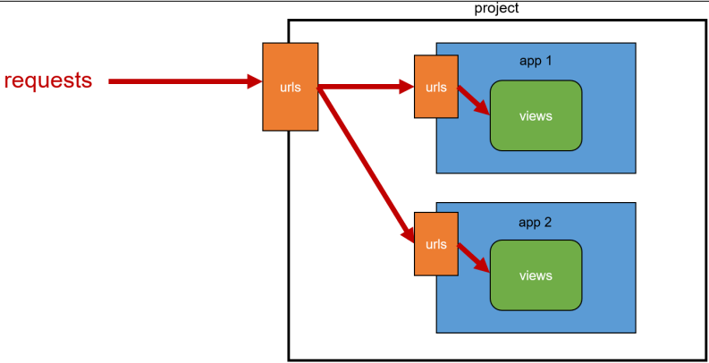

# ✔ 요청과 응답
- URL → VIEW → TEMPLATE 순의 작성 순서로 코드를 작성해보고 데이터의 흐름을 이해하기

> URLs
- URL → VIEW → TEMPLATE

  ```python
  # urls.py

  from django.contrib import admin
  from django.urls import path
  from articles import views

  urlpatterns = [
    path('admin/', admin.site.urls),
    path('index/', views.index),
  ]
  ```

- Trailing Slashes
  - Django는 URL 끝에 `/`가(Trailing slash) 없다면 자동으로 붙여주는 것이 기본 설정
  - 검색 엔진 로봇이나 웹 트래픽 분석 도구에서는 `/`가 있는 페이지와 없는 페이지를 서로 다른 페이지로 봄
  - 그래서 Django는 URL을 정규화하여 검색 엔진 로봇이 혼동하지 않게 해야 함

- URL 정규화
  - 정규 URL(=오리지널로 평가되어야 할 URL)을 명시하는 것
  - 복수의 페이지에서 같은 콘텐츠가 존재하는 것을 방지하기 위함
  - Django에서는 trailing slash가 없는 요청에 대해 자동으로 slash를 추가하여 통합된 하나의 콘텐츠로 볼 수 있도록 함

> Views
- HTTP 요청을 수신하고 HTTP 응답을 반환하는 함수 작성
- Template에게 HTTP 응답 서식을 맡김

  ```python
  # articles/views.py

  def index(request): 
    return render(request, 'index.html')
  ```

- `render()`: 주어진 템플릿을 주어진 context 데이터와 결합하고 렌더링된 텍스트와 함께 HttpResponse(응답) 객체를 반환하는 함수
  
  ```python
  render(request, template_name, context)
  ```

  - `request`: 응답을 생성하는 데 사용되는 요청 객체
  - `template_name`: 템플릿의 전체 이름 또는 템플릿 이름의 경로
  - `context`: 템플릿에서 사용할 데이터 (**딕녀너리** 타입으로 작성)
    - context라는 이름은 다른 이름으로 사용 가능하지만 관행적으로 context를 사용

> Templates
- 실제 내용을 보여주는데 사용되는 파일
- 파일의 구조나 레이아웃을 정의
- Template 파일의 기본 경로
  - app 폴더 안의 templates 폴더 (템플릿 폴더 이름은 반드시 templates라고 지정해야 함)
  - app_name/templates/
  
  ```html
  <!-- articles/templates/index.html -->
  
  <!DOCTYPE html>
  <html lang="en">
  <head>
    <!-- 생략 -->
  </head>
  <body>
    <h1>만나서 반가워요!</h1>
  </body>
  </html>
  ```


# ✔ App URL Mapping
- 앱이 많아졌을 때 urls.py를 각 app에 매핑하여 효율적으로 관리 가능

> App URL Mapping 하는 이유
- app의 view 함수가 많아지면서 사용하는 path() 또한 많아지고, app 또한 더 많이 작성되기 때문에 프로젝트의 urls.py에서 모두 관리하는 것은 프로젝트 유지보수에 좋지 않음
  
  ```python
  # firstpjt/urls.py

  from articles import views as articles_views
  from pages import views as pages_views
  
  urlpatterns = [
    ...,
    path('pages-index', pages_views.index),
  ]
  ```

> App URL Mapping
- 하나의 프로젝트에 여러 앱이 존재한다면, 각각의 앱 안에 urls.py을 만들고 프로젝트 urls.py에서 각 앱의 urls.py 파일로 URL 매핑을 위탁
  - 복수 개의 앱의 URL을 project의 urls.py에서 관리
  - 각각의 앱에서 URL을 관리

  


- urlpattern은 언제든지 다른 URLconf 모듈을 포함(include)할 수 있음
- include되는 앱의 url.py에 urlpatterns가 작성되어 있지 않다면 에러가 발생
  - 예를 들어, pages 앱의 urlpatterns가 빈 리스트라도 작성되어 있어야 함

- `include()`
  - 다른 URLconf(app1/urls.py)들을 참조할 수 있도록 돕는 함수
  - 함수 include()를 만나게 되면 URL의 그 시점까지 일치하는 부분을 잘라내고, 남은 문자열 부분을 후속 처리를 위해 include된 URLconf로 전달

  ```python
  # firstpjt/urls.py

  from django.contrib import admin
  from django.urls import path, include

  urlpatterns = [
    path('admin/', admin.site.urls),
    path('articles/', include('articles.urls')),
    path('pages/', include('pages.urls')),
  ]
  ```

  ```python
  # articles/urls.py

  from django.urls import path
  from . import views

  urlpatterns = [
    path('index/', views.index),
    path('greeting/', views.greeting),
    path('throw/', views.throw),
    path('catch/', views.catch),
  ]
  ```

  ```python
  # pages/urls.py

  from django.urls import path
  from . import views
  
  urlpatterns = [
      path('hello/<str:name>/', views.hello),
      path('dinner/', views.dinner),
  ]
  ```


# ✔ Django Template Language (DTL)
> Django Template
- 데이터 표현을 제어하는 도구이자 표현에 관련된 로직
- Django Template을 이용한 HTML 정적 부분과 동적 컨텐츠 삽입
- Template System의 기본 목표를 숙지
- Django Template System: 데이터 표현을 제어하는 도구이자 표현에 관련된 로직을 담당

> Django Template Language (DTL)
- Django template에서 사용하는 built-in template system
- 조건, 반복, 변수 치환, 필터 등의 기능을 제공
  - Python처럼 일부 프로그래밍 구조(if, for 등)를 사용할 수 있지만, 이것은 Python 코드로 실행되는 것이 아님
  - 주의) Django 템플릿 시스템은 단순히 Python이 HTML에 포함 된 것이 아님
- 프로그래밍적 로직이 아니라 프레젠테이션을 표현하기 위한 것임을 명심할 것

> Django Template Language (DTL) Syntax
1. Variable

   ```python 
   {{ variable }}
   ```

   - 변수명은 영어, 숫자와 밑줄(_)의 조합으로 구성될 수 있으나 밑줄로는 시작 할 수 없음
     - 공백이나 구두점 문자 또한 사용할 수 없음
   - dot(.)를 사용하여 변수 속성에 접근할 수 있음
   - `render()`의 세번째 인자로 {'key': value} 와 같이 딕셔너리 형태로 넘겨주며, 여기서 정의한 key에 해당하는 문자열이 template에서 사용 가능한 변수명이 됨

     ```python
     # articles/views.py
 
     def greeting(request):
        return render(request, 'greeting.html', {'name': 'Alice'})
     ```
 
     ```html
     <!-- articles/templates/greeting.html -->
 
     <!DOCTYPE html>
     <html lang="en">
     <head>
        …
     </head>
     <body>
        <p>안녕하세요 저는 {{ name }} 입니다.</p>
     </body>
     </html>
     ```

     ```python
     # views.py

     def greeting(request):
        foods = ['apple', 'banana', 'coconut',]
        info = {
          'name': 'Alice'
        }
        context = {
          'foods': foods,
          'info': info,
        }
        return render(request, 'greeting.html', context)
     ```

     ```html
     <!-- articles/templates/greeting.html -->

     <p>저는 {{ foods.0 }}을 가장 좋아합니다.</p>
     <p>안녕하세요 저는 {{ info.name }} 입니다.</p>
     ```

2. Filters

   ```python
   {{ variable|filter }}
   ```

   - 표시할 변수를 수정할 때 사용
     - 예) `{{ name|lower }}`: name 변수를 모두 소문자로 출력
   - 60개의 built-in template filters를 제공
   - chained가 가능하며 일부 필터는 인자를 받기도 함
     - 예) `{{ name|truncatewords:30 }}`

     ```python
     # articles/views.py

     import random
     from django.shortcuts import render
     
     def dinner(request):
        foods = ['족발', '햄버거', '치킨', '초밥',]
        pick = random.choice(foods)
        context = {
          'pick': pick,
          'foods': foods,
        }
        return render(request, 'dinner.html', context)
     ```

     ```html
     <!-- articles/templates/dinner.html -->

     <!DOCTYPE html>
     <html lang="en">
     <head>
        ...
     </head>
     <body>
        <p>{{ pick }}은 {{ pick|length }}글자</p>
        <p>{{ foods|join:", "}}</p>
     </body>
     </html>
     ```

3. Tags

   ```python
   
   ```

   - 출력 텍스트를 만들거나, 반복 또는 논리를 수행하여 제어 흐름을 만드는 등 변수보다 복잡한 일들을 수행
   - 일부 태그는 시작과 종료 태그가 필요
     - 예) ``
   - 약 24개의 built-in template tags를 제공

     ```html
     <!-- dinner.html -->

     <!DOCTYPE html>
     <html lang="en">
     <head>
        ...
     </head>
     <body>
        <p>메뉴판</p>
        <ul>
          
            <li>{{ food }}</li>
          
        </ul>
     </body>
     </html>
     ```

4. Comments
   
   ```
   {# comments #}
   ```

   - Django template에서 라인의 주석을 표현하기 위해 사용
   - 한 줄 주석에만 사용할 수 있음 (줄 바꿈이 허용되지 않음)
   - 여러 줄 주석은 와  사이에 입력

     ```
      
       여러 줄
       주석
     
     ```


# ✔ Template Inheritance
> 템플릿 상속
- 템플릿 상속은 기본적으로 코드의 재사용성에 초점을 맞춤
- 템플릿 상속을 사용하면 사이트의 모든 공통 요소를 포함하고, 하위 템플릿이 재정의(override) 할 수 있는 블록을 정의하는 기본 ‘skeleton’ 템플릿을 만들 수 있음

> 템플릿 상속 관련 Tags
1. ``

   - 자식(하위)템플릿이 부모 템플릿을 확장한다는 것을 알림
   - 반드시 템플릿 최상단에 작성 되어야 함 (2개 이상 사용할 수 없음)

2. `` 
   
   - 하위 템플릿에서 재지정(overridden)할 수 있는 블록을 정의
   - 즉, 하위 템플릿이 채울 수 있는 공간
   - 가독성을 높이기 위해 선택적으로 endblock 태그에 이름을 지정할 수 있음

    ```html
    <!-- articles/templates/base.html -->

    <!DOCTYPE html>
    <html lang="en">
    <head>
      ...
    </head>
    <body>
      
      
    </body>
    </html>
    ```

    ```html
    <!-- index.html -->

    

    
      <h1>만나서 반가워요!</h1>
      <a href="/greeting/">greeting</a>
      <a href="/dinner/">dinner</a>
    
    ```


# ✔ Template Namespace
> Template Namespace
- Django는 기본적으로 `app_name/templates/` 경로에 있는 templates 파일들만 찾을 수 있으며, settings.py의 **INSTALLED_APPS에 작성한 app 순서**로 template을 검색 후 렌더링 함
- 아래 속성 값이 해당 경로를 활성화하고 있음
  
  ```python
  # settings.py

  TEMPLATES = [
    {
      ...,
      'APP_DIRS': True,
      ...
    },
  ]
  ```

> Template Namespace를 고려해야하는 이유
- 만약 단일 앱으로만 이루어진 프로젝트라면 상관없음
- 여러 앱이 되었을 때에도 템플릿 파일 이름이 겹치지 않게 하면 되지만, 앱이 많아지면 대부분은 같은 이름의 템플릿 파일이 존재하기 마련
  - 따라서, pages app의 index url로 이동했지만 articles app의 index 페이지가 출력될 수 있음
  - 해결책: 디렉토리 생성을 통해 물리적으로 이름공간을 구분해줘야 함

> Template Namespace 구분
- Django templates의 기본 경로에 app과 같은 이름의 폴더를 생성해 폴더 구조를 `app_name/templates/app_name/` 형태로 변경
- Django templates의 기본 경로 자체를 변경할 수는 없기 때문에 물리적으로 이름 공간을 만들어야 함
  
  ```
  articles/
    templates/
      articles/
        index.html
  ```
  
  ```
  pages/
    templates/
      pages/
        index.html
  ```

- 폴더 구조 변경 후 변경된 경로로 해당하는 모든 부분 수정 필수
  
  ```python
  # articles/views.py
  
  def index(request):
    return render(request, 'articles/index.html')
  ```

  ```python
  # pages/views.py

  def index(request):
    return render(request, 'pages/index.html')
  ```

> 추가 템플릿 경로 설정

- `app_name/templates/` 디렉토리 경로 외 추가 경로 설정 가능
- 예) base.html의 위치를 앱 안의 template 디렉토리가 아닌 **프로젝트 최상단**의 templates 디렉토리 안에 위치

  ```python
  # settings.py

  TEMPLATES = [
      {
        'DIRS': [BASE_DIR / 'templates',],
      },
    ]
  ```

> 참고) `BASE_DIR`
  
  - settings.py에서 특정 경로를 절대 경로로 편하게 작성할 수 있도록 Django에서 미리 지정해둔 경로 값
  
  ```python
  # settings.py

  BASE_DIR = Path(__file__).resolve().parent.parent
  ```

> 참고) 추가 설정

- `LANGUAGE_CODE`
  - 모든 사용자에게 제공되는 번역을 결정
  - 이 설정이 적용 되려면 USE_I18N이 활성화(True)되어 있어야 함
  - <http://www.i18nguy.com/unicode/language-identifiers.html>

- `TIME_ZONE`
  - 데이터베이스 연결의 시간대를 나타내는 문자열 지정
  - USE_TZ가 True이고 이 옵션이 설정된 경우 데이터베이스에서 날짜 시간을 읽으면, UTC 대신 새로 설정한 시간대의 인식 날짜&시간이 반환 됨
  - USE_TZ이 False인 상태로 이 값을 설정하는 것은 error가 발생하므로 주의
  - <https://en.wikipedia.org/wiki/List_of_tz_database_time_zones>
  
  ```python
  # settings.py

  LANGUAGE_CODE = 'ko-kr'
  TIME_ZONE = 'Asia/Seoul'
  ```

- `USE_I18N`
  - Django의 번역 시스템을 활성화해야 하는지 여부를 지정

- `USE_L10N`
  - 데이터의 지역화된 형식(localized formatting)을 기본적으로 활성화할지 여부를 지정
  - True일 경우, Django는 현재 locale의 형식을 사용하여 숫자와 날짜를 표시

- `USE_TZ`
  - datetimes가 기본적으로 시간대를 인식하는지 여부를 지정
  - True일 경우 Django는 내부적으로 시간대 인식 날짜 / 시간을 사용