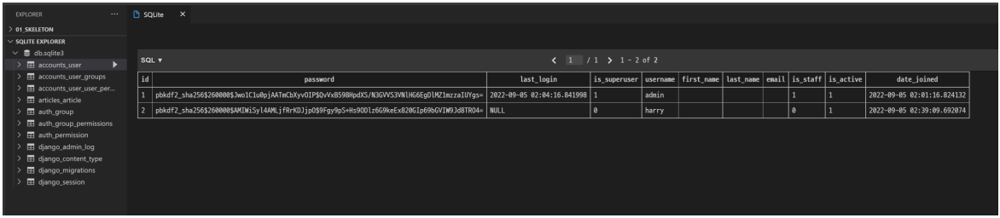
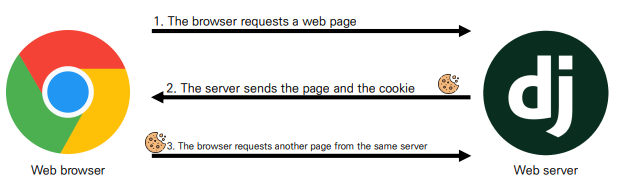
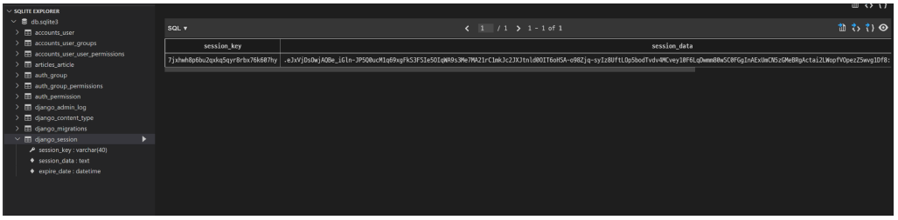
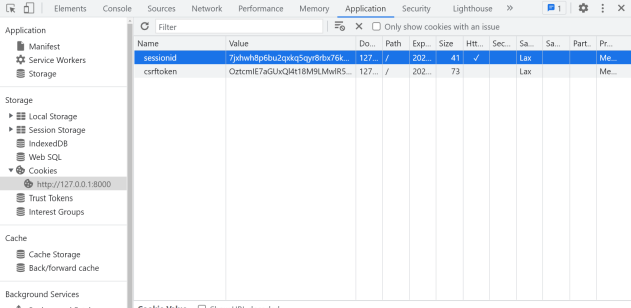
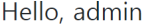
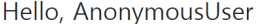

# ✔ 회원 가입

> 회원가입 - `CREATE`
- 회원 가입 페이지 작성

  ```python
  # accounts/urls.py

  app_name = 'accounts'
  urlpatterns = [
    ...,
    path('signup/', views.signup, name='signup'),
  ]
  ```

  ```python
  # accounts/views.py

  from .forms import CustomUserCreationForm
  
  def signup(request):
    if request.method == 'POST':
      form = CustomUserCreationForm(request.POST)
      if form.is_valid():
        form.save()
        return redirect('articles:index')
    else:
      form = CustomUserCreationForm()
    
    context = {
      'form': form,
    }
   
    return render(request, 'accounts/signup.html', context)
  ```

  ```django
  <!-- accounts/signup.html -->

  

  
    <h1>회원가입</h1>
    <form action="" method="POST">
      
      {{ form.as_p }}
      <input type="submit">
    </form>
  
  ```

- 회원가입 진행 후 테이블 확인
  
  

> 프로필 상세보기 - `READ`
- 회원 정보 상세 페이지(프로필 페이지) 작성

  ```python
  # accounts/urls.py

  from django.urls import path
  from . import views

  app_name = 'accounts'
  urlpatterns = [
      ...
      path('<int:pk>/', views.detail, name='detail'),
  ]
  ```

  ```python
  # accounts/views.py

  from django.contrib.auth import get_user_model

  def detail(request, pk):
      user = get_user_model().objects.get(pk=pk)

      context = {
          'user': user,
      }

      return render(request, 'accounts/detail.html', context)
  ```

  ```django
  <!-- templates/accounts/detail.html -->

  
    <p>사용자 이름: {{ user.username }}</p>
    <p>이메일: {{ user.email }}</p>
    <p>지난 로그인: {{ user.last_login }}</p>
    <p>가입일: {{ user.date_joined }}</p>
  
  ```

> 프로필 수정하기 - `UPDATE`

> 회원탈퇴 - `DELETE`


# ✔ 로그인
> HTTP

- Hyper Text Transfer Protocol
- HTML 문서와 같은 리소스들을 가져올 수 있도록 해주는 프로토콜(규칙, 규약)
- 웹(WWW)에서 이루어지는 모든 데이터 교환의 기초
- 클라이언트 - 서버 프로토콜이라고도 부름
  - 요청 (requests): 클라이언트(브라우저)에 의해 전송되는 메시지
  - 응답 (response): 서버에서 응답으로 전송되는 메시지
- **HTTP 특징: 비연결지향(connectionless), 무상태(stateless)**

1. 비연결지향(connectionless)
   - 서버는 요청에 대한 응답을 보낸 후 연결을 끊음
     - 예를 들어, 우리가 네이버 메인 페이지를 보고 있을 때 우리는 네이버 서버와 연결되어 있는 것이 아님
     - 네이버 서버는 우리에게 메인 페이지를 응답하고 연결을 끊은 것

2. 무상태(stateless)
   - 연결을 끊는 순간 클라이언트와 서버 간의 통신이 끝나며 상태 정보가 유지되지 않음
   - 클라이언트와 서버가 주고받는 메시지들은 서로 완전히 독립적

> 쿠키(Cookie)

- **서버와 클라이언트 간 지속적인 상태 유지**를 위해 “쿠키와 세션”이 존재
  - 따라서, 우리가 로그인을 하고 웹 사이트를 사용할 때 페이지를 이동해도 로그인 “상태”가 유지됨
- 서버가 사용자의 웹 브라우저(클라이언트)에 전송하는 작은 데이터 조각
  - 브라우저(클라이언트)는 쿠키를 로컬에 KEY-VALUE의 데이터 형식으로 저장
  - 동일한 서버에 재요청 시 저장된 쿠키를 함께 전송
- 쿠키는 서로 다른 요청이 동일한 브라우저로부터 발생한 것인지 판단할 때 주로 사용됨
  - 상태가 없는(stateless) HTTP에서 상태 정보를 관리, 사용자는 로그인 상태를 유지할 수 있음

  

- 쿠키 사용 목적
  
  1. 세션 관리 (Session management)
     - 로그인, 아이디 자동완성, 공지 하루 안 보기, 팝업 체크, 장바구니 등의 정보 관리

  2. 개인화 (Personalization)
     - 사용자 선호, 테마 등의 설정

  3. 트래킹 (Tracking)
     - 사용자 행동을 기록 및 분석

- 쿠키 Lifetime (수명)
  
  1. Session cookie
     - 현재 세션(current session)이 종료되면 삭제됨
     - 브라우저 종료와 함께 세션이 삭제됨

  2. Persistent cookies 
     - Expires 속성에 지정된 날짜 혹은 Max-Age 속성에 지정된 기간이 지나면 삭제됨

> 세션 (Session)

- 사이트와 특정 브라우저 사이의 state(상태)를 유지시키는 것
- 클라이언트가 서버에 접속하면 서버가 특정 session id를 발급하고, 클라이언트는 session id를 쿠키에 저장
  - 클라이언트가 다시 동일한 서버에 접속하면 요청과 함께 쿠키(session id가 저장된)를 서버에 전달
  - 쿠키는 요청 때마다 서버에 함께 전송 되므로 서버에서 session id를 확인해 알맞은 로직을 처리
- session id는 세션을 구별하기 위해 필요하며, 쿠키에는 session id만 저장

> Session in Django

- Django는 database-backed sessions 저장 방식을 기본 값으로 사용
  - session 정보는 Django DB의 django_session 테이블에 저장
  - 설정을 통해 다른 저장방식으로 변경 가능 ([참고](https://docs.djangoproject.com/en/3.2/topics/http/sessions/))
- Django는 특정 session id를 포함하는 쿠키를 사용해서 각각의 브라우저와 사이트가 연결된 session을 확인함

> `login(request, user, backend=None)`

- 인증된 사용자를 로그인
  - 유저의 ID를 세션에 저장하여 세션을 기록
- HttpRequest 객체와 User 객체가 필요
  - 유저 정보는 반드시 인증된 유저 정보여야 함
    - 인증 방법1) authenticate()함수를 활용한 인증
    - 인증 방법2) AuthenticationForm을 활용한 is_valid (AuthenticationForm에 authenticate()함수가 내장됨)

- [GitHub > Django/contrib/auth/__init__.py > authenticate()](https://github.com/django/django/blob/main/django/contrib/auth/__init__.py#L63)
  
  ```python
  # Django/contrib/auth/__init__.py

  def authenticate(request=None, **credentials):
      """
      If the given credentials are valid, return a User object.
      """
      for backend, backend_path in _get_backends(return_tuples=True):
          backend_signature = inspect.signature(backend.authenticate)
          try:
              backend_signature.bind(request, **credentials)
          except TypeError:
              # This backend doesn't accept these credentials as arguments. Try
              # the next one.
              continue
          try:
              user = backend.authenticate(request, **credentials)
          except PermissionDenied:
              # This backend says to stop in our tracks - this user should not be
              # allowed in at all.
              break
          if user is None:
              continue
          # Annotate the user object with the path of the backend.
          user.backend = backend_path
          return user

      # The credentials supplied are invalid to all backends, fire signal
      user_login_failed.send(
          sender=__name__, credentials=_clean_credentials(credentials), request=request
      )
  ```

  ```python
  from django.contrib.auth import authenticate

  user = authenticate(username='john', password='secret')
  ```

- [GitHub > Django/contrib/auth/__init__.py > login()](https://github.com/django/django/blob/main/django/contrib/auth/__init__.py#L94)

  ```python
  # Django/contrib/auth/__init__.py

  def login(request, user, backend=None):
      """
      Persist a user id and a backend in the request. This way a user doesn't
      have to reauthenticate on every request. Note that data set during
      the anonymous session is retained when the user logs in.
      """
      session_auth_hash = ""
      if user is None:
          user = request.user
      if hasattr(user, "get_session_auth_hash"):
          session_auth_hash = user.get_session_auth_hash()

      if SESSION_KEY in request.session:
          if _get_user_session_key(request) != user.pk or (
              session_auth_hash
              and not constant_time_compare(
                  request.session.get(HASH_SESSION_KEY, ""), session_auth_hash
              )
          ):
              # To avoid reusing another user's session, create a new, empty
              # session if the existing session corresponds to a different
              # authenticated user.
              request.session.flush()
      else:
          request.session.cycle_key()

      ...
  ```

> `logout(request)`

- 요청 유저에 대한 세션 정보를 삭제함
  - DB에서 session data 삭제
  - 클라이언트의 쿠키에서 sessionid 삭제
- HttpRequest 객체를 인자로 받고 반환 값이 없음
- 사용자가 로그인하지 않은 경우 오류를 발생시키지 않음
- [GitHub > Django/contrib/auth/__init__.py > logout()](https://github.com/django/django/blob/main/django/contrib/auth/__init__.py#L147)
  
  ```python
  # Django/contrib/auth/__init__.py

  def logout(request):
      """
      Remove the authenticated user's ID from the request and flush their session
      data.
      """
      # Dispatch the signal before the user is logged out so the receivers have a
      # chance to find out *who* logged out.
      user = getattr(request, "user", None)
      if not getattr(user, "is_authenticated", True):
          user = None
      user_logged_out.send(sender=user.__class__, request=request, user=user)
      request.session.flush()
      if hasattr(request, "user"):
          from django.contrib.auth.models import AnonymousUser

          request.user = AnonymousUser()
  ```

> Login

- 로그인 페이지
  - 일반적인 ModelForm 기반의 Create 로직과 동일하지만,
  - ModelForm이 아닌 Form으로 필수 인자 구성이 다름
  - DB에 저장하는 것 대신 세션에 유저를 기록하는 함수 호출함
    
    - View 함수와 이름이 동일하여 변경하여 호출
    
    - 로그인 URL이 `/accounts/login/`에서 변경되는 경우, settings.py LOGIN_URL을 변경하여야 함

  ```python
  # accounts/urls.py

  from django.urls import path
  from . import views
  
  app_name = 'accounts'
  urlpatterns = [
    path('login/', views.login, name='login'),
  ]
  ```

  ```python
  # accounts/views.py

  from django.contrib.auth.forms import AuthenticationForm
  from django.contrib.auth import login as auth_login

  def login(request):
    if request.method == 'POST':
      form = AuthenticationForm(request, data=request.POST)
      if form.is_valid():
        auth_login(request, form.get_user())
        return redirect('articles:index')
    else:
      form = AuthenticationForm()
    
    context = {
      'form': form
    }

    return render(request, 'accounts/login.html', context)
  ```

  ```django
  <!-- accounts/login.html -->

  

  
    <h1>로그인</h1>
    <form action="" method="POST">
      
      {{ form.as_p }}
      <input type="submit">
    </form>
  
  ```

- 로그인 후 세션 데이터 확인
  - 로그인 후 개발자 도구와 DB에서 django로부터 발급받은 세션 확인 (로그인은 관리자 계정을 만든 후 진행)
  - django_session 테이블에서 확인

    

  - 브라우저에서 확인 (개발자도구 – Application - Cookies)

    

> Authentication with User
- 실습 편의를 위해 base 템플릿에 로그인 페이지로 이동할 수 있는 하이퍼 링크 작성

  ```django
  <!-- base.html -->

  <body>
    <div class="container">
      <a href="">Login</a>
      <hr>
      
      
    </div>
    ...
  </body>
  </html>
  ```

- 템플릿에서 인증 관련 데이터를 출력하는 방법
  - context 데이터 없이 `템플릿 변수 {{ user }}`를 사용해 유저 정보 출력 가능
    
    - 이유: settings.py의 context processors 설정의 `django.contrib.auth.context_processors.auth`
    
    - 클라이언트가 로그인한 경우, user = `User` 클래스의 인스턴스
    
    - 클라이언트가 로그인하지 않은 경우, user = `AnonymousUser` 클래스의 인스턴스

  ```django
  <!-- base.html -->

  <body>
    <div class="container">
      <h3>Hello, {{ user }}</h3>
      <a href="">Login</a>
      <hr>
      
      
    </div>
    ...
  </body>
  </html>
  ```

  - 로그인 상태 :  

  - 비로그인 상태 : 

- 참고) context processors
  - 템플릿이 렌더링될 때 호출 가능한 컨텍스트 데이터 목록
  - 작성된 컨텍스트 데이터는 기본적으로 템플릿에서 사용 가능한 변수로 포함됨
  - 즉, django에서 자주 사용하는 데이터 목록을 미리 템플릿에 로드해 둔 것

  ```python
  # settings.py

  TEMPLATES = [
    {
      ...
      'OPTIONS': {
        'context_processors': [
          'django.template.context_processors.debug',
          'django.template.context_processors.request',
          'django.contrib.auth.context_processors.auth',
          'django.contrib.messages.context_processors.messages',
        ],
      },
    }
  ]
  ```

> Logout
- 로그아웃 기능 구현

  ```python
  # accounts/urls.py

  from django.urls import path
  from . import views

  app_name = 'accounts'
  urlpatterns = [
    path('login/', views.login, name='login'),
    path('logout/', views.logout, name='logout'),
  ]
  ```

  ```python
  # accounts/views.py

  from django.contrib.auth import logout as auth_logout

  def logout(request):
    auth_logout(request)
    return redirect('articles:index')
  ```

  ```django
  <!-- base.html -->

  <body>
    <div class="container">
      <h3>Hello, {{ user }}</h3>
      <a href="">Login</a>
      <form action="" method="POST">
        
        <input type="submit" value="Logout">
      </form>
      <hr>
      
      
    </div>
  </body>
  ```

> Limiting access to logged-in users
- 로그인 사용자에 대해 접근을 제한하는 2가지 방법
  
  - 방법1) `is_authenticated` attribute를 활용한 조건문
  
  - 방법2) The `login_required` decorator를 활용한 view 제한

- `is_authenticated` attribute

   - User model의 속성(attributes) 중 하나
   - 사용자가 인증 되었는지 여부를 알 수 있는 방법
   - 모든 User 인스턴스에 대해 항상 True인 읽기 전용 속성
     - AnonymousUser에 대해서는 항상 False
   - 일반적으로 request.user에서 이 속성을 사용 (request.user.is_authenticated)
   - 권한(permission)과는 관련이 없으며, 사용자가 활성화 상태(active)이거나 유효한 세션(valid session)을 가지고 있는지도 확인하지 않음

- `login_required` decorator
  
   - 사용자가 로그인 되어 있으면 정상적으로 view 함수를 실행
   - 로그인 하지 않은 사용자의 경우 settings.py의 LOGIN_URL 문자열 주소로 redirect 
     - 참고) `LOGIN_URL`의 기본 값은 `/accounts/login/`

  
1. `is_authenticated` attribute를 활용한 조건문
  
   - 로그인과 비로그인 상태에서 출력되는 링크를 다르게 설정하기
    
      ```django
      <!-- base.html -->

      
        <h3>Hello, {{ user }}</h3>
        <form action="" method="POST">
          
          <input type="submit" value="Logout">
        </form>
        <a href="">회원정보수정</a>
        <form action="" method="POST">
          
          <input type="submit" value="회원탈퇴">
        </form>
      
        <a href="">Login</a>
        <a href="">Signup</a>
      
      ```

   - 인증된 사용자만 게시글 작성 링크를 볼 수 있도록 처리하기
     - 하지만, 현재까지는 URL을 직접 입력하면 게시글 작성 페이지로 갈 수 있음
     - 따라서, View에서의 처리도 반드시 필요함

      ```django
      <!-- articles/index.html -->

      

      
        <h1>Articles</h1>
        
          <a href="">CREATE</a>
        
          <a href="">새 글을 작성하려면 로그인하세요</a>
        
        ...
      
      ```

   - 인증된 사용자라면 로그인 로직을 수행할 수 없도록 처리

      ```python
      # accounts/views.py

      def login(request):
        if request.user.is_authenticated:
          return redirect('articles:index')
        ...
      ```

2. The `login_required` decorator를 활용한 view 제한

   - 로그인 상태에서만 글을 작성/수정/삭제 할 수 있도록 변경
    
      ```python
      # articles/views.py

      from django.contrib.auth.decorators import login_required

      @login_required
      def create(request):
        pass

      @login_required
      def delete(request, pk):
        pass

      @login_required
      def update(request, pk):
        pass    
      ```
  
   - login_required 적용 확인하기
     
     - `/articles/create/`로 브라우저에 직접 요청
     
     - 로그인 페이지로 리다이렉트 및 URL 확인
     
     - 인증 성공 시 사용자가 redirect 되어야하는 경로는 "next"라는 쿼리 문자열 매개 변수에 저장됨
     
     - 예시) `/accounts/login/?next=/articles/create/`

   - "next" query string parameter 대응
     
     - 주의) 만약 login 템플릿에서 form action이 작성되어 있다면 동작하지 않음
     
     - 이유: 해당 action 주소 next 파라미터가 작성 되어있는 현재 url이 아닌 `/accounts/login/`으로 요청을 보내기 때문

      ```python
      # accounts/views.py

      def login(request):
        if request.user.is_authenticated:
          return redirect('articles:index')
        
        if request.method == 'POST':
          form = AuthenticationForm(request, request.POST)
          if form.is_valid():
            auth_login(request, form.get_user())
            return redirect(request.GET.get('next') or 'articles:index')
        ...
      ```

      ```django
      <!-- accounts/login.html -->

      
        <h1>로그인</h1>
        <form action="" method="POST">
          
          {{ form.as_p }}
          <input type="submit">
        </form>
      
      ```
