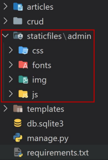
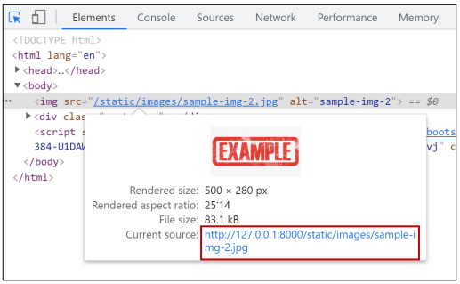

# ✔ Static Files
> 웹 서버
- 웹 서버는 특정 위치(URL)에 있는 자원(resource)을 요청(HTTP request) 받아서 제공(serving)하는 응답(HTTP response)을 처리하는 것을 기본 동작으로 함
- 즉, 웹 서버는 요청 받은 URL로 서버에 존재하는 정적 자원(static resource)를 제공

> 정적 파일
- 응답할 때 별도의 처리 없이 파일 내용을 그대로 보여주면 되는 파일
  - 사용자의 요청에 따라 내용이 바뀌는 것이 아니라 요청한 것을 그대로 보여주는 파일
- 예를 들어, 웹 서버는 일반적으로 이미지, 자바 스크립트 또는 CSS와 같은 미리 준비된 추가 파일(움직이지 않는)을 제공해야 함
- 파일 자체가 고정되어 있고, 서비스 중에도 추가되거나 변경되지 않고 고정되어 있음
- Django에서는 이러한 파일들을 `Static file`이라 함
  - Django는 staticfiles 앱을 통해 정적 파일과 관련 된 기능을 제공

> 정적 파일 활용

- `django.contrib.staticfiles`가 INSTALLED_APPS에 포함되어 있는지 확인
- settings.py에서 STATIC_URL을 정의
- 템플릿에서 `static 템플릿 태그`를 사용하여 지정된 상대경로에 대한 URL을 빌드

  ```django
  

  
  ```

- 앱의 static 디렉토리에 정적 파일을 저장
  - 예) my_app/static/my_app/example.jpg

1. `load`
   
   - 사용자 정의 템플릿 태그 세트를 로드(load)
   - 로드하는 라이브러리, 패키지에 등록된 모든 태그와 필터를 불러옴

2. `static`
   
   - STATIC_ROOT에 저장된 정적 파일에 연결


> `STATIC_ROOT`

- `collectstatic`이 **배포**를 위해 정적 파일을 수집하는 디렉토리의 절대 경로
  - 개발 환경에서는 사용하지 않으니 삭제 후 진행
- django 프로젝트에서 사용하는 모든 정적 파일을 한 곳에 모아 넣는 경로
- 개발 과정에서 settings.py의 DEBUG 값이 True로 설정되어 있으면 해당 값은 작용되지 않음
  - 직접 작성하지 않으면 django 프로젝트에서는 settings.py에 작성되어 있지 않음
- 실 서비스 환경(배포 환경)에서 django의 모든 정적 파일을 다른 웹 서버가 직접 제공하기 위함
- 참고) collectstatic
  
  - STATIC_ROOT 작성

    ```python
    STATIC_ROOT = BASE_DIR / 'staticfiles'
    ```
  
  - collectstatic 명령어
  
    ```bash
    $ python manage.py collectstatic
    ```
  
  - 실행 결과

    

> `STATIC_URL`

- STATIC_ROOT에 있는 정적 파일을 참조 할 때 사용할 URL
- **개발** 단계에서는 실제 정적 파일들이 저장되어 있는 ‘app/static/’ 경로(기본 경로) 및 STATICFILES_DIRS에 정의된 추가 경로들을 탐색함
- 실제 파일이나 디렉토리가 아니며, URL로만 존재
- 비어 있지 않은 값으로 설정 한다면 반드시 slash(/)로 끝나야 함

  - STATIC_URL 작성
  
    ```python
    STATIC_URL = '/static/'
    ```

  - 기본 경로 (정적 파일 경로: app/static/app/)
  
    ```
    articles
      static
        articles
          sample_img.jpg
    ```
  
  - template에서 경로 참조
  
    ```django
    <!-- articles/detail.html -->

    
    

    
      
      <h2>DETAIL</h2>
      ...
    
    ```

> `STATICFILES_DIRS`

  - ‘app/static/’ 디렉토리 경로(기본 경로)를 사용하는 것 외에 추가적인 정적 파일 경로 목록을 정의하는 리스트
  - 추가 파일 디렉토리에 대한 전체 경로를 포함하는 문자열 목록으로 작성되어야 함

    - STATICFILES_DIRS 작성
  
      ```python
      STATICFILES_DIRS = [
        BASE_DIR / 'static',
      ]
      ```

    - 추가 경로 (정적 파일 경로: static/)
    
      ```
      articles
      static
        images
          sample_img.jpg
      ```
  
    - template에서 경로 참조
    
      ```django
      <!-- base.html -->

      

      <!DOCTYPE html>
      <html lang="ko">
      <head>
        ...
      </head>
      <body>
        
        
        
      </body>
      ```
    
    - 크롬 개발자 도구에서 STATIC_URL 확인
    
      