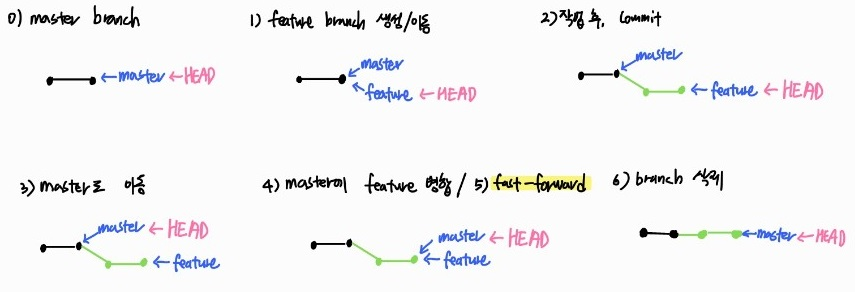
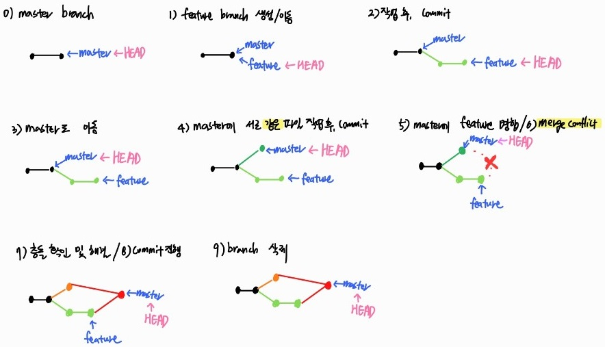
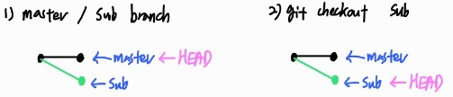
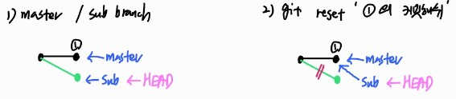

# ✔ Git Flow


Git을 활용하여 협업하는 흐름으로 branch를 활용하는 전략을 말한다.

깃으로 버전 관리를 시작하면 기본적으로 master(또는 main)라는 브랜치가 만들어진다.
master 브랜치에서 뻗어 나오는 새 브런치를 만드는 것을 **'분기(branch)'**라고 하는데, 분기를 하면 기본에 저장한 파일을 master 브랜치에 그대로 유지하면서 기존 파일 내용을 수정하거나 새로운 기능을 구현할 파일을 만들 수 있다.

새 브랜치에서 원하는 작업을 다 끝냈다면, 새 브랜치에 있던 파일을 원래 master 브랜치에 합칠 수 있다. 분기했던 브랜치를 master 브랜치에 합치는 것을 **'병합(merge)'**이라고 한다.

******

> branch 이름 및 특징
1. master (main): **배포** 가능한 상태의 branch
   - 최종 배포(release) 이력을 관리하기 위한 최상위 branch이다
2. develop (main): 다음 출시 버전 대비하여 **개발**하는 branch
   - master branch에서 기능 개발을 위해 feature branch가 분기된다
   - 개발한 기능들을 병합하고, 버그를 수정해 배포 가능한 안정적인 상태로 만들면 release branch로 갈라진다
3. feature branch (supporting): **기능별** 개발 branch(topic branch)
   - 추가 기능 개발 branch로, 개발 후 develope branch에 병합되거나 드랍된다
   - 기능이 반영/드랍된 후 해당 branch는 삭제된다
4. release branch (supporting): **다음 버전 출시**를 준비하는 branch
   - 개발 완료된 develop branch를 병합한 후, QA/test 등을 통해 발생하는 minor bug를 수정한다
   - master branch에 합병되어 배포된다
5. hotfixes (supporting): master branch에서 발생한 **버그를 수정**하는 branch
   - 현재 버전에서 발생한 bug를 긴급하게 수정한다


# ✔ Branch
> Branch 기본 명령어
1. 브랜치 생성
      ```bash
      $ git branch {브랜치명}
      ```
2. 브랜치 이동
   1. 구 명령어
      ```bash
      $ git chechout {브랜치명}
      ```
   2. 신 명령어
      ```bash
      $ git switch {브랜치명}
      ```
3. 브랜치 생성 및 이동
   1. 구 명령어
      ```bash
      $ git checkout -b {브랜치명}
      ```
   2. 신 명령어
      ```bash
      $ git switch -c {브랜치명}
      ```
5. 브랜치 목록 조회
   ```bash
   $ git branch
   ```
   - 특정 브랜치 앞에 `*` 표시는 현재 작업하고 있는 브랜치를 뜻함
6. 브랜치 삭제
   ``` bash
   $ git branch -d {브랜치명}
   ```
   - 삭제한 브랜치는 같은 이름으로 다시 브랜치를 만들면, 예전에 작업했던 내용이 그대로 나타남
   - 병합하지 않은 브랜치를 삭제하려면 오류 메시지가 나타남
   - `$ git branch -D {브랜치명}`: 병합하지 않은 브랜치 강제로 삭제

*****

> Branch merge (병합)

```bash
(HEAD -> master)
$ git merge {브랜치명}
```
- HEAD는 여러 브랜치 중에서 현재 작업 중인 브랜치를 가리킨다
- 각 브랜치에서 작업한 후 버전(커밋,이력)을 합치기 위해서 일반적으로 merge 명령어를 사용한다
- 브랜치를 병합할 때 자동으로 편집기가 실행되면서 커밋 메시지를 추가 작성할 수 있다
- `$ git merge {브랜치명} --no-edit`: 브랜치 병합할 때 편집기 창을 열지 않고 깃에서 지정하는 커밋 메시지를 그대로 사용하고 싶을 경우, 편집기 창이 나타나지 않도록 설정
- `$ git merge {브랜치명} --edit`: 브랜치 병합할 때 편집기 창이 나타나지 않도록 설정한 경우, 커밋 메시지를 추가하거나 수정하고 싶을 때 --edit옵션 사용
- 병합을 진행할 때, 만약 서로 다른 이력에서 동일한 파일의 동일한 부분을 수정한 경우 충돌이 발생할 수 있다
- 충돌이 발생하면 직접 수정을 진행해야 한다

*****

> Branch merge 시나리오

1. fast-forword merge
   - 새 브랜치 생성하고 버전을 만든 후 merge할 때, 기존 master branch에 변경사항이 없어(새로운 커밋을 만들지 않아서) 포인터가 단순히 앞으로 이동하는 상황

   ```bash
   ex) fast-forward 하는 상황
   
   # 1) feature/home branch 생성 및 이동
   (master) $ git branch feature/home
   (master) $ git checkout feature/home
   
   # 2) 작업 완료 후 feature/home branch에 commit
   (feature/home) $ touch home.txt
   (feature/home) $ git add .
   (feature/home) $ git commit -m 'Add home.txt'
   
   # 3) master branch로 이동
   (feature/home) $ git checkout master
   
   # 4) master branch에 feature branch 병합
   (master) $ git merge feature/home
   
   # 5) 결과: fast-forward
   
   # 6) branch 삭제
   (master) $ git branch -d feature/home
   ```
   

   
   
2. merge commit
   
   **상황1)** 서로 다른 파일이나 폴더가 수정된 두 이력을 병합하는 경우 
   
   ​			 (또는 같은 파일 내 다른 부분이 수정된 두 이력을 병합하는 경우)
   
      - git이 auto merging을 진행하고, commit이 발생된다
    ```bash
   ex) auto merge commit 하는 상황
   
   # 1) feature/home branch 생성 및 이동
   (master) $ git branch feature/home
   (master) $ git checkout feature/home
   
   # 2) 작업 완료 후 feature/home branch에 commit
   (feature/home) $ touch home.txt
   (feature/home) $ git add .
   (feature/home) $ git commit -m 'Add home.txt'
   
   # 3) master branch로 이동
   (feature/home) $ git checkout master
   
   # 4) master에서 서로 다른 파일이나 폴더를 작업 후, 추가 commit을 발생
   (master) $ touch master.txt
   (master) $ git add .
   (master) $ git commit -m 'Add master.txt'
   
   # 5) master branch에 feature branch 병합
   (master) $ git merge feature/home
   
   # 6) 결과: 자동으로 merge commit 발생
   
   # 7) branch 삭제
   (master) $ git branch -d feature/home
    ```
   
   
   **상황2)** 같은 파일 내 같은 부분이 수정된 두 이력을 병합하는 경우 `💥충돌💥`
      - git이 auto merging하지 못하고 충돌 메시지를 보여준다
      - 사용자가 직접 충돌부분을 해결한 후, 직접 commit을 발생시켜야 한다
   ```bash
   ex) 병합 시 충돌하는 상황
   
   # 1) feature/home branch 생성 및 이동
   (master) $ git branch feature/home
   (master) $ git checkout feature/home
   
   # 2) 작업 완료 후 feature/home branch에 commit
   # README.md 파일 열어서 수정
   (feature/home) $ touch home.txt
   (feature/home) $ git add .
   (feature/home) $ git commit -m 'Add home.txt, Update README.md'
   
   # 3) master branch로 이동
   (feature/home) $ git checkout master
   
   # 4) master에서 같은 파일의 같은 부분을 작업 후, 추가 commit을 발생
   # README.md 파일 열어서 수정
   (master) $ git add .
   (master) $ git commit -m 'Update README.md'
   
   # 5) master branch에 feature branch 병합
   (master) $ git merge feature/home
   Auto-merging README.md
   CONFLICT (content): Merge conflict in README.md
   Automatic merge failed; fix conflicts and then commit the result.
   
   # 6) 결과: merge conflict 발생
   (master|MERGING) $ git status
   On branch master
   You have unmerged paths.
     (fix conflicts and run "git commit")        
     (use "git merge --abort" to abort the merge)
   
   Unmerged paths:
     (use "git add <file>..." to mark resolution)
           both modified:   README.md
   
   # 7) 충돌 확인 및 해결
   <<<<<<< HEAD
   마스터에서 작업함...
   =======
   테스트에서 작성
   >>>>>>> feature/home
   
   # 8) merge commit 진행
   (master|MERGING) $ git add .
   (master|MERGING) $ git commit
   
   # 9) branch 삭제
   (master) $ git branch -d feature/home
   ```
   

*****
> 병합 자동화 프로그램
1. P4Merge
2. Meld
3. Kdiff3
4. Ariaxis Merge

# ✔ $ git checkout과 $ git reset의 비교
1. `$ git checkout {브랜치명}`
   - HEAD를 제어해서 브랜치를 이동
   
2. `$ git reset {되돌아갈 커밋 해시}`
   - HEAD가 가리키고 있는 브랜치의 최신 커밋을 원하는 커밋으로 지정 가능
   - 어떤 브랜치에 있는 커밋이든 지정 가능하며, 명령을 수행한 뒤 브랜치와 연결이 끊긴 커밋은 삭제됨
   