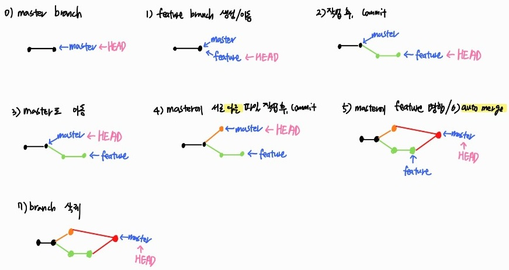

# ✔ Git Flow


Git을 활용하여 협업하는 흐름으로 branch를 활용하는 전략을 말한다.

******

> branch 이름 및 특징
1. master (main): **배포** 가능한 상태의 branch
   - 최종 배포(release) 이력을 관리하기 위한 최상위 branch이다
2. develop (main): 다음 출시 버전 대비하여 **개발**하는 branch
   - master branch에서 기능 개발을 위해 feature branch가 분기된다
   - 개발한 기능들을 병합하고, 버그를 수정해 배포 가능한 안정적인 상태로 만들면 release branch로 갈라진다
3. feature branch (supporting): **기능별** 개발 branch(topic branch)
   - 추가 기능 개발 branch로, 개발 후 develope branch에 병합되거나 드랍된다
   - 기능이 반영/드랍된 후 해당 branch는 삭제된다
4. release branch (supporting): **다음 버전 출시**를 준비하는 branch
   - 개발 완료된 develop branch를 병합한 후, QA/test 등을 통해 발생하는 minor bug를 수정한다
   - master branch에 합병되어 배포된다
5. hotfixes (supporting): master branch에서 발생한 **버그를 수정**하는 branch
   - 현재 버전에서 발생한 bug를 긴급하게 수정한다


# ✔ Branch
> Branch 기본 명령어
1. 브랜치 생성
```bash
$ git branch {브랜치명}
```
2. 브랜치 이동
```bash
$ git chechout {브랜치명}
```
3. 브랜치 생성 및 이동
```bash
$ git checkout -b {브랜치명}
```
4. 브랜치 목록 조회
```bash
$ git branch
```
5. 브랜치 삭제
``` bash
$ git branch -d {브랜치명}
```

*****

> Branch merge (병합)

```bash
(HEAD -> master)
$ git merge {브랜치명}
```
- 각 브랜치에서 작업한 후 버전(커밋,이력)을 합치기 위해서 일반적으로 merge 명령어를 사용한다
- 병합을 진행할 때, 만약 서로 다른 이력에서 동일한 파일의 동일한 부분을 수정한 경우 충돌이 발생할 수 있다
- 충돌이 발생하면 직접 수정을 진행해야 한다

*****

> Branch merge 시나리오

1. fast-forword
   - 새 브랜치 생성하고 버전을 만든 후 merge할 때, 기존 master branch에 변경사항이 없어 단순히 앞으로 이동하는 상황

   ```bash
   ex) fast-forward 하는 상황
   
   # 1) feature/home branch 생성 및 이동
   (master) $ git branch feature/home
   (master) $ git checkout feature/home
   
   # 2) 작업 완료 후 feature/home branch에 commit
   (feature/home) $ touch home.txt
   (feature/home) $ git add .
   (feature/home) $ git commit -m 'Add home.txt'
   
   # 3) master branch로 이동
   (feature/home) $ git checkout master
   
   # 4) master branch에 feature branch 병합
   (master) $ git merge feature/home
   
   # 5) 결과: fast-forward
   
   # 6) branch 삭제
   (master) $ git branch -d feature/home
   ```
   

   
   
2. merge commit
   
   **상황1)** 서로 다른 파일이나 폴더가 수정된 두 이력을 병합하는 경우 
   
   ​			 (또는 같은 파일 내 다른 부분이 수정된 두 이력을 병합하는 경우)
   
      - git이 auto merging을 진행하고, commit이 발생된다
    ```bash
   ex) auto merge commit 하는 상황
   
   # 1) feature/home branch 생성 및 이동
   (master) $ git branch feature/home
   (master) $ git checkout feature/home
   
   # 2) 작업 완료 후 feature/home branch에 commit
   (feature/home) $ touch home.txt
   (feature/home) $ git add .
   (feature/home) $ git commit -m 'Add home.txt'
   
   # 3) master branch로 이동
   (feature/home) $ git checkout master
   
   # 4) master에서 서로 다른 파일이나 폴더를 작업 후, 추가 commit을 발생
   (master) $ touch master.txt
   (master) $ git add .
   (master) $ git commit -m 'Add master.txt'
   
   # 5) master branch에 feature branch 병합
   (master) $ git merge feature/home
   
   # 6) 결과: 자동으로 merge commit 발생
   
   # 7) branch 삭제
   (master) $ git branch -d feature/home
    ```
   
   
   **상황2)** 같은 파일 내 같은 부분이 수정된 두 이력을 병합하는 경우 `💥충돌💥`
      - git이 auto merging하지 못하고 충돌 메시지를 보여준다
      - 코드를 직접 수정한 후, 직접 commit을 발생시켜야 한다
   ```bash
   ex) 병합 시 충돌하는 상황
   
   # 1) feature/home branch 생성 및 이동
   (master) $ git branch feature/home
   (master) $ git checkout feature/home
   
   # 2) 작업 완료 후 feature/home branch에 commit
   # README.md 파일 열어서 수정
   (feature/home) $ touch home.txt
   (feature/home) $ git add .
   (feature/home) $ git commit -m 'Add home.txt, Update README.md'
   
   # 3) master branch로 이동
   (feature/home) $ git checkout master
   
   # 4) master에서 같은 파일의 같은 부분을 작업 후, 추가 commit을 발생
   # README.md 파일 열어서 수정
   (master) $ git add .
   (master) $ git commit -m 'Update README.md'
   
   # 5) master branch에 feature branch 병합
   (master) $ git merge feature/home
   Auto-merging README.md
   CONFLICT (content): Merge conflict in README.md
   Automatic merge failed; fix conflicts and then commit the result.
   
   # 6) 결과: merge conflict 발생
   (master|MERGING) $ git status
   On branch master
   You have unmerged paths.
     (fix conflicts and run "git commit")        
     (use "git merge --abort" to abort the merge)
   
   Unmerged paths:
     (use "git add <file>..." to mark resolution)
           both modified:   README.md
   
   # 7) 충돌 확인 및 해결
   <<<<<<< HEAD
   마스터에서 작업함...
   =======
   테스트에서 작성
   >>>>>>> feature/home
   
   # 8) merge commit 진행
   (master|MERGING) $ git add .
   (master|MERGING) $ git commit
   
   # 9) branch 삭제
   (master) $ git branch -d feature/home
   ```
   