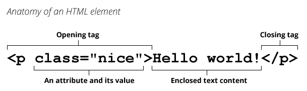
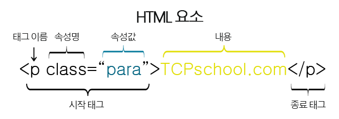

# ✔ HTML 기본 구조

```html
<!-- HTML 기본 골격 -->
<!DOCTYPE html>
<html lang="en">
  <head>
      <meta charset="UTF-8">
      <title>Document</title>
  </head>
  <body>
  </body>
</html>
```

1. `<html></html>`
   - 페이지 전체의 컨텐츠를 감싸는 요소
   - 문서의 최상위(root) 요소

2. `<head></head>`
   - 문서 메타데이터 요소
   - 문서 제목, 인코딩, 스타일, 외부 파일 로딩 등
   - 일반적으로 브라우저에 나타나지 않는 내용

3. `<body></body>`
   - 실제 화면 구성과 관련된 내용


# ✔ html 태그 & head 태그

> `<html></html>` 태그 구조

```html
<!-- html 태그 구조 -->
<html lang="en">
</html>
```

- 문서의 기본 언어 설정 (한국어의 경우, lang="ko")

> `<head></head>` 태그 구조

```html
<!-- head 태그 구조 -->
<head>
  <title>HTML 학습</title>
  <meta charset="UTF-8">
  <link href="style.css" rel="stylesheet">
  <script src="javascript.js"></script>
  <style>
    p {
    color: black;
    }
  </style>
</head>
```

1. `<title></title>`
   
   - HTML문서 전체의 타이틀
   - 브라우저 상단 탭의 타이틀
    
    ```html
    <head>
      <title>HTML 학습</title>
    </head>
    ```

2. `<meta>`
   
   - 문서 레벨 메타데이터 요소
     - 문서의 인코딩(character set) 특정
     - 저자(name)와 설명(content) 추가
   - [Open Graph Data](https://ogp.me/)
     - 메타 데이터를 표현하는 새로운 규약
     - Facebook이 웹 사이트에 더 풍부한 메타 데이터를 제공하기 위해 발명한 메타 데이터 프로토콜
     - HTML 문서의 메타 데이터를 통해 문서의 정보를 전달
     - 메타정보에 해당하는 제목, 설명 등을 쓸 수 있도록 정의
  
    ```html
    <head>
      <meta charset="UTF-8">
      <meta name="author" content="HJ Yun">
      <meta name="description" content="I learned HTML">

      <meta property="og:title" content="The Rock" />
      <meta property="og:type" content="video.movie" />
      <meta property="og:url" content="https://www.imdb.com/title/tt0117500/" />
      <meta property="og:image" content="https://ia.media-imdb.com/images/rock.jpg" />
    </head>
    ```

    

3. `<link>`
   
   - 외부 리소스 (CSS 파일, favicon 등) 연결 요소

    ```html
    <head>
      <link rel="stylesheet" href="style.css">
      <link rel="shortcut icon" href="favicon.ico" type="image/x-icon">
    </head>
    ```

4. `<script></script>`
   
   - 스크립트 요소 (JavaScript 파일/코드)

    ```html
    <head>
      <script src="javascript.js"></script>
    </head>
    ```

5. `<style></style>`
   
   - CSS 직접 작성

    ```html
    <head>
      <style>
        p {
        color: black;
        }
      </style>
    </head>
    ```

# ✔ 요소와 속성

> 요소 (element)



- HTML의 요소는 시작 태그, 종료 태크, 내용(content)으로 구성
  - 요소는 태그로 내용을 감싸는 것으로 그 정보의 성격과 의미를 정의
  - 내용이 없는 태그들도 존재(닫는 태그가 없음)
    - br, hr, img, input, link, meta 등
- 요소는 중첩(nested)될 수 있음
  - 요소의 중첩을 통해 하나의 문서를 구조화
  - 여는 태그와 닫는 태그의 쌍을 잘 확인해야 함
    - 이유: 오류를 반환하는 것이 아닌 레이아웃이 깨진 상태로 출력되기 때문에, 디버깅이 힘들어 질 수 있음
- 인라인 레벨 요소 vs 블록 레벨 요소
- 텍스트 요소: a, b, i, br, img, span 등
- 그룹 요소: p, hr, ol, ul, pre, div, blockquote 등

> 속성 (attribute)



- 속성을 통해 태그의 부가적인 정보를 설정할 수 있음
- 요소는 속성을 가질 수 있으며, 경로나 크기와 같은 추가적인 정보를 제공
- 요소의 시작 태그에 작성하며 보통 이름과 값이 하나의 쌍으로 존재
- 속성 지정 스타일 가이드
  - 등호 좌우에 공백은 없어야 함
  - 속성값 작성 시 쌍따옴표 사용
- 태그별로 사용할 수 있는 속성은 다름
- 태그와 상관없이 사용 가능한 속성(HTML Global Attribute)들도 있음

> HTML Global Attribute
- 모든 HTML 요소가 공통으로 사용할 수 있는 대표적인 속성 (일부 요소에는 아무 효과가 없을 수 있음)

1. `id`: 문서 전체에서 유일한 고유 식별자 지정
   
2. `class`: 공백으로 구분된 해당 요소의 클래스 목록
   - CSS, JS에서 요소를 선택하거나 접근하기 위해 사용됨

3. `style`: inline 스타일 지정

4. `data-*`: 페이지에 개인 사용자 정의 데이터를 저장하기 위해 사용

5. `title`: 요소에 대한 추가 정보 지정

6. `tabindex`: 요소의 탭 순서


# ✔ DOM(Document Object Model) 트리
> 렌더링 (Rendering)
- 텍스트로 작성된 코드를 사용자가 보게 되는 웹 사이트로 바꾸는 과정
  
> DOM 트리
- 텍스트 파일인 HTML 문서를 브라우저에서 렌더링 하기 위한 구조
- HTML 문서에 대한 모델을 구성함
- HTML 문서 내의 각 요소에 접근/수정하는데 필요한 프로퍼티와 메서드를 제공함


