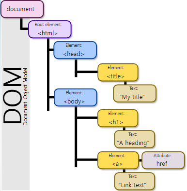

# ✔ 자바스크립트 

## ▶ JavaScript 정의

- ‘웹페이지에 생동감을 불어넣기 위해’ 만들어진 프로그래밍 언어
- 브라우저에서만 쓸 목적으로 고안된 언어이지만, 지금은 다양한 환경에서 쓰이고 있음
- 자바스크립트 엔진이 들어 있는 모든 디바이스에 동작 가능
- 실행 환경에 따라 자바스크립트의 능력이 달라짐
  - `Node.js` 환경의 경우, 임의의 파일을 읽고 쓰거나 네트워크 요청을 수행하는 함수 지원
  - `브라우저` 환경의 경우, 웹페이지를 조작하거나 클라이언트와 서버의 상호작용에 관한 모든 일을 할 수 있음
- 자바스크립트만의 강점
  - HTML/CSS와 완전히 통합할 수 있음
  - 모든 주요 브라우저에서 지원하고, 기본 언어로 사용됨

## ▶ 자바스크립트 엔진

### 🔹 브라우저별 자바스크립트 엔진

- Chrome, Opera: `V8`
- Firefox: `SpiderMonkey`
- MS Edge: `ChakraCore`
- Safari: `SquirelFish`

### 🔹 자바스크립트 엔진 동작 방법

1. 엔진이 스크립트를 읽음(파싱)
2. 스크립트를 기계어로 전환(컴파일)
3. 기계어로 전환된 코드 실행

## ▶ 브라우저 환경에서의 자바스크립트

### 🔹 브라우저에서 자바스크립트로 할 수 있는 일

- 페이지에 새로운 HTML 추가
- 기존 HTML, 스타일 수정
- 마우스 클릭과 같은 사용자 행동에 반응하기
- 서버에 요청 보내기, 파일 다운로드/업로드 (AJAX, COMET 기술)
- 쿠키를 가져오거나 설정
- 클라이언트 사이드에 데이터 저장하기 (로컬 스토리지)

### 🔹 브라우저에서 자바스크립트로 할 수 없는 일

- 디스크에 저장된 임의의 파일을 읽고 쓰고 복사하거나 실행할 때 제약을 받음
  - 단, `<input>` 태그를 통해 파일을 선택할 때와 같이 특정 상황에서는 파일 접근 가능
- 카메라와 마이크 같은 디바이스와 상호 작용하려면 사용자의 명시적인 허가가 있어야 함
- 브라우저 내 탭과 창은 대개 서로의 정보를 알 수 없음
  - `http://anysite.com`에서 받아온 페이지가 `http://gmail.com`에서 받아온 페이지 상의 정보에 접근해 중요한 개인정보를 훔치는 걸 막기 위함
- 타 사이트나 도메인에서 서버를 통해 데이터를 받아오는 건 불가
  - 단, 서버에서 명확히 승인을 해주면 데이터를 받아올 수 있음

## ▶ 자바스크립트 ‘너머의’ 언어들

- 브라우저에서 실행되기 전에 자바스크립트로 변환(transpile)할 수 있는 언어들
- `TypeScript`: MS가 개발한 언어로, '자료형의 명시화(strict data typing)'에 집중해 만듦
- `CoffeeScript`: 짧은 문법을 도입하여 명료하고 이해하기 쉬운 코드 작성 가능
- `Flow`: Facebook에서 개발한 언어로, 자료형을 강제함
- `Dart`: Google에서 개발한 언어로, 모바일 앱과 같이 브라우저가 아닌 환경에서 동작하는 고유의 엔진을 가진 독자적 언어

## ▶ 명세서 / 매뉴얼 / 호환성표

- 명세서: [ECMA-262 명세서(specification)](https://www.ecma-international.org/publications/standards/Ecma-262.htm)
- 매뉴얼: [MDN JavaScript Reference](https://developer.mozilla.org/en-US/docs/Web/JavaScript/Reference)
- 호환성 표: [CanIUse](http://caniuse.com)

## ▶ 코드 에디터(code editor)

1. 통합 개발 환경 (Integrated Development Environment, IDE)
   - 프로젝트 전체를 관장하는 다양한 기능을 제공
   - 버전 관리 시스템, 테스팅 환경 등의 작업도 수행
   - 종류: `Visual Studio`, `WebStorm`

2. 경량 에디터 (lightweight editor)
   - IDE만큼 많은 기능을 제공하진 않음
   - IDE보다 속도가 빠르고 단순함
   - 파일을 열고 바로 수정하고자 할 때 주로 사용됨
   - 다양한 플러그인을 지원하므로, IDE 못지않게 다양한 기능을 사용 가능
   - 종류: `Atom`, `Visual Studio Code`, `Sublime Text`, `Notepad++`, `Vim`, `Emacs`

# ✔ ECMAScript / DOM / BOM

- 브라우저(BOM)과 그 내부의 문서(DOM)를 조작하기 위해 ECMAScript(JS)의 학습이 필요
  
## ▶ JavaScript Core (ECMAScript)

> 참고: [JavaScript와 ECMAScript는 무슨 차이점이 있을까?](https://wormwlrm.github.io/2018/10/03/What-is-the-difference-between-javascript-and-ecmascript.html)
- Data Structure(Object, Array), Conditional Expression, Iteration

## ▶ DOM (Document Object Model)

- HTML, XML과 같은 문서를 다루기 위한 문서 프로그래밍 인터페이스
- 문서를 구조화하고 구조화된 구성 요소를 하나의 객체로 취급하여 다루는 논리적 트리 모델
- 문서가 구조화되어 있으며 각 요소는 객체(object)로 취급
- 자바스크립트로 요소의 단순한 속성 접근, 메서드 활용뿐만 아니라 프로그래밍 언어적 특성을 활용한 조작 가능
- 문서 객체(Document Object)
  
  - `window` : DOM을 표현하는 창. 가장 최상위 객체 (작성 시 생략 가능)
  
  - `document` : 페이지 컨텐츠의 Entry Point 역할을 하며, `<body>` 등과 같은 수많은 다른 요소들을 포함
  
  - `navigator`, `location`, `history`, `screen`

  

- 파싱 (Parsing)
  - 구문 분석, 해석
  - 브라우저가 문자열을 해석하여 DOM Tree로 만드는 과정

## ▶ BOM (Browser Object Model)

- 자바스크립트가 브라우저와 소통하기 위한 모델
- 브라우저의 창이나 프레임을 추상화해서 프로그래밍적으로 제어할 수 있도록 제공하는 수단
  - 버튼, URL 입력창, 타이틀 바 등 브라우저 윈도우 및 웹 페이지 일부분을 제어 가능
- window 객체는 모든 브라우저로부터 지원받으며 브라우저의 창(window)를 지칭
- 브라우저 객체(Browser Object)
  
  - `navigator`, `screen`, `location`, `frames`, `history`, `XHR`

  