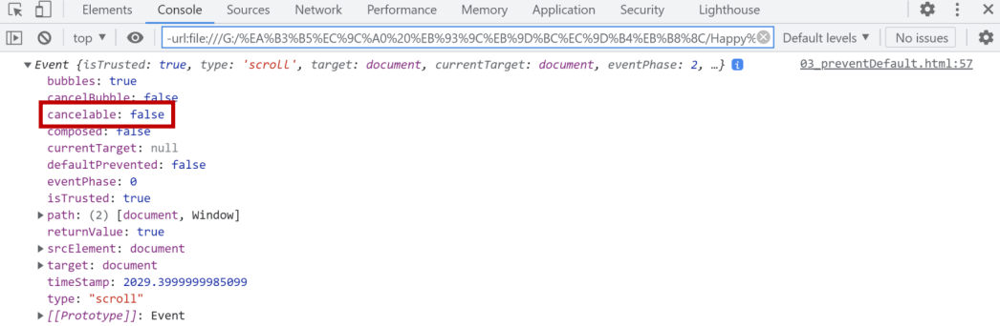

# ✔ Event
> Event 개념
- 네트워크 활동이나 사용자와의 상호작용 같은 사건의 발생을 알리기 위한 객체
- 이벤트 발생
  - 마우스를 클릭하거나 키보드를 누르는 등 사용자 행동으로 발생할 수도 있음
  - 특정 메서드를 호출(Element.click())하여 프로그래밍적으로도 만들어 낼 수 있음
- 대상에 특정 이벤트가 발생했을 때, 할 일(함수)을 등록

> Event Handler

```javascript
EventTarget.addEventListener(type, listener[, option])
```

- 지정한 이벤트가 대상에 전달될 때마다 호출할 함수를 설정
- 이벤트를 지원하는 모든 객체(Element, Document, Window 등)를 대상으로 지정 가능
- type
  - 반응 할 이벤트 유형 (대소문자 구분 문자열)
- listener
  - 지정된 타입의 이벤트가 발생했을 때 알림을 받는 객체
  - EventListener 인터페이스 혹은 JS function 객체(콜백 함수)여야 함

> Event 취소

```javascript
event.preventDefault()
```

- 현재 이벤트의 기본 동작을 중단
- HTML 요소의 기본 동작을 작동하지 않게 막음
  -  ex) a 태그의 기본 동작은 클릭 시 링크로 이동 / form 태그의 기본 동작은 form 데이터 전송
- 이벤트를 취소할 수 있는 경우, 이벤트의 전파를 막지 않고 그 이벤트를 취소
- 취소 할 수 없는 이벤트도 존재
  - 이벤트의 취소 가능 여부는 event.cancelable을 사용해 확인할 수 있음

  


# ✔ Event 유형
1. key 관련 이벤트

   - `keydown`: 키가 눌렸을 때
   - `keypress`: 쉬프트, Fn, CapsLock 을 제외한 키가 연속적으로 눌린 상태일 때
   - `keyup`: 키 누름이 해제될 때

2. mouse 관련 이벤트

   - `mouseover`: 포인팅 장치가 리스너가 등록된 엘리먼트나 그 자식 엘리먼트의 위로 이동했을 때
   - `click`: 포인팅 장치 버튼(모든 버튼; 주 버튼만 해당될 예정)이 엘리먼트에서 눌렸다가 놓였을 때

3. 복사/잘라내기/붙여넣기 관련 이벤트

   - `cut`: 선택이 잘라내어진 후 클립보드로 복사되었을 때
   - `copy`: 선택이 클립보드로 복사되었을 때
   - `paste`: 클립보드의 항목이 붙여넣어졌을 때