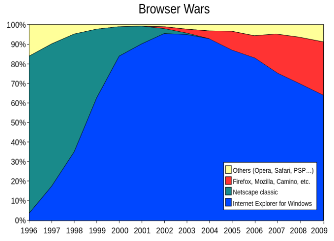
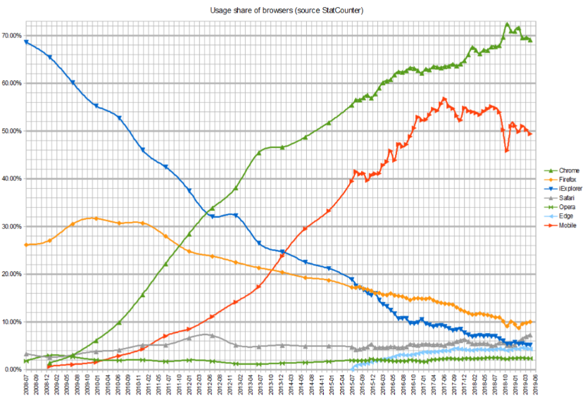

# ✔ 자바스크립트 Intro

## ▶ 브라우저 (Browser)

- URL로 웹(WWW)을 탐색하며 서버와 통신하고, HTML 문서나 파일을 출력하는 GUI 기반의 소프트웨어
- 인터넷의 컨텐츠를 검색 및 열람하도록 함
- 주요 브라우저: Google `Chrome`, Mozilla `Firefox`, Microsoft `Edge`, `Opera`, `Safari`

## ▶ 자바스크립트의 필요성

- 브라우저 화면을 **동적**으로 만들기 위함
- 브라우저를 조작할 수 있는 유일한 언어

# ✔ 자바스크립트의 역사

## ▶ 자바스크립트의 탄생

- 1994년 당시 넷스케이프 커뮤니케이션스사의 Netscape Navigator(NN) 브라우저가 전 세계 점유율을 80% 이상 독점하며 브라우저의 표준 역할을 함
- 당시 넷스케이프에 재직 중인던 브랜던 아이크가 HTML을 동적으로 동작하기 위한 회사 내부 프로젝트를 진행 중 JS를 개발
- JavaScript 이름 변천사: Mocha → LiveScript → JavaScript (1995)
- 그러나 1995년 경쟁사 마이크로소프트에서 이를 채택하여 커스터마이징한 JScript를 만듦
- 이를, IE 1.0 에 탑재 → 1차 브라우저 전쟁의 시작

## ▶ 제 1차 브라우저 전쟁 - `넷스케이프` vs `MS`

- MS의 폭발적 성장, IE3에서 자체적인 JScript를 지원, 호환성 문제로 크로스 브라우징 (Cross Browsing) 등의 이슈 발생
- 빌 게이츠 주도하에 MS는 1997년 IE 4를 발표하면서 시장을 장악하기 시작
  - 당시 윈도우 OS의 시장 점유율은 90%
  - 글로벌 기업 MS의 공격적인 마케팅
- MS의 승리로 끝나며 2001년부터 IE의 점유율은 90%를 상회
- 1998년 넷스케이프에서 나온 브랜던 아이크 외 후계자들은 모질라 재단을 설립
  - 파이어폭스를 통해 IE에 대항하며 꾸준히 점유율을 올려 나감

  

## ▶ 제 2차 브라우저 전쟁 - `MS` vs `Google`

- 2008년 Google의 Chrome 브라우저 발표
- 2011년 3년 만에 파이어폭스의 점유율을 돌파 후 2012년부터 전 세계 점유율 1위 등록
- 크롬의 승리 요인
  - 압도적인 속도
  - 강력한 개발자 도구 제공
  - 웹 표준

  

## ▶ 파편화와 표준화

- 제1차 브라우저 전쟁 이후 수많은 브라우저에서 자체 자바스크립트 언어를 사용하게 됨
- 결국 서로 다른 자바스크립트가 만들어지면서 크로스 브라우징 이슈가 발생하여 웹 표준의 필요성이 제기
- **크로스 브라우징** (Cross Browsing)
  - W3C에서 채택된 표준 웹 기술을 채용하여 각각의 브라우저마다 다르게 구현되는 기술을 비슷하게 만들되, 어느 한쪽에 치우치지 않도록 웹 페이지를 제작하는 방법론 (동일성이 아닌 동등성)
  - 브라우저마다 렌더링에 사용하는 엔진이 다르기 때문
- 1996년부터 넷스케이프는 표준 제정의 필요성을 주장
  - ECMA 인터내셔널(정보와 통신 시스템을 위한 국제적 표준화 기구)에 표준 제정 요청
- **1997년 ECMAScript 1 (ES1)** 탄생
- 제1차 브라우저 전쟁 이후 제기된 언어의 파편화를 해결하기 위해 각 브라우저 회사와 재단은 표준화에 더욱 적극적으로 힘을 모으기 시작
- **2015년 ES2015 (ES6)** 탄생
  - JavaScript의 고질적인 문제들을 해결
  - JavaScript의 다음 시대라고 불릴 정도로 많은 혁신과 변화를 맞이한 버전
  - 이때부터 버전 순서가 아닌 출시 연도를 붙이는 것이 공식 명칭이나 통상적으로 ES6라 부름
  - 현재는 표준 대부분이 ES6+로 넘어옴