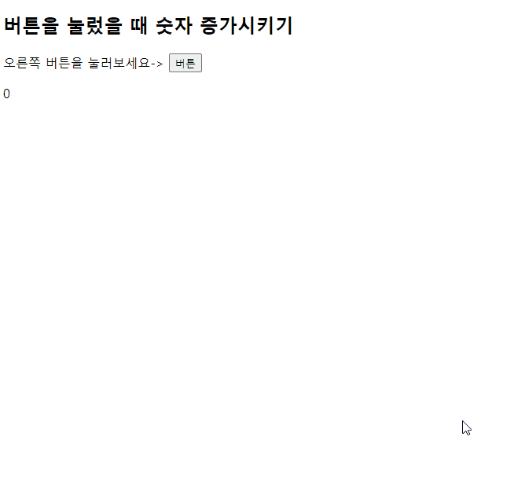
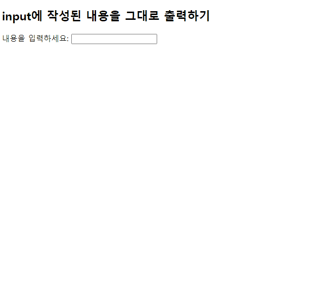
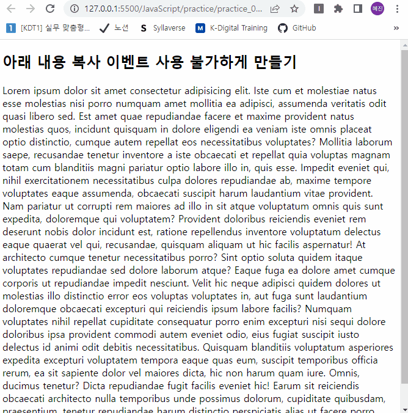
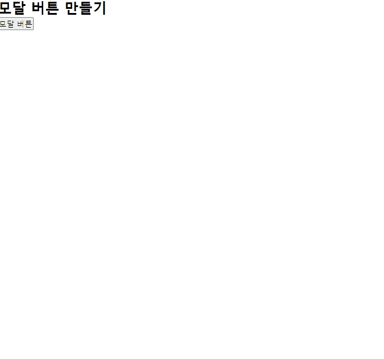
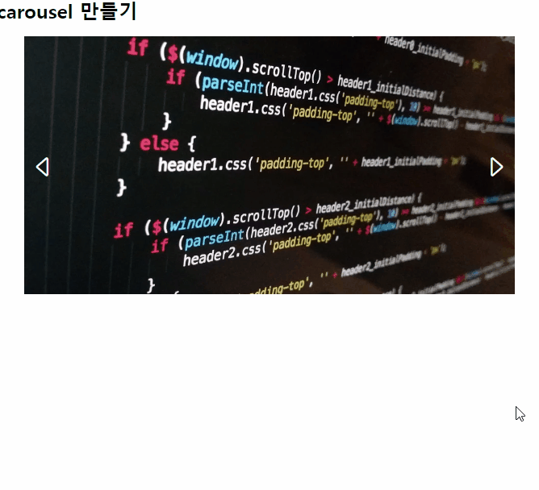
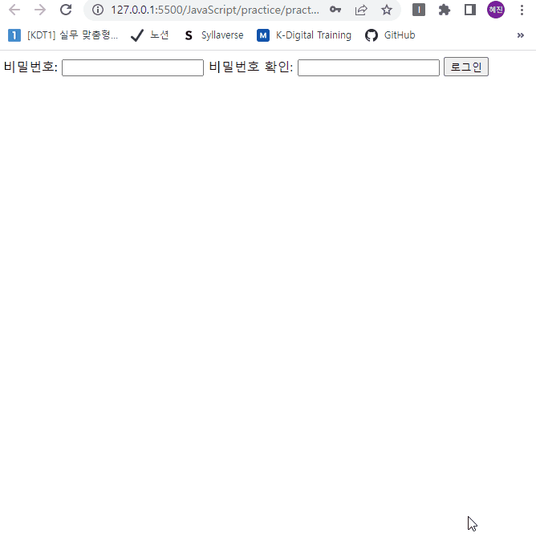

# 실습01 - 자바스크립를 이용해 동적 상호작용 생성

## 실습 과정
> 01_button.html

- 버튼을 눌렀을 때, 바로 아래에 버튼을 누른 수만큼 숫자가 뜨게 함

> 02_input.html

- 입력란에 입력한 텍스트 그대로 바로 아래에 나타나게 함

> 03_prevent.html

- 글을 복사하지 않게 막음

> 04_modal.html

- 모달 버튼을 누르면 모달 창이 나타나게 함
- 모달 창에서 취소나 제출 버튼을 누르면 모달 창이 다시 사라지게 함

> 05_carousel.html

- 왼쪽이나 오른쪽 아이콘을 누르면 사진이 순서에 맞게 화면에 나타남

> 06_form.html

- 비밀번호 및 비밀번호 일치 여부를 확인해 경고창을 띄워 메시지 전달
- 조건
  - 비밀번호는 8자리 이상이어야 함
  - 비밀번호는 비밀번호와 비밀번호 확인 값이 일치해야 함

# 실습 결과 완성본

> 01_button.html

> 02_input.html

> 03_prevent.html

> 04_modal.html

> 05_carousel.html

> 06_form.html

