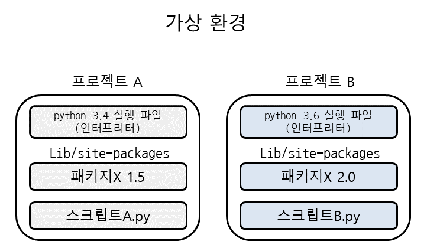

# ✔ 파이썬 표준 라이브러리
- Python Standard Library (PSL)
- 파이썬에 기본적으로 설치된 모듈과 내장함수의 모음
- 함수, 클래스 < 모듈 < 패키지 < 라이브러리


# ✔ 파이썬 패키지
> 파이썬 패키지 관리자 (pip)
- PyPI (Python Package Index)에 저장된 외부 패키지들을 설치하도록 도와주는 패키지 관리 시스템
- 파이썬 표준 라이브러리가 아닌 외부 패키지와 모듈을 사용하는 경우, 모두 pip를 통해 설치해야함

> 패키지 설치
   
   ```python
   # 아래 명령어는 모두 bash, cmd에서 사용 가능
   $ pip install <패키지명>
   $ pip install <패키지명>==1.0.5
   $ pip install '패키지명>=1.0.4'
   ```
   
   - 최신 버전 / 특정 버전 / 최소 버전을 명시하여 설치할 수 있음
   - 이미 설치되어 있는 경우 이미 설치되어 있음을 알리고 재설치하지 않음

> 패키지 삭제

  ```python
  $ pip uninstall <패키지명>
  ```

  - pip는 패키지를 업그레이드하는 경우 과거 버전을 자동으로 지워줌

> 패키지 목록 및 특정 패키지 정보 출력
    
  ```python
  # 패키지 목록 출력
  $ pip list
  
  # 특정 패키지 정보 출력
  $ pip show <패키지명>
  ```

> 패키지 목록 관리 및 설치
   
   ```python
  # 패키지 목록 출력
  $ pip freeze

  # 특정 파일에 패키지 목록 기록
  $ pip freeze > <파일명>

  # 파일에 기록된 패키지들을 모두 설치
  $ pip install -r <파일명>
  ```

  1. `pip freeze`
      - `pip list`처럼 패키지 목록을 출력하지만, pip install에서 활용되는 형식으로 출력
  2. `pip freeze > requirements.txt`
      - 설치되어 있는 패키지 목록을 특정 파일으로 만들어 관리함
      - 일반적으로 패키지를 기록하는 파일의 이름은 `requirements.txt`로 정의함
  3. `pip install -r requirements.txt`
      - 다른 작업환경에서 `requirements.txt`에 있는 목록을 읽은 후 패키지 전부를 설치  


# ✔ 가상 환경
- 복수의 프로젝트를 하는 경우, 도구당 버전이 상이할 수 있음
- 이러한 경우, 가상환경을 만들어 **프로젝트별로 독립적인 패키지를 관리**할 수 있음

   

> venv 모듈
- 가상환경을 만들고 관리하는데 사용되는 모듈
- Python 버전 3.5부터 지원함
- 특정 디렉토리에 가상 환경을 만들고, 고유한 파이썬 패키지 집합을 가질 수 있음
- 특정 폴더에 가상환경(패키지 집합 폴더 등)이 있고, 실행환경에서 가상환경을 활성화시켜, 해당 폴더에 있는 패키지를 관리 및 사용할 수 있음
1. 가상환경 생성
   
   ```python
   $ python -m venv <폴더명>
   ```
  
    - 가상환경을 생성하면, 해당 디렉토리에 별도의 파이썬 패키지가 설치됨
2. 가상환경 활성화
   
   ```python
   # 1) 실행환경이 bash인 경우 
   $ source 가상환경_폴더명/Scripts/activate 
   (가상환경_폴더명)
   $

   # 2) 실행환경이 cmd인 경우
   C:\프로젝트명\가상환경_폴더명>Scripts\activate.bat
   (가상환경_폴더명) C:\프로젝트명\가상환경_폴더명>
   ```

3. 가상환경에서 패키지 설치 및 목록 출력
   
   ```python
   (example) C:\projectA\example>pip install numpy
   (example) C:\projectA\example>dir /B Lib\site-packages
    easy_install.py
    numpy
    numpy-1.12.1.dist-info
   ```
   
   - 가상환경이 활성화된 상태에서, pip로 패키지를 설치하면 `C:\projectA\example\Lib\site-packages`안에 패키지가 저장됨