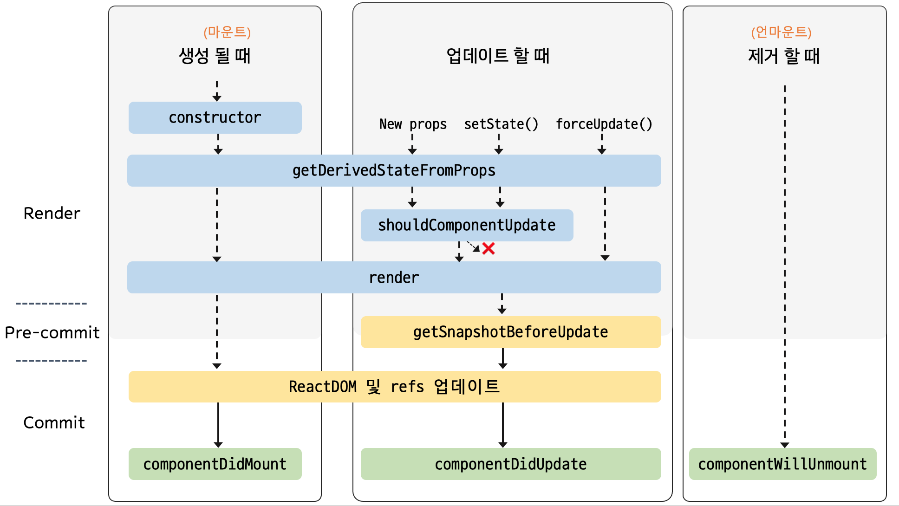

## ▶ 클래스형 컴포넌트의 생명 주기 메서드

- 모든 컴포넌트는 아래 세 단계를 거침

  - 1️⃣ `초기화` 단계: 최초 컴포넌트 객체가 생성될 때 한번 수행
  - 2️⃣ `업데이트` 단계: 컴포넌트의 속성값/상탯값이 변경될 때마다 수행
  - 3️⃣ `소멸` 단계: 컴포넌트가 제거될 때 한번 수행

- 각 단계에서 **생명 주기 메서드**들이 정해진 순서대로 호출됨

  - `초기화` 단계에서의 메서드

    - `constructor()`
    - static `getDerivedStateFromProps()`
    - `render()`
    - `componentDidMount()`

  - `업데이트` 단계에서의 메서드

    - static `getDerivedStateFromProps()`
    - `shouldComponentUpdate()`
    - `render()`
    - `getSnapshotBeforeUpdate()`
    - `componentDidUpdate()`

  - `소멸` 단계에서의 메서드

    - `componentWillUnmount()`

  - 렌더링동안 예외 발생 시 호출되는 메서드
    - static `getDerivedStateFromError()`
    - `componentDidCatch()`

  

### 🔹 `constructor` 메서드

- `constructor(props)`

  - props 매개변수는 컴포넌트 기본 속성값(defaultProps)이 적용된 상태로 호출됨

- `constructor` 메서드 내부에서 반드시 `super` 함수를 호출해야 함

  - `React.component` 클래스의 `constructor` 메서드를 호출하기 위함

  ```js
  class MyComponent extends React.Component {
    constructor(props) {
      super(props);
      // ...
    }
  }
  ```

- 초기 속성값으로 상탯값을 만들기 위해 사용됨

  - 상탯값을 직접 할당하는 것은 `constructor` 메서드에서만 허용됨
  - 다른 생명 주기 메서드에서 상탯값을 변경할 때는 `setState` 메서드를 사용해야 함

  ```js
  class MyComponent extends React.Component {
    constructor(props) {
      super(props);
      this.state = {
        currentMovie: props.age < 10 ? "뽀로로" : "어벤져스",
      };
    }
  }
  ```

- js의 'class field'를 사용하면 `constructor` 메서드 없이도 초기 속성값으로 상탯값을 정의할 수 있음

  - ES6+이후 js에서도 클래스 필드에 선언 할 수 있게 됨
  - 클래스필드에 변수를 선언하면 인스턴스의 변수가 됨

  ```js
  class MyComponent extends React.Component {
    state = {
      currentMovie: this.props.age < 10 ? "뽀로로" : "어벤져스",
    };
  }
  ```

- `constructor` 메서드에서 `setState` 메서드를 호출하지 말자

  - `setState` 메서드 호출은 컴포넌트가 마운트된 이후에만 유효함
  - 따라서, `constructor` 메서드 내부에서 호출되는 `setState` 메서드는 무시됨

### 🔹 `getDerivedStateFromProps` 메서드

- static `getDerivedStateFromProps(props, state)`

  - 정적 메서드이기 떄문에 함수 내부에서 `this` 객체에 접근할 수 없음
  - `render` 메서드가 호출되기 직전에 호출됨

- 속성값과 상탯값을 기반으로 새로운 상탯값을 만듦

  - 매개변수에 현재 속성값은 있어도 이전 속성값은 없으므로, 상탯값에 이전 속성값을 저장해야 함
  - 상탯값을 변경할 필요가 없다면 null을 반환

  ```js
  class MyComponent extends React.Component {
    state = {
      prevSpeed: this.props.speed,
    };

    static getDerivedStateFromProps(props, state) {
      if (props.speed !== state.prevSpeed) {
        // ...
        return {
          prevSpeed: props.speed,
        };
      }
      return null;
    }
  }
  ```

- 이전 속성값과 이후 속성값 모두에 의존적인 상탯값이 필요할 경우 사용됨

  ```js
  class MyComponent extends React.Component {
    state = {
      prevSpeed: this.props.speed,
      isMovingFaster: false,
    };

    static getDerivedStateFromProps(props, state) {
      if (props.speed !== state.prevSpeed) {
        return {
          isMovingFaster: state.prevSpeed < props.speed,
          prevSpeed: props.speed,
        };
      }
      return null;
    }
  }
  ```

#### ❗ 주의 1) 속성값 변화에 따라 API를 호출하기 위해 사용하지 말자

- `getDerivedStateFromProps` 메서드는 정적 메서드이기 떄문에 함수 내부에서 `this` 객체에 접근할 수 없음

  - 하지만, 보통 API 호출은 `this` 객체가 필요한 경우가 많음

- 해결책) `componentDidUpdate` 메서드를 사용해 처리할 수 있음

  ```js
  class MyComponent extends React.Component {
    componentDidUpdate(prevProps) {
      const { productId } = this.props;
      if (prevProps.productId !== productId) {
        this.requestData(productId);
      }
    }
  }
  ```

#### ❗ 주의 2) 속성값을 입력으로 하는 메모이제이션을 상탯값으로 관리하기 위해 사용하지 말자

- 같은 입력값에 대해 항상 같은 출력값이 나온다면 메모이제이션을 이용할 수 있음
- `getDerivedStateFromProps` 메서드를 이용한 메모이제이션은 최소 2개의 상탯값이 필요함

  - 하지만, 상탯값이 많아질 수록 컴포넌트 코드가 복잡해지므로 되도록 개수를 최소화하는게 좋음

  ```js
  class MyComponent extends React.Component {
    static getDerivedStateFromProps(props, state) {
      const { products } = props;
      if (products !== state.prevProducts) {
        return {
          filteredProducts: products.filter((product) => product.price < 1000),
          prevProducts: products,
        };
      }
      return null;
    }

    render() {
      const { filteredProducts } = this.state;
      return <div>{filteredProducts.map(/*...*/)}</div>;
    }
  }
  ```

- 해결책) `render` 메서드에서 직접 메모이제이션을 이용하는게 좋음

  - 메모이제이션을 위해 `lodash` 패키지의 `memoize` 함수를 이용
  - `memoize` 함수: 매개변수가 변경되는 경우에만 실행하고, 변경되지 않으면 이전의 결과를 반환
  - 결과적으로, 메모이제이션을 위해 상탯값을 추가할 필요가 없어짐

  ```js
  import memoize from "lodash/memoize";

  class MyComponent extends React.Component {
    getFilteredProducts = memoize(function (products) {
      return products.filter((product) => product.price < 1000);
    });

    render() {
      const { products } = this.props;
      const filteredProducts = this.getFilteredProducts(products);
      return <div>{filteredProducts.map(/*...*/)}</div>;
    }
  }
  ```

#### ❗ 주의 3) 속성값이 변경될 때 상탯값을 초기화하기 위해 사용하지 말자

- 가정) 상품 정보를 가진 ProductEdit 컴포넌트로부터 price 속성값을 전달받아 변경하는 PriceInput 컴포넌트가 있음

  - 하지만, 아래의 코드에선 두 상품의 가격이 같다면 price 상탯값이 초기화되지 않는 문제 발생

  ```js
  class ProductInput extends React.Component {
    static getDerivedStateFromProps(props, state) {
      if (props.price !== state.prevPrice) {
        return {
          price: props.price,
          prevPrice: props.price,
        };
      }
      return null;
    }

    onChange = (e) => {
      const price = Number(e.target.value);
      if (!Number.isNaN(price)) {
        this.setState({ price });
      }
    };

    render() {
      const { price } = this.state;
      return <input onChange={this.onChange} value={price} />;
    }
  }
  ```

- 해결책 1) PriceInput 컴포넌트에 `key` 속성값을 부여하자

  - 컴포넌트에 `key` 속성값을 부여하고 `key` 값을 변경하면 이전의 컴포넌트 인스턴스는 사라지고 새로운 인스턴스가 생성됨
  - 따라서, PriceInput 컴포넌트에서는 초기 가격만 상탯값에 넣으면 됨

  ```js
  class ProductEdit extends React.Component {
    // ...
    render() {
      const { product } = this.props;
      return <PriceInput key={product.id} value={product.price} />;
    }
  }
  ```

  ```js
  class ProductInput extends React.Component {
    state = {
      price: this.props.price,
    };

    onChange = (e) => {
      /*...*/
    };

    render() {
      const { price } = this.state;
      return <input onChange={this.onChange} value={price} />;
    }
  }
  ```

- 해결책 2) 상탯값과 이벤트 처리 메서드를 부모 컴포넌트에서 관리하자

  - PriceInput 컴포넌트에서 상탯값과 이벤트 처리 메서드를 구현할 필요가 없기 때문에 함수형 컴포넌트로 정의할 수 있음

  ```js
  class ProductEdit extends React.Component {
    state = {
      currentPrice: this.props.product.price,
    };

    onChangePrice = (e) => {
      const currentPrice = Number(e.target.value);
      if (!Number.isNaN(currentPrice)) {
        this.setState({ currentPrice });
      }
    };

    render() {
      const { currentPrice } = this.state;
      return <PriceInput onChange={this.onChangePrice} value={currentPrice} />;
    }
  }
  ```

  ```js
  function PriceInput({ price, onChange }) {
    return <input onChange={onChange} value={price} />;
  }
  ```

### 🔹 `render` 메서드

- `render` 메서드의 반환값은 화면에 보여질 내용을 결정함
- `render` 메서드에서는 부수 효과(서버와 통신, 브라우저 쿠기에 저장 등)를 발생시키면 안 됨

### 🔹 `componentDidMount` 메서드

- `render` 메서드의 첫번째 반환값이 실제 돔에 반영된 직후에 호출됨

- `componentDidMount` 메서드가 호출될 때는 리액트 요소가 돔 요소로 만들어진 시점이기 때문에 돔 요소로부터 필요한 정보를 가져올 수 있음

  - ex) CSS 코드에서 `width: 100%`로 표현된 요소는 돔 반영 후에 px 단위로 가로 길이를 알 수 있음

  ```js
  class Box extends React.Component {
    state = {
      boxWidth: 0,
    };

    divRef = React.createRef();

    componentDidMount() {
      const rect = this.divRef.current.getBoundaryClientRect();
      this.setState({ boxWidth: rect.width });
    }

    render() {
      const { boxWidth } = this.state;
      const backgroundColor = boxWidth < 400 ? "red" : "blue";

      return (
        <div ref={this.divRef} style={{ width: "100%", backgroundColor }}>
          box
        </div>
      );
    }
  }
  ```

- API 호출을 통해 데이터를 가져올 때 적합함

### 🔹 `shouldComponentUpdate` 메서드

### 🔹 `getSnapshotBeforeUpdate` 메서드

### 🔹 `componentDidUpdate` 메서드

### 🔹 `componentWillUnmount` 메서드

### 🔹 `getDerivedStateFromError`, `componentDidCatch` 메서드
