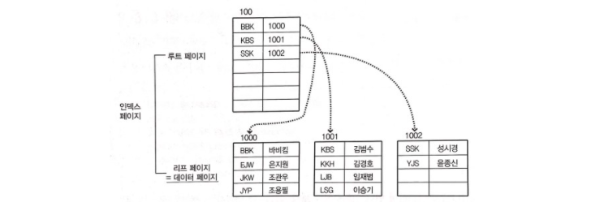
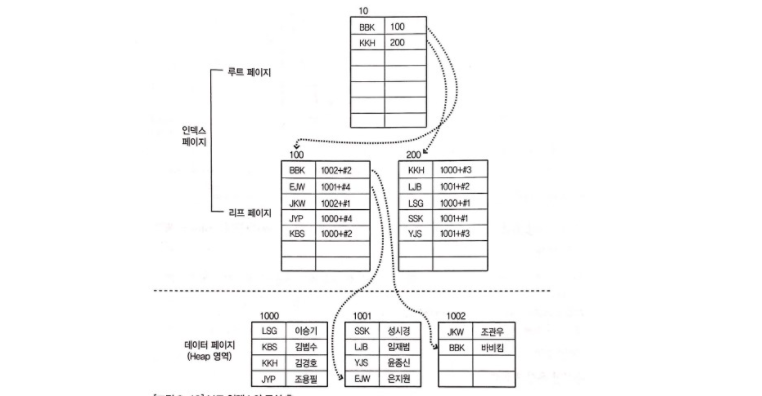

# ✔ 인덱스의 내부 작동

- 클러스터형 인덱스와 보조 인덱스는 모두 내부적으로 균형 트리로 만들어짐
- 균형 트리: 나무를 거꾸로 표현한 자료 구조로, 제일 상단의 뿌리를 루트, 줄기를 중간, 끝을 리프라고 부름

## 1️⃣ 인덱스의 내부 작동 원리

### 균형 트리의 개념

- 루트 노드: 노드의 가장 상위 노드
- 리프 노드: 제일 마지막에 존재하는 노드
- 중간 노드: 루트 노드와 리프 노드의 중간에 끼인 노드들
- MySQL에서는 노드를 페이지(page)라고 부름
  - 페이지: 최소한의 저장 단위
  - 1페이지 = 16Kbyte
  - 1건의 데이터만 입력해도 1페이지가 필요함
- 균형 트리로 구성하지 않으면(인덱스가 없으면) 전체 테이블 검색(Full Table Scan) 방법 밖에 없음
- 균형 트리는 데이터를 검색할 때(SELECT 구문을 사용할 때) 아주 뛰어난 성능을 발휘함
  - 균형 트리는 무조건 루트 페이지부터 검색한 후, 전체 테이블 검색보다 적은 페이지만 읽어서 검색하게 됨

### 균형 트리의 페이지 분할

- 페이지 분할: 새로운 페이지를 준비해서 데이터를 나누는 작업
- 인텍스를 만들면 SELECT의 속도를 향상시킬 수 있음
- 하지만, 인덱스를 구성하면 데이터 변경 작업(INSERT, UPDATE, DELETE) 시 성능이 나빠짐
  - 이유: 페이지 분할 작업이 발생하기 때문

## 2️⃣ 인덱스의 구조

### 클러스터형 인덱스 구성하기

- 데이터 페이지: 실제 데이터가 들어가 있는 부분
- 클러스터형 인덱스를 생성하면 데이터 페이지가 정렬되고 균형 트리 형태의 인덱스가 형성됨
- 인덱스 페이지의 리프 페이지는 데이터 그 자체임
  - 즉, 데이터 페이지가 인덱스에 포함됨

### 보조 인덱스 구성하기

- 보조 인덱스를 생성해도 데이터 페이지는 변경(정렬)되지 않음
- 대신, 별도의 공간에 인덱스 페이지를 생성함
- 인덱스 페이지의 리프 페이지에 인덱스로 구성한 열을 정렬하고, `페이지 번호 + #위치` 형태로 데이터의 위치를 기록함

### 인덱스에서 데이터 검색하기

- 두 인덱스 모두 검색이 빠르긴 하지만 클러스터형 인덱스가 조금 더 빠름
