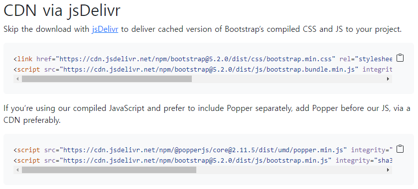

# ✔ CDN을 통한 Bootstrap 이용
> CDN
- Content Delivery(Distribution) Network
- 컨텐츠(CSS, JS, Image, Text 등)을 효율적으로 전달하기 위해 여러 노드에 가진 네트워크에 데이터를 제공하는 시스켐
- 장점
  - 개별 end-user의 가까운 서버를 통해 빠르게 전달 가능(지리적 이점)
  - 외부 서버를 활용함으로써 본인 서버의 부하가 적어짐

> CDN을 통한 Bootstrap(v5.2) 이용

