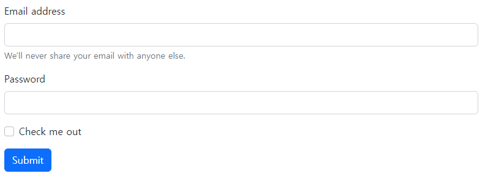

# ✔ Forms
- form-control 클래스를 사용해 `<input>` 및 `<form>` 태그를 스타일링할 수 있음

> Form 예시



```html
<form>
  <div class="mb-3">
    <label for="exampleInputEmail1" class="form-label">Email address</label>
    <input type="email" class="form-control" id="exampleInputEmail1" aria-describedby="emailHelp">
    <div id="emailHelp" class="form-text">We'll never share your email with anyone else.</div>
  </div>
  <div class="mb-3">
    <label for="exampleInputPassword1" class="form-label">Password</label>
    <input type="password" class="form-control" id="exampleInputPassword1">
  </div>
  <div class="mb-3 form-check">
    <input type="checkbox" class="form-check-input" id="exampleCheck1">
    <label class="form-check-label" for="exampleCheck1">Check me out</label>
  </div>
  <button type="submit" class="btn btn-primary">Submit</button>
</form>
```

> Forms 구성
- [Overview](#-overview): Form Text, Disabled Forms
- [Form Control](#-form-control-input-태그): Sizing, Disabled, Readonly, Readonly Plain Text, File Input, Color Input, Datalists
- [Select](#-select): Default, Sizing, Multiple, Option Sizing, Disabled
- [Checks & Radios](#-checks--radios): Checks, Radios, Disabled, Checked, Display, Checks & Radios의 변형 - Switches/Toggle Buttons/Toggle Buttons(outlined styles)
- [Range](#-range): Range, Min and Max, Steps
- [Input Group](#-input-group): Text + Text Input, Checkboxes & Radios + Text Input, Button + Text Input, Buttons with Dropdowns + Text Input, Segmented Buttons + Text Input, Text + Select, Text + File Input, Input Group Sizing
- [Floating Labels](#-floating-labels): Floating Labels - Input/Textareas/Selects/Readonly Plaintext/Input Groups


# ✔ Overview

> Form Text

1. 기본 포맷
   
   ```
   <label for="동일" class="form-label">라벨명</label>
   <input type="" id="동일" class="form-control">
   <div id="동일" class="form-text">
     텍스트
   </div>
   ```

   ```html
   <label for="inputPassword5" class="form-label">Password</label>
   <input type="password" id="inputPassword5" class="form-control" aria-describedby="passwordHelpBlock">
   <div id="passwordHelpBlock" class="form-text">
     Your password must be 8-20 characters long, contain letters and numbers, and must not contain spaces, special characters, or emoji.
   </div>
   ```

> Disabled Forms

1. 기본 포맷

   ```
   <form>
     <fieldset disabled>
       <legend>폼 이름</legend>
       <div>
         <label for="동일1" class="form-label">라벨명</label>
         <input type="text" id="동일" class="form-control">
       </div>
       <button type="submit" class="btn btn-{color}">버튼명</button>
     </fieldset>
   </form>
   ```

   ```html
   <form>
     <fieldset disabled>
       <legend>Disabled fieldset example</legend>
       <div class="mb-3">
         <label for="disabledTextInput" class="form-label">Disabled input</label>
         <input type="text" id="disabledTextInput" class="form-control" placeholder="Disabled input">
       </div>
       <button type="submit" class="btn btn-primary">Submit</button>
     </fieldset>
   </form>
   ```


# ✔ Form Control

> Form Control Sizing

1. 기본 포맷
   
   ```
   <input class="form-control form-control-{size}" type="">
   ```

   ```html
   <input class="form-control form-control-lg" type="text" placeholder=".form-control-lg" aria-label=".form-control-lg example">
   ```

2. size

   - `lg`, `sm`

> Disabled Form Control

1. 기본 포맷

   ```
   <input class="form-control" type="" disabled>
   ```

   ```html
   <input class="form-control" type="text" placeholder="Disabled input here..." disabled>
   ```

> Form Control Readonly

1. 기본 포맷

   ```
   <input class="form-control" type="" readonly>
   ```

   ```html
   <input class="form-control" type="text" value="Readonly input here..." readonly>
   ```

> Form Control Readonly Plain Text 

1. 기본 포맷

   ```
   <input class="form-control-plaintext" type="" readonly>
   ```

   ```html
   <label for="staticEmail" class="col-sm-2 col-form-label">Email</label>
   <input type="text" readonly class="form-control-plaintext" id="staticEmail" value="email@example.com">
   ```

> Form Control Type - 1) File Input

1. 기본 포맷
  
   ```
   1) 파일 하나 선택
   <input class="form-control" type="file">

   2) 파일 다중 선택
   <input class="form-control" type="file" multiple>
   ```

   ```html
   <input class="form-control" type="file" id="formFile">
   <input class="form-control" type="file" id="formFileMultiple" multiple>
   ```

> Form Control Type - 2) Color Input

1. 기본 포맷
  
   ```
   <input type="color" class="form-control form-control-color">
   ```

   ```html
   <input type="color" class="form-control form-control-color" id="exampleColorInput" value="#563d7c" title="Choose your color">
   ```

> Form Control Type - 3) Datalists

1. 기본 포맷
  
   ```
   <input class="form-control" list="동일">
   <datalist id="동일">
     <option value="옵션1">
     <option value="옵션2">
     <option value="옵션3">
   </datalist>
   ```

   ```html
   <input class="form-control" list="datalistOptions" placeholder="Type to search...">
   <datalist id="datalistOptions">
     <option value="San Francisco">
     <option value="New York">
     <option value="Seattle">
   </datalist>
   ```


# ✔ Select

> Select Default

1. 기본 포맷
  
   ```
   <select class="form-select">
     <option selected>옵션1</option>
     <option value="1">옵션2</option>
     <option value="2">옵션3</option>
     <option value="3">옵션4</option>
   </select>
   ```

   ```html
   <select class="form-select" aria-label="Default select example">
     <option selected>Open this select menu</option>
     <option value="1">One</option>
     <option value="2">Two</option>
     <option value="3">Three</option>
   </select>
   ```

> Select Sizing

1. 기본 포맷
  
   ```
   <select class="form-select form-select-{size}">
     <option selected>옵션1</option>
     <option value="1">옵션2</option>
     <option value="2">옵션3</option>
     <option value="3">옵션4</option>
   </select>
   ```

   ```html
   <select class="form-select form-select-lg mb-3" aria-label=".form-select-lg example">
     <option selected>Open this select menu</option>
     <option value="1">One</option>
     <option value="2">Two</option>
     <option value="3">Three</option>
   </select>
   ```

2. size
   
   - `lg`, `sm`

> Select Multiple

1. 기본 포맷
  
   ```
   <select class="form-select" multiple>
     <option selected>옵션1</option>
     <option value="1">옵션2</option>
     <option value="2">옵션3</option>
     <option value="3">옵션4</option>
   </select>
   ```

   ```html
   <select class="form-select" multiple aria-label="multiple select example">
     <option selected>Open this select menu</option>
     <option value="1">One</option>
     <option value="2">Two</option>
     <option value="3">Three</option>
   </select>
   ```

> Select Option Sizing

1. 기본 포맷
  
   ```
   <select class="form-select" size="3">
     <option selected>옵션1</option>
     <option value="1">옵션2</option>
     <option value="2">옵션3</option>
     <option value="3">옵션4</option>
   </select>
   ```

   ```html
   <select class="form-select" size="3" aria-label="size 3 select example">
     <option selected>Open this select menu</option>
     <option value="1">One</option>
     <option value="2">Two</option>
     <option value="3">Three</option>
   </select>
   ```

> Disabled Select

1. 기본 포맷
  
   ```
   <select class="form-select" disabled>
     <option selected>옵션1</option>
     <option value="1">옵션2</option>
     <option value="2">옵션3</option>
     <option value="3">옵션4</option>
   </select>
   ```

   ```html
   <select class="form-select" aria-label="Disabled select example" disabled>
     <option selected>Open this select menu</option>
     <option value="1">One</option>
     <option value="2">Two</option>
     <option value="3">Three</option>
   </select>
   ```


# ✔ Checks & Radios

> Checks

1. 기본 포맷
  
   ```
   <div class="form-check">
     <input class="form-check-input" type="checkbox" value="" id="동일1">
     <label class="form-check-label" for="동일1">라벨명</label>
   </div>
   <div class="form-check">
     <input class="form-check-input" type="checkbox" value="" id="동일2" checked>
     <label class="form-check-label" for="동일2">라벨명</label>
   </div>
    <div class="form-check">
     <input class="form-check-input" type="checkbox" value="" id="동일3" disabled>
     <label class="form-check-label" for="동일3">라벨명</label>
   </div>
   ```

   ```html
   <div class="form-check">
     <input class="form-check-input" type="checkbox" value="" id="flexCheckDefault">
     <label class="form-check-label" for="flexCheckDefault">
       Default checkbox
     </label>
   </div>
   <div class="form-check">
     <input class="form-check-input" type="checkbox" value="" id="flexCheckChecked" checked>
     <label class="form-check-label" for="flexCheckChecked">
       Checked checkbox
     </label>
   </div>
    <div class="form-check">
     <input class="form-check-input" type="checkbox" value="" id="flexCheckIndeterminateDisabled" disabled>
     <label class="form-check-label" for="flexCheckIndeterminateDisabled">
       Disabled indeterminate checkbox
     </label>
   </div>
   ```

> Radios

1. 기본 포맷
  
   ```
   <div class="form-check">
     <input class="form-check-input" type="radio" name="동일name" id="동일1">
     <label class="form-check-label" for="동일1">라벨명</label>
   </div>
   <div class="form-check">
     <input class="form-check-input" type="radio" name="동일name" id="동일2" checked>
     <label class="form-check-label" for="동일2">라벨명</label>
   </div>
   <div class="form-check">
     <input class="form-check-input" type="radio" name="동일name" id="동일3" disabled>
     <label class="form-check-label" for="동일3">라벨명</label>
   </div>
   ```

   ```html
   <div class="form-check">
     <input class="form-check-input" type="radio" name="flexRadioDefault" id="flexRadioDefault1">
     <label class="form-check-label" for="flexRadioDefault1">
       Default radio
     </label>
   </div>
   <div class="form-check">
     <input class="form-check-input" type="radio" name="flexRadioDefault" id="flexRadioDefault2" checked>
     <label class="form-check-label" for="flexRadioDefault2">
       Default checked radio
     </label>
   </div>
    <div class="form-check">
     <input class="form-check-input" type="radio" name="flexRadioDefault" id="flexRadioDefault3" disabled>
     <label class="form-check-label" for="flexRadioDefault3">
       Disabled radio
     </label>
   </div>
   ```

> Checks & Radios의 Display
- default는 block이기 때문에 `form-check-{display}`을 따로 지정해주지 않으면 아래 방향으로 요소가 쌓임

1. 기본 포맷
   
   ```
   <div class="form-check form-check-{display}">
     <input class="form-check-input" type="checkbox" id="동일1" value="">
     <label class="form-check-label" for="동일1">라벨명</label>
   </div>
   <div class="form-check form-check-{display}">
     <input class="form-check-input" type="checkbox" id="동일2" value="">
     <label class="form-check-label" for="동일2">라벨명</label>
   </div>
   ```

   ```html
   <div class="form-check form-check-inline">
     <input class="form-check-input" type="checkbox" id="inlineCheckbox1" value="option1">
     <label class="form-check-label" for="inlineCheckbox1">1</label>
   </div>
   <div class="form-check form-check-inline">
     <input class="form-check-input" type="checkbox" id="inlineCheckbox2" value="option2">
     <label class="form-check-label" for="inlineCheckbox2">2</label>
   </div>
   ```

2. display
   
   - `inline`, `reverse`

> Checks & Radios의 변형 - 1) Switches

1. 기본 포맷
  
   ```
   1) Checks의 경우
   <div class="form-check form-switch">
     <input class="form-check-input" type="checkbox" role="switch" id="동일">
     <label class="form-check-label" for="동일">라벨명</label>
   </div>
   <div class="form-check form-switch">
     <input class="form-check-input" type="checkbox" role="switch" id="동일" checked>
     <label class="form-check-label" for="동일">라벨명</label>
   </div>

   2) Radios의 경우
   <div class="form-check form-switch">
     <input class="form-check-input" type="radio" name="동일name" id="동일1">
     <label class="form-check-label" for="동일1">라벨명</label>
   </div>
   <div class="form-check form-switch">
     <input class="form-check-input" type="radio" name="동일name" id="동일2" checked>
     <label class="form-check-label" for="동일2">라벨명</label>
   </div>
   ```

   ```html
   <div class="form-check form-switch">
     <input class="form-check-input" type="checkbox" role="switch" id="flexSwitchCheckDefault">
     <label class="form-check-label" for="flexSwitchCheckDefault">Default switch checkbox input</label>
   </div>
   <div class="form-check form-switch">
     <input class="form-check-input" type="checkbox" role="switch" id="flexSwitchCheckChecked" checked>
     <label class="form-check-label" for="flexSwitchCheckChecked">Checked switch checkbox input</label>
   </div>
   ```

> Checks & Radios의 변형 - 2) Toggle Buttons

1. 기본 포맷
   
   ```
   1) Checks의 경우
   <input type="checkbox" class="btn-check" id="동일1">
   <label class="btn btn-[outline]-{color}" for="동일1">라벨명</label>
 
   <input type="checkbox" class="btn-check" id="동일2" checked>
   <label class="btn btn-[outline]-{color}" for="동일2">라벨명/label>
 
   <input type="checkbox" class="btn-check" id="동일3" disabled>
   <label class="btn btn-[outline]-{color}" for="동일3">라벨명</label>

   2) Radios의 경우
   <input type="radio" class="btn-check" name="동일name" id="동일1" checked>
   <label class="btn btn-{color}" for="동일1">라벨명</label>
   
   <input type="radio" class="btn-check" name="동일name" id="동일2">
   <label class="btn btn-{color}" for="동일2">라벨명</label>
   
   <input type="radio" class="btn-check" name="동일name" id="동일3" disabled>
   <label class="btn btn-{color}" for="동일3">라벨명</label>
   ```

   ```html
   <input type="checkbox" class="btn-check" id="btn-check" autocomplete="off">
   <label class="btn btn-primary" for="btn-check">Single toggle</label>
 
   <input type="checkbox" class="btn-check" id="btn-check-2" checked autocomplete="off">
   <label class="btn btn-primary" for="btn-check-2">Checked</label>
 
   <input type="checkbox" class="btn-check" id="btn-check-3" autocomplete="off" disabled>
   <label class="btn btn-primary" for="btn-check-3">Disabled</label>

   <input type="checkbox" class="btn-check" id="btn-check-outlined" autocomplete="off">
   <label class="btn btn-outline-primary" for="btn-check-outlined">Single toggle</label><br>
   
   <input type="checkbox" class="btn-check" id="btn-check-2-outlined" checked autocomplete="off">
   <label class="btn btn-outline-secondary" for="btn-check-2-outlined">Checked</label><br>
   ```


# ✔ Range

> Range

1. 기본 포맷
   
   ```
   <input type="range" class="form-range">
   <input type="range" class="form-range" disabled>
   ```

   ```html
   <label for="customRange1" class="form-label">Example range</label>
   <input type="range" class="form-range" id="customRange1">

   <label for="disabledRange" class="form-label">Disabled range</label>
   <input type="range" class="form-range" id="disabledRange" disabled>
   ```

> Range의 Min and Max 

1. 기본 포맷
   
   ```
   <input type="range" class="form-range" min="{숫자}" max="{숫자}">
   ```

   ```html
   <label for="customRange2" class="form-label">Example range</label>
   <input type="range" class="form-range" min="0" max="5" id="customRange2">
   ```

> Range의 Steps

1. 기본 포맷
   
   ```
   <input type="range" class="form-range" min="{숫자}" max="{숫자}" step="{숫자}">
   ```

   ```html
   <label for="customRange3" class="form-label">Example range</label>
   <input type="range" class="form-range" min="0" max="5" step="0.5" id="customRange3">
   ```


# ✔ Input Group

> Input Group - 1) Text + Text Input

1. 기본 포맷
   
   ```
   <div class="input-group">
     <span class="input-group-text">문자열</span>
     <input type="text" class="form-control">
   </div>
   ```

   ```html
   <div class="input-group mb-3">
     <span class="input-group-text" id="basic-addon1">@</span>
     <input type="text" class="form-control" placeholder="Username" aria-label="Username" aria-describedby="basic-addon1">
   </div>
   
   <div class="input-group mb-3">
     <input type="text" class="form-control" placeholder="Recipient's username" aria-label="Recipient's username" aria-describedby="basic-addon2">
     <span class="input-group-text" id="basic-addon2">@example.com</span>
   </div>
   
   
   <div class="input-group mb-3">
     <span class="input-group-text">$</span>
     <input type="text" class="form-control" aria-label="Amount (to the nearest dollar)">
     <span class="input-group-text">.00</span>
   </div>
   
   <div class="input-group mb-3">
     <input type="text" class="form-control" placeholder="Username" aria-label="Username">
     <span class="input-group-text">@</span>
     <input type="text" class="form-control" placeholder="Server" aria-label="Server">
   </div>
   
   <div class="input-group">
     <span class="input-group-text">With textarea</span>
     <textarea class="form-control" aria-label="With textarea"></textarea>
   </div>

   <div class="input-group">
     <span class="input-group-text">First and last name</span>
     <input type="text" aria-label="First name" class="form-control">
     <input type="text" aria-label="Last name" class="form-control">
   </div>

   <div class="input-group mb-3">
     <span class="input-group-text">$</span>
     <span class="input-group-text">0.00</span>
     <input type="text" class="form-control" aria-label="Dollar amount (with dot and two decimal places)">
   </div>
   ```

> Input Group - 2) Checkboxes & Radios + Text Input

1. 기본 포맷
   
   ```
   <div class="input-group">
     <div class="input-group-text">
       <input class="form-check-input" type="checkbox|radio" value="">
     </div>
     <input type="text" class="form-control">
   </div>
   ```

   ```html
   <div class="input-group mb-3">
     <div class="input-group-text">
       <input class="form-check-input mt-0" type="checkbox" value="" aria-label="Checkbox for following text input">
     </div>
     <input type="text" class="form-control" aria-label="Text input with checkbox">
   </div>
   ```

> Input Group - 3) Button + Text Input

1. 기본 포맷
   
   ```
   <div class="input-group">
     <button class="btn btn-[outline]-{color}" type="button">버튼명</button>
     <input type="text" class="form-control">
   </div>
   ```

   ```html
   <div class="input-group mb-3">
     <button class="btn btn-outline-secondary" type="button" id="button-addon1">Button</button>
     <input type="text" class="form-control" placeholder="" aria-label="Example text with button addon" aria-describedby="button-addon1">
   </div>
   ```

> Input Group - 4) Buttons with Dropdowns + Text Input

1. 기본 포맷
   
   ```
   <div class="input-group">
     <button type="button" class="btn btn-[outline]-{color} dropdown-toggle" data-bs-toggle="dropdown" aria-expanded="false">메뉴명</button>
     <ul class="dropdown-menu">
       <li><a class="dropdown-item" href="#">옵션1</a></li>
       <li><a class="dropdown-item" href="#">옵션2</a></li>
       <li><a class="dropdown-item" href="#">옵션3</a></li>
     </ul>
     <input type="text" class="form-control">
   </div>
   ```

   ```html
   <div class="input-group mb-3">
     <button class="btn btn-outline-secondary dropdown-toggle" type="button" data-bs-toggle="dropdown" aria-expanded="false">Dropdown</button>
     <ul class="dropdown-menu">
       <li><a class="dropdown-item" href="#">Action</a></li>
       <li><a class="dropdown-item" href="#">Another action</a></li>
       <li><a class="dropdown-item" href="#">Something else here</a></li>
       <li><hr class="dropdown-divider"></li>
       <li><a class="dropdown-item" href="#">Separated link</a></li>
     </ul>
     <input type="text" class="form-control" aria-label="Text input with dropdown button">
   </div>
   ```

> Input Group - 5) Segmented Buttons + Text Input

1. 기본 포맷
   
   ```
   <div class="input-group">
     <button type="button" class="btn btn-[outline]-{color}">메뉴명</button>
     <button type="button" class="btn btn-[outline]-{color} dropdown-toggle dropdown-toggle-split" data-bs-toggle="dropdown" aria-expanded="false">
      <span class="visually-hidden">숨긴 메뉴명</span>
     </button>
     <ul class="dropdown-menu">
       <li><a class="dropdown-item" href="#">옵션1</a></li>
       <li><a class="dropdown-item" href="#">옵션2</a></li>
       <li><a class="dropdown-item" href="#">옵션3</a></li>
     </ul>
     <input type="text" class="form-control">
   </div>
   ```

   ```html
   <div class="input-group mb-3">
     <button type="button" class="btn btn-outline-secondary">Action</button>
     <button type="button" class="btn btn-outline-secondary dropdown-toggle dropdown-toggle-split" data-bs-toggle="dropdown" aria-expanded="false">
       <span class="visually-hidden">Toggle Dropdown</span>
     </button>
     <ul class="dropdown-menu">
       <li><a class="dropdown-item" href="#">Action</a></li>
       <li><a class="dropdown-item" href="#">Another action</a></li>
       <li><a class="dropdown-item" href="#">Something else here</a></li>
       <li><hr class="dropdown-divider"></li>
       <li><a class="dropdown-item" href="#">Separated link</a></li>
     </ul>
     <input type="text" class="form-control" aria-label="Text input with segmented dropdown button">
   </div>
   ```

> Input Group - 6) Text + Select

1. 기본 포맷
   
   ```
   <div class="input-group">
     <label class="input-group-text" for="동일">라벨명</label>
     <select class="form-select" id="동일">
       <option selected>옵션1</option>
       <option value="1">옵션2</option>
       <option value="2">옵션3</option>
     </select>
   </div>
   ```

   ```html
   <div class="input-group mb-3">
     <label class="input-group-text" for="inputGroupSelect01">Options</label>
     <select class="form-select" id="inputGroupSelect01">
       <option selected>Choose...</option>
       <option value="1">One</option>
       <option value="2">Two</option>
       <option value="3">Three</option>
     </select>
   </div>
   ```

> Input Group - 7) Text + File Input

1. 기본 포맷
   
   ```
   <div class="input-group">
     <label class="input-group-text" for="동일">라벨명</label>
     <input type="file" class="form-control" id="동일">
   </div>
   ```

   ```html
   <div class="input-group mb-3">
     <label class="input-group-text" for="inputGroupFile01">Upload</label>
     <input type="file" class="form-control" id="inputGroupFile01">
   </div>
   ```

> Input Group Sizing

1. 기본 포맷
   
   ```
   <div class="input-group input-group-{size}">
     <span class="input-group-text" id="동일">문자열</span>
     <input type="text" class="form-control" aria-describedby="동일">
   </div>
   ```

   ```html
   <div class="input-group mb-3">
     <span class="input-group-text" id="basic-addon1">@</span>
     <input type="text" class="form-control" placeholder="Username" aria-label="Username" aria-describedby="basic-addon1">
   </div>
   ```

2. size
   
   - `lg`, `sm`


# ✔ Floating Labels

> Floating Labels - 1) Input

1. 기본 포맷
   
   ```
   1) 기본
   <div class="form-floating">
     <input type="" class="form-control" id="동일" placeholder="{아무 값}">
     <label for="동일">라벨명</label>
   </div>

   2) value값 추가
   <form class="form-floating">
     <input type="" class="form-control" id="동일" placeholder="{아무 값}" value="test@example.com">
     <label for="동일">라벨명</label>
   </form>

   3) validation styles 추가
   <form class="form-floating">
     <input type="" class="form-control is-invalid" id="동일" placeholder="{아무 값}" value="test@example.com">
     <label for="동일">라벨명</label>
   </form>
   ```

   ```html
   <!-- 1) 기본 -->
   <div class="form-floating mb-3">
     <input type="email" class="form-control" id="floatingInput" placeholder="name@example.com">
     <label for="floatingInput">Email address</label>
   </div>

   <!-- 2) value값 추가 -->
   <form class="form-floating">
     <input type="email" class="form-control" id="floatingInputValue" placeholder="name@example.com" value="test@example.com">
     <label for="floatingInputValue">Input with value</label>
   </form>

   <!-- 3) validation styles 추가 -->
   <form class="form-floating">
     <input type="email" class="form-control is-invalid" id="floatingInputInvalid" placeholder="name@example.com" value="test@example.com">
     <label for="floatingInputInvalid">Invalid input</label>
   </form>
   ```

> Floating Labels - 2) Textareas

1. 기본 포맷
   
   ```
   <div class="form-floating">
     <textarea class="form-control" placeholder="{아무 값}" id="동일"></textarea>
     <label for="동일">라벨명</label>
   </div>
   ```

   ```html
   <div class="form-floating">
     <textarea class="form-control" placeholder="Leave a comment here" id="floatingTextarea"></textarea>
     <label for="floatingTextarea">Comments</label>
   </div>
   ```

> Floating Labels - 3) Selects

1. 기본 포맷
   
   ```
   <div class="form-floating">
     <select class="form-select" id="동일">
       <option selected>옵션1</option>
       <option value="1">옵션2</option>
       <option value="2">옵션3</option>
     </select>
     <label for="동일">라벨명</label>
   </div>
   ```

   ```html
   <div class="form-floating">
     <select class="form-select" id="floatingSelect" aria-label="Floating label select example">
       <option selected>Open this select menu</option>
       <option value="1">One</option>
       <option value="2">Two</option>
       <option value="3">Three</option>
     </select>
     <label for="floatingSelect">Works with selects</label>
   </div>
   ```

> Floating Labels - 4) Readonly Plaintext

1. 기본 포맷
   
   ```
   <div class="form-floating">
     <input type="" class="form-control-plaintext" id="동일" placeholder="{아무 값}" value="name@example.com" readonly>
     <label for="동일">라벨명</label>
   </div>
   ```

   ```html
   <div class="form-floating mb-3">
     <input type="email" readonly class="form-control-plaintext" id="floatingPlaintextInput" placeholder="name@example.com" value="name@example.com">
     <label for="floatingPlaintextInput">Input with value</label>
   </div>
   ```

> Floating Labels - 5) Input Groups

1. 기본 포맷
   
   ```
   1) 기본
   <div class="input-group">
     <span class="input-group-text">문자열</span>
     <div class="form-floating">
       <input type="" class="form-control" id="동일" placeholder="{아무 값}">
       <label for="동일">라벨명</label>
     </div>
   </div>

   2) validation styles 추가
   <div class="input-group has-validation">
     <span class="input-group-text">문자열</span>
     <div class="form-floating is-invalid">
       <input type="" class="form-control is-invalid" id="동일" placeholder="{아무 값}" required>
       <label for="동일">라벨명</label>
     </div>
     <div class="invalid-feedback">
       알림
     </div>
   </div>
   ```

   ```html
   <!-- 1) 기본 -->
   <div class="input-group mb-3">
     <span class="input-group-text">@</span>
     <div class="form-floating">
       <input type="text" class="form-control" id="floatingInputGroup1" placeholder="Username">
       <label for="floatingInputGroup1">Username</label>
     </div>
   </div>

   <!-- 2) validation styles 추가 -->
   <div class="input-group has-validation">
     <span class="input-group-text">@</span>
     <div class="form-floating is-invalid">
       <input type="text" class="form-control is-invalid" id="floatingInputGroup2" placeholder="Username" required>
       <label for="floatingInputGroup2">Username</label>
     </div>
     <div class="invalid-feedback">
       Please choose a username.
     </div>
   </div>
   ```