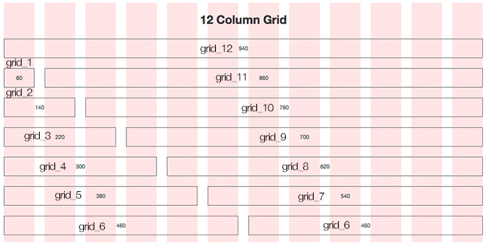

# ✔ Bootstrap Layout
> Layout 종류
- [Breakpoins](#-breakpoints)
- [Containers](#-containers): Container, Responsive Containers, Fluid Containers
- [Grid System](#-grid-system): Responsive Grid, Nesting Grid
- [Columns](#-columns): Vertical Alignment, Horizontal Alignment, Column Breaks, Order Classes, Offsetting Columns, Standalone Column Classes
- [Gutters](#-gutters): Horizontal Gutters, Vertical Gutters, Horizontal & Vertical Gutters, No Gutters


# ✔ Breakpoints
- viewport 크기에 따라 반응형 layout을 만들기 위해 너비를 customize한 것

> Breakpoints

- none: Extra small (<576px)

- `sm`: Small (>=576px)

- `md`: Medium (>=768px)

- `lg`: Large (>=992px)

- `xl`: Extra large (>=1200px)

- `xxl`: Extra extra large (>=1400px)


# ✔ Containers
- viewport에 따라 padding 및 정렬이 자동으로 결정된 buliding block을 만들어주는 클래스

> Container

1. 기본 포맷
   
   ```
   <div class="container"></div>
   ```

> Responsive Containers
- 특정 breakpoint에 도달하기 전까지 너비 100%를 차지함
- breakpoint를 따로 지정하지 않으면, dafault는 `xs`

1. 기본 포맷

   ```
   <div class="container-[{breakpoint}]"></div>
   ```

> Fluid Containers
- viewport에 상관없이 항상 너비 100%를 차지함

1. 기본 포맷

   ```
   <div class="container-fluid"></div>
   ```


# ✔ Grid System
- 요소들의 디자인과 배치에 도움을 주는 시스템
- 기본요소
  - Column: 실제 컨텐츠를 포함하는 부분
  - Gutter: 칼럼과 칼럼 사이의 공간 (사이 간격)
  - Container: 칼럼들을 담고 있는 공간
  
  

- Bootstrap Grid System은 **flexbox**로 제작됨
  - 따라서, `display: flex`일때 적용할 수 있는 스타일 속성 사용 가능
- container, row, column 클래스로 컨텐츠를 배치하고 정렬
- 12개의 column, 6개의 grid breakpoints

> Responsive Grid

1. 기본 포맷
   
   ```
   <div class="container">
     <div class="row">
       <div class="col-[{breakpoint}]-[{숫자}]">컨텐츠1</div>
       <div class="col-[{breakpoint}]-[{숫자}]">컨텐츠2</div>
       <div class="col-[{breakpoint}]-[{숫자}]">컨텐츠3</div>
     </div>
   </div>
   ```

   ```html
   <div class="container text-center">
     <div class="row">
       <div class="col">col</div>
       <div class="col">col</div>
       <div class="col">col</div>
     </div>
     <div class="row">
       <div class="col-8">col-8</div>
       <div class="col-4">col-4</div>
     </div>
   </div>
   
   <div class="container text-center">
     <div class="row">
       <div class="col-md-8">.col-md-8</div>
       <div class="col-6 col-md-4">.col-6 .col-md-4</div>
     </div>
   </div>
   ```

2. breakpoint
   
   - none (xs), `sm`, `md`, `lg`, `xl`, `xxl`

3. 숫자
   
   - 12개의 column 중 해당 컨텐츠에 부여할 column 칸 수
   - 숫자를 아예 지정하지 않으면 col 클래스 갯수만큼 동일한 비율로 column 칸 수가 부여됨
     - ex) col 클래스 3개 ⇒ column 4칸(=12개 column / 3)씩 부여됨
     - col 클래스 숫자 합이 12가 넘으면 마지막 컨텐츠는 아래로 내려감

> Nesting Grid

1. 기본 포맷
   
   ```
   <div class="container">
     <div class="row">
       <div class="col-[{breakpoint}]-[{숫자}]">컨텐츠1</div>
       <div class="col-[{breakpoint}]-[{숫자}]">
         <div class="row">
           <div class="col-[{breakpoint}]-[{숫자}]">컨텐츠2 안에 컨텐츠1</div>
           <div class="col-[{breakpoint}]-[{숫자}]">컨텐츠2 안에 컨텐츠2</div>
         </div>
       </div>
     </div>
   </div>
   ```

   ```html
   <div class="container text-center">
     <div class="row">
       <div class="col-sm-3">
         Level 1: .col-sm-3
       </div>
       <div class="col-sm-9">
         <div class="row">
           <div class="col-8 col-sm-6">
             Level 2: .col-8 .col-sm-6
           </div>
           <div class="col-4 col-sm-6">
             Level 2: .col-4 .col-sm-6
           </div>
         </div>
       </div>
     </div>
   </div>
   ```


# ✔ Columns
- column들을 수직/수평 정렬하기 위해 flexbox alignment 방식을 이용하면 됨

> Alignment - 1) Vertical Alignment 

1. 기본 포맷

   ```
   1) align-items
   <div class="container">
     <div class="row align-items-{position}">
       <div class="col">컨텐츠1</div>
       <div class="col">컨텐츠2</div>
       <div class="col">컨텐츠3</div>
     </div>
   </div>

   2) align-self
   <div class="container">
     <div class="row">
       <div class="col align-self-{position}">컨텐츠1</div>
       <div class="col align-self-{position}">컨텐츠2</div>
       <div class="col align-self-{position}">컨텐츠3</div>
     </div>
   </div>   
   ```

   ```html
   <div class="container text-center">
     <div class="row align-items-center">
       <div class="col">
         One of three columns
       </div>
       <div class="col">
         One of three columns
       </div>
       <div class="col">
         One of three columns
       </div>
     </div>
   </div>

   <div class="container text-center">
     <div class="row">
       <div class="col align-self-start">
         One of three columns
       </div>
       <div class="col align-self-center">
         One of three columns
       </div>
       <div class="col align-self-end">
         One of three columns
       </div>
     </div>
   </div>
   ```

2. position

   - `start`, `center`, `end`

> Alignment - 2) Horizontal Alignment

1. 기본 포맷
   
   ```
   <div class="container">
     <div class="row justify-content-{position}">
       <div class="col-4">컨텐츠1</div>
       <div class="col-4">컨텐츠2</div>
     </div>
   </div>
   ```

   ```html
   <div class="container text-center">
     <div class="row justify-content-between">
       <div class="col-4">
         One of two columns
       </div>
       <div class="col-4">
         One of two columns
       </div>
     </div>
   </div>
   ```

2. position
   
   - `start`, `center`, `end`, `around`, `between`, `evenly`

> Alignment - 3) Column Breaks

1. 기본 포맷
   
   ```
   <div class="container">
     <div class="row">
       <div class="col-6 col-sm-3">컨텐츠1</div>
       <div class="col-6 col-sm-3">컨텐츠2</div>
   
       <div class="w-100"></div>
   
       <div class="col-6 col-sm-3">컨텐츠3</div>
       <div class="col-6 col-sm-3">컨텐츠4</div>
     </div>
   </div>
   ```

   ```html
   <div class="container text-center">
     <div class="row">
       <div class="col-6 col-sm-4">.col-6 .col-sm-4</div>
       <div class="col-6 col-sm-4">.col-6 .col-sm-4</div>
   
       <!-- Force next columns to break to new line at md breakpoint and up -->
       <div class="w-100 d-none d-md-block"></div>
   
       <div class="col-6 col-sm-4">.col-6 .col-sm-4</div>
       <div class="col-6 col-sm-4">.col-6 .col-sm-4</div>
     </div>
   </div>
   ```

> Reordering - 1) Order Classes

1. 기본 포맷

   ```
   <div class="container">
     <div class="row">
       <div class="col order-[{breakingpoint}]-{숫자|first|last}">컨텐츠1</div>
       <div class="col order-[{breakingpoint}]-{숫자|first|last}">컨텐츠2</div>
       <div class="col order-[{breakingpoint}]-{숫자|first|last}">컨텐츠3</div>
     </div>
   </div>
   ```

   ```html
   <div class="container text-center">
     <div class="row">
       <div class="col">
         First in DOM, no order applied
       </div>
       <div class="col order-5">
         Second in DOM, with a larger order
       </div>
       <div class="col order-1">
         Third in DOM, with an order of 1
       </div>
     </div>
   </div>
   ```

2. 숫자|first|last
   
   - -1부터 6까지 숫자
   
   - `first`:  `order: -1`과 동일
   
   - `last`: `order: 6`과 동일

> Reordering - 2) Offsetting Columns
- offset 크기만큼 앞에 비워둠

1. 기본 포맷
   
   ```
   <div class="container">
     <div class="row">
       <div class="col-[{breakingpoint}]-[{숫자}] offset-[{breakingpoint}]-[{숫자}]">컨텐츠</div>
     </div>
   </div>
   ```

   ```html
   <div class="container text-center">
     <div class="row">
       <div class="col-md-4">.col-md-4</div>
       <div class="col-md-4 offset-md-4">.col-md-4 .offset-md-4</div>
     </div>
     <div class="row">
       <div class="col-md-6 offset-md-3">.col-md-6 .offset-md-3</div>
     </div>
      <div class="row">
        <div class="col-sm-5 col-md-6">.col-sm-5 .col-md-6</div>
        <div class="col-sm-5 offset-sm-2 col-md-6 offset-md-0">.col-sm-5 .offset-sm-2 .col-md-6 .offset-md-0</div>
      </div>
   </div>
   ```

> Standalone Column Classes

1. 기본 포맷
   
   ```
   <div class="col-[{breakingpoint}]-[{숫자}]">컨텐츠</div>
   ```

   ```html
   <div class="col-3 bg-light p-3 border">
     .col-3: width of 25%
   </div>
   <div class="col-sm-9 bg-light p-3 border">
     .col-sm-9: width of 75% above sm breakpoint
   </div>
   ```


# ✔ Gutters
- gutter의 default는 4(=1.5rem =24px)로 양쪽 padding이 주어짐

> Horizontal Gutters

1. 기본 포맷
   
   ```
   <div class="container">
     <div class="row gx-{숫자}">
       <div class="col">컨텐츠1</div>
       <div class="col">컨텐츠2</div>
     </div>
   </div>
   ```

   ```html
   <div class="container px-4 text-center">
     <div class="row gx-5">
       <div class="col">
        <div class="p-3 border bg-light">Custom column padding</div>
       </div>
       <div class="col">
         <div class="p-3 border bg-light">Custom column padding</div>
       </div>
     </div>
   </div>
   ```

> Vertical Gutters

1. 기본 포맷
   
   ```
   <div class="container">
     <div class="row gy-{숫자}">
         <div class="col">컨텐츠1</div>
         <div class="col">컨텐츠2</div>
     </div>
   </div>
   ```

   ```html
   <div class="container overflow-hidden text-center">
     <div class="row gy-5">
       <div class="col-6">
         <div class="p-3 border bg-light">Custom column padding</div>
       </div>
       <div class="col-6">
         <div class="p-3 border bg-light">Custom column padding</div>
       </div>
       <div class="col-6">
         <div class="p-3 border bg-light">Custom column padding</div>
       </div>
       <div class="col-6">
         <div class="p-3 border bg-light">Custom column padding</div>
       </div>
     </div>
   </div>
   ```

> Horizontal & Vertical Gutters

1. 기본 포맷
   
   ```
   <div class="container">
     <div class="row g-{숫자}">
         <div class="col">컨텐츠1</div>
         <div class="col">컨텐츠2</div>
     </div>
   </div>
   ```

   ```html
   <div class="container text-center">
     <div class="row g-2">
       <div class="col-6">
         <div class="p-3 border bg-light">Custom column padding</div>
       </div>
       <div class="col-6">
         <div class="p-3 border bg-light">Custom column padding</div>
       </div>
       <div class="col-6">
         <div class="p-3 border bg-light">Custom column padding</div>
       </div>
       <div class="col-6">
         <div class="p-3 border bg-light">Custom column padding</div>
       </div>
     </div>
   </div>
   ```

> No Gutters

1. 기본 포맷
   
   ```
   <div class="container">
     <div class="row g-0">
         <div class="col">컨텐츠1</div>
         <div class="col">컨텐츠2</div>
     </div>
   </div>
   ```

   ```html
   <div class="row g-0 text-center">
     <div class="col-sm-6 col-md-8">.col-sm-6 .col-md-8</div>
     <div class="col-6 col-md-4">.col-6 .col-md-4</div>
   </div>
   ```